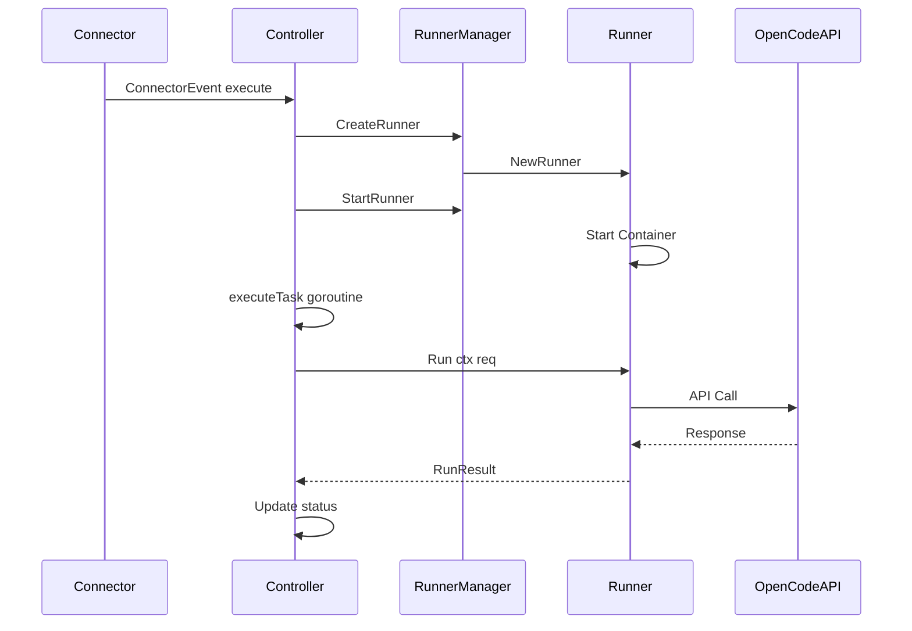
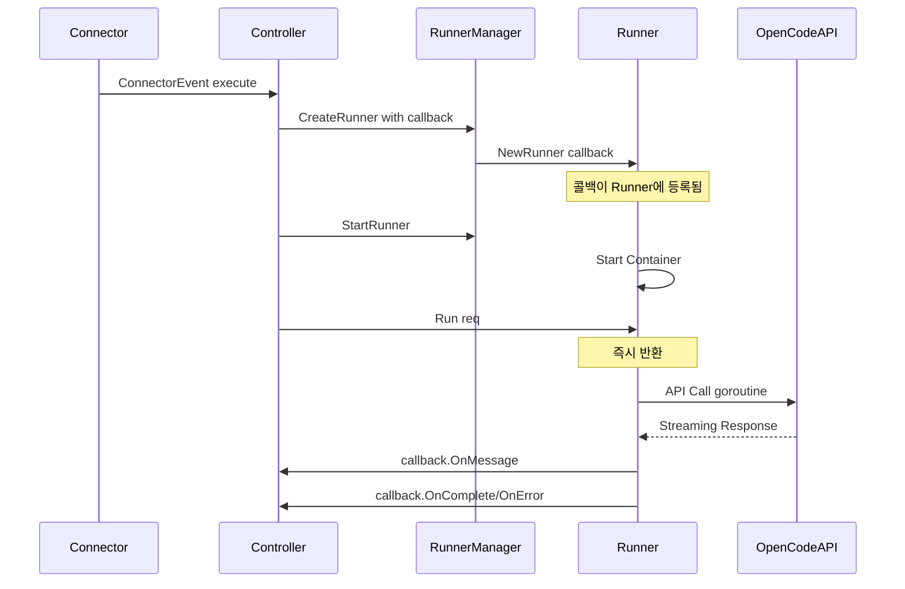

# Runner 비동기 콜백 아키텍처 리팩토링 계획

## 개요

이 문서는 Runner의 `runSync`, `runWithStreaming` 메서드를 삭제하고, TaskRunner 생성 시 콜백 핸들러를 컨트롤러가 러너에게 전달하도록 하여 `TaskRunner.Run` 함수가 완전히 비동기로 동작하도록 리팩토링하는 계획을 설명합니다.

### 핵심 설계 원칙

1. **콜백은 생성 시점에만 등록**: Task는 Run 여부와 상관없이 임의의 SSE 이벤트를 받을 수 있으므로, 콜백은 `NewRunner()` 또는 `NewTaskRunner()` 생성자에서만 등록
2. **Run() 메소드 유지**: 기존 `Run()` 메소드 이름을 유지하되, 내부 동작만 비동기로 변경
3. **RunRequest에서 콜백 제거**: `RunRequest` 구조체에서 콜백 필드를 완전히 제거하여 책임 분리 명확화

## 현재 아키텍처 분석

### 현재 구조



### 현재 파일 구조

| 파일                                                                               | 역할                                               |
| ---------------------------------------------------------------------------------- | -------------------------------------------------- |
| [`internal/runner/runner.go`](internal/runner/runner.go)                           | Runner 구조체, Run/runSync/runWithStreaming 메서드 |
| [`internal/controller/task.go`](internal/controller/task.go)                       | Task 생성, Runner 생성 및 시작                     |
| [`internal/controller/executor.go`](internal/controller/executor.go)               | Task 실행 로직, Runner.Run 호출                    |
| [`internal/controller/runner_callback.go`](internal/controller/runner_callback.go) | StatusCallback 인터페이스 구현                     |
| [`internal/controller/types.go`](internal/controller/types.go)                     | TaskContext, Event 타입 정의                       |
| [`internal/runner/manager.go`](internal/runner/manager.go)                         | Runner 생명주기 관리                               |

### 현재 문제점

1. **동기-비동기 혼재**: [`Runner.Run()`](internal/runner/runner.go:417) 메서드는 동기적으로 결과를 반환하지만, Controller는 이를 goroutine에서 호출하여 비동기로 처리

2. **책임 분리 부족**: Controller가 Runner 실행과 결과 처리를 모두 담당

   - [`executor.go:103`](internal/controller/executor.go:103)에서 executeTask가 Runner.Run을 직접 호출하고 결과를 처리

3. **콜백 전달 시점 불일치**: 콜백이 RunRequest에 포함되어 Run 호출 시 전달됨

   - 이로 인해 Runner가 이미 실행 중일 때만 콜백이 활성화됨

4. **코드 중복**: runSync와 runWithStreaming에서 세션 생성/삭제, 메시지 변환 등이 중복됨

5. **테스트 어려움**: 동기적 Run 메서드로 인해 비동기 동작 테스트가 복잡

### 현재 코드 흐름 상세 분석

```go
// executor.go:217 - 현재 동기 호출
result, err := runner.Run(ctx, req)

// runner.go:417 - Run 메서드 구현
func (r *Runner) Run(ctx context.Context, req *RunRequest) (*RunResult, error) {
    // 콜백이 있으면 스트리밍 모드
    if req.Callback != nil {
        return r.runWithStreaming(ctx, apiClient, req, messages)
    }
    // 일반 모드 - 동기 폴링
    return r.runSync(ctx, apiClient, req, messages)
}
```

## 새로운 비동기 콜백 아키텍처

### 설계 목표

1. **완전한 비동기 실행**: Runner.Run이 즉시 반환하고, 결과는 콜백을 통해 전달
2. **책임 분리**: Runner는 실행만, Controller는 결과 처리만
3. **콜백 생성 시점 등록**: TaskRunner 생성 시점에 콜백 등록 (Run 호출과 무관하게 SSE 이벤트 수신 가능)
4. **코드 단순화**: runSync, runWithStreaming 제거

### 새로운 구조



### 새로운 인터페이스 설계

#### 1. TaskRunner 인터페이스 변경

```go
// internal/runner/runner.go

// TaskRunner는 Task 실행을 위한 인터페이스입니다.
type TaskRunner interface {
    // Run은 주어진 요청으로 비동기 실행을 시작합니다.
    // 즉시 반환되며, 결과는 생성 시 등록된 콜백을 통해 전달됩니다.
    Run(ctx context.Context, req *RunRequest) error

    // GetStatus는 현재 Runner 상태를 반환합니다.
    GetStatus() string

    // Cancel은 실행 중인 작업을 취소합니다.
    Cancel() error
}
```

#### 2. RunnerMessage 구조체 정의

SSE 이벤트를 타입 안전하게 처리하기 위한 `RunnerMessage` 구조체를 정의합니다.

```go
// internal/runner/runner.go

// RunnerMessageType은 Runner 메시지 타입을 나타냅니다.
type RunnerMessageType string

const (
    // 텍스트 관련 이벤트
    RunnerMessageTypeText       RunnerMessageType = "text"            // 텍스트 청크 (스트리밍)
    RunnerMessageTypeReasoning  RunnerMessageType = "reasoning"       // 추론 텍스트

    // 도구 관련 이벤트
    RunnerMessageTypeToolCall   RunnerMessageType = "tool_call"       // 도구 호출 시작
    RunnerMessageTypeToolResult RunnerMessageType = "tool_result"     // 도구 실행 결과

    // 상태 관련 이벤트
    RunnerMessageTypeStatus     RunnerMessageType = "status"          // 상태 변경
    RunnerMessageTypeProgress   RunnerMessageType = "progress"        // 진행률 업데이트

    // 완료 관련 이벤트
    RunnerMessageTypeComplete   RunnerMessageType = "complete"        // 메시지 완료
    RunnerMessageTypeError      RunnerMessageType = "error"           // 에러 발생

    // 세션 관련 이벤트
    RunnerMessageTypeSessionCreated   RunnerMessageType = "session_created"   // 세션 생성됨
    RunnerMessageTypeSessionAborted   RunnerMessageType = "session_aborted"   // 세션 중단됨
)

// RunnerMessage는 SSE 이벤트를 타입 안전하게 표현하는 구조체입니다.
// Controller는 이 구조체를 통해 Runner로부터 받은 이벤트의 타입을 명확히 파악할 수 있습니다.
type RunnerMessage struct {
    // Type은 메시지 타입입니다.
    Type RunnerMessageType `json:"type"`

    // SessionID는 메시지가 속한 세션 ID입니다.
    SessionID string `json:"sessionID,omitempty"`

    // MessageID는 메시지가 속한 OpenCode 메시지 ID입니다.
    MessageID string `json:"messageID,omitempty"`

    // PartID는 메시지 파트 ID입니다 (스트리밍 텍스트의 경우).
    PartID string `json:"partID,omitempty"`

    // Timestamp는 메시지 생성 시간입니다.
    Timestamp time.Time `json:"timestamp"`

    // Content는 메시지 내용입니다 (텍스트 타입의 경우).
    Content string `json:"content,omitempty"`

    // ToolCall은 도구 호출 정보입니다 (tool_call 타입의 경우).
    ToolCall *ToolCallInfo `json:"toolCall,omitempty"`

    // ToolResult는 도구 실행 결과입니다 (tool_result 타입의 경우).
    ToolResult *ToolResultInfo `json:"toolResult,omitempty"`

    // Status는 상태 정보입니다 (status 타입의 경우).
    Status string `json:"status,omitempty"`

    // Progress는 진행률 정보입니다 (progress 타입의 경우, 0-100).
    Progress *int `json:"progress,omitempty"`

    // Error는 에러 정보입니다 (error 타입의 경우).
    Error *RunnerError `json:"error,omitempty"`

    // Metadata는 추가 메타데이터입니다.
    Metadata map[string]interface{} `json:"metadata,omitempty"`

    // RawEvent는 원본 SSE 이벤트입니다 (디버깅용).
    RawEvent *Event `json:"-"`
}

// ToolCallInfo는 도구 호출 정보입니다.
type ToolCallInfo struct {
    // CallID는 도구 호출 고유 ID입니다.
    CallID string `json:"callID"`

    // Tool은 호출된 도구 이름입니다.
    Tool string `json:"tool"`

    // Input은 도구 입력 파라미터입니다.
    Input map[string]interface{} `json:"input,omitempty"`

    // Title은 도구 호출 제목입니다.
    Title string `json:"title,omitempty"`
}

// ToolResultInfo는 도구 실행 결과입니다.
type ToolResultInfo struct {
    // CallID는 도구 호출 고유 ID입니다.
    CallID string `json:"callID"`

    // Tool은 실행된 도구 이름입니다.
    Tool string `json:"tool"`

    // Status는 실행 상태입니다 ("completed", "error").
    Status string `json:"status"`

    // Output은 도구 출력입니다.
    Output string `json:"output,omitempty"`

    // Error는 에러 메시지입니다.
    Error string `json:"error,omitempty"`

    // Attachments는 첨부 파일 목록입니다.
    Attachments []Part `json:"attachments,omitempty"`
}

// RunnerError는 Runner 에러 정보입니다.
type RunnerError struct {
    // Code는 에러 코드입니다.
    Code string `json:"code"`

    // Message는 에러 메시지입니다.
    Message string `json:"message"`

    // Details는 추가 에러 상세 정보입니다.
    Details map[string]interface{} `json:"details,omitempty"`
}

// IsText는 메시지가 텍스트 타입인지 확인합니다.
func (m *RunnerMessage) IsText() bool {
    return m.Type == RunnerMessageTypeText || m.Type == RunnerMessageTypeReasoning
}

// IsToolRelated는 메시지가 도구 관련 타입인지 확인합니다.
func (m *RunnerMessage) IsToolRelated() bool {
    return m.Type == RunnerMessageTypeToolCall || m.Type == RunnerMessageTypeToolResult
}

// IsTerminal은 메시지가 종료 이벤트인지 확인합니다 (complete 또는 error).
func (m *RunnerMessage) IsTerminal() bool {
    return m.Type == RunnerMessageTypeComplete || m.Type == RunnerMessageTypeError
}
```

#### 3. StatusCallback 인터페이스 확장

```go
// internal/runner/runner.go

// StatusCallback은 Task 실행 중 상태 변경을 Controller에 알리기 위한 콜백 인터페이스입니다.
type StatusCallback interface {
    // OnStarted는 Task 실행이 시작될 때 호출됩니다.
    OnStarted(taskID string) error

    // OnStatusChange는 Task 상태가 변경될 때 호출됩니다.
    OnStatusChange(taskID string, status string) error

    // OnMessage는 Runner가 SSE 이벤트를 수신할 때 호출됩니다.
    // RunnerMessage를 통해 이벤트 타입을 명확히 파악하고 적절히 처리할 수 있습니다.
    //
    // 주요 사용 패턴:
    //   - Text 이벤트: 스트리밍 텍스트를 Connector에 전달
    //   - ToolCall 이벤트: 도구 실행 상태 UI 업데이트
    //   - ToolResult 이벤트: 도구 결과 표시
    //   - Progress 이벤트: 진행률 표시
    OnMessage(taskID string, msg *RunnerMessage) error

    // OnComplete는 Task가 성공적으로 완료될 때 호출됩니다.
    OnComplete(taskID string, result *RunResult) error

    // OnError는 Task 실행 중 에러가 발생할 때 호출됩니다.
    OnError(taskID string, err error) error
}
```

#### 3. RunRequest 구조체 변경

```go
// internal/runner/runner.go

// RunRequest는 TaskRunner 실행 요청입니다.
// 콜백은 Runner 생성 시 등록되므로 RunRequest에는 포함되지 않습니다.
type RunRequest struct {
    TaskID       string
    Model        string
    SystemPrompt string
    Messages     []ChatMessage
    // 참고: Callback 필드는 제거됨 - 콜백은 NewRunner()에서 등록
}
```

#### 4. Runner 구조체 변경

```go
// internal/runner/runner.go

// Runner는 Docker Container 기반 TaskRunner 구현체입니다.
type Runner struct {
    // 기존 필드들...

    // 콜백 핸들러 (생성 시 등록)
    callback StatusCallback

    // 실행 컨텍스트 취소 함수
    cancelFunc context.CancelFunc

    // 실행 상태
    isRunning bool
    runMu     sync.Mutex
}
```

### 변경이 필요한 파일 목록

#### 1. internal/runner/runner.go

**변경 내용:**

- `runSync()` 메서드 삭제
- `runWithStreaming()` 메서드 삭제
- `Run()` 메서드를 비동기로 변경 (이름은 유지)
- `Cancel()` 메서드 추가
- `GetStatus()` 메서드 추가
- `NewRunner()` 함수에 콜백 파라미터 추가
- `TaskRunner` 인터페이스 변경
- `StatusCallback` 인터페이스에 `OnStarted()` 추가
- `RunRequest`에서 `Callback` 필드 제거

**새로운 Run 구현 예시:**

```go
func (r *Runner) Run(ctx context.Context, req *RunRequest) error {
    r.runMu.Lock()
    if r.isRunning {
        r.runMu.Unlock()
        return fmt.Errorf("runner가 이미 실행 중입니다")
    }
    r.isRunning = true
    r.runMu.Unlock()

    // 실행 컨텍스트 생성
    runCtx, cancel := context.WithCancel(ctx)
    r.cancelFunc = cancel

    // Runner에 등록된 콜백 사용 (생성 시점에 등록됨)
    callback := r.callback
    if callback == nil {
        return fmt.Errorf("콜백이 등록되지 않았습니다")
    }

    // 비동기 실행
    go func() {
        defer func() {
            r.runMu.Lock()
            r.isRunning = false
            r.runMu.Unlock()
        }()

        // 시작 알림
        if err := callback.OnStarted(req.TaskID); err != nil {
            r.logger.Warn("OnStarted 콜백 실패", zap.Error(err))
        }

        // OpenCode API 클라이언트 생성
        apiClient := NewOpenCodeClient(
            r.BaseURL,
            WithOpenCodeHTTPClient(r.httpClient),
            WithOpenCodeLogger(r.logger),
        )

        // 메시지 구성
        messages := r.buildMessages(req)

        // 실제 실행 (이벤트 구독 기반)
        r.executeWithEvents(runCtx, apiClient, req, messages, callback)
    }()

    return nil
}

func (r *Runner) executeWithEvents(ctx context.Context, client *OpenCodeClient,
    req *RunRequest, messages []ChatMessage, callback StatusCallback) {

    // 세션 생성
    session, err := client.CreateSession(ctx, &CreateSessionRequest{
        Title: req.TaskID,
    })
    if err != nil {
        callback.OnError(req.TaskID, fmt.Errorf("세션 생성 실패: %w", err))
        return
    }
    defer client.DeleteSession(context.Background(), session.ID)

    // 세션 생성 알림 (RunnerMessage 사용)
    callback.OnMessage(req.TaskID, &RunnerMessage{
        Type:      RunnerMessageTypeSessionCreated,
        SessionID: session.ID,
        Timestamp: time.Now(),
    })

    // 이벤트 구독 시작
    var fullContent strings.Builder
    eventCtx, cancelEvent := context.WithCancel(ctx)
    defer cancelEvent()

    messageCompleted := make(chan bool, 1)

    go func() {
        client.SubscribeEvents(eventCtx, func(event *Event) error {
            // SSE 이벤트를 RunnerMessage로 변환
            msg := r.convertEventToMessage(event, session.ID)
            if msg == nil {
                return nil // 지원하지 않는 이벤트 타입
            }

            // 텍스트 이벤트인 경우 전체 컨텐츠에 추가
            if msg.IsText() && msg.Content != "" {
                fullContent.WriteString(msg.Content)
            }

            // 콜백으로 메시지 전달 (RunnerMessage 타입)
            if err := callback.OnMessage(req.TaskID, msg); err != nil {
                r.logger.Warn("콜백 전달 실패",
                    zap.String("task_id", req.TaskID),
                    zap.String("msg_type", string(msg.Type)),
                    zap.Error(err),
                )
            }

            // 완료 이벤트인 경우 채널로 알림
            if msg.Type == RunnerMessageTypeComplete {
                messageCompleted <- true
            }

            return nil
        })
    }()

    // 프롬프트 전송
    providerID, modelID := parseModel(req.Model)
    parts := convertMessagesToParts(messages)

    _, err = client.Prompt(ctx, session.ID, &PromptRequest{
        Model: &PromptModel{
            ProviderID: providerID,
            ModelID:    modelID,
        },
        Parts: parts,
    })
    if err != nil {
        callback.OnError(req.TaskID, fmt.Errorf("프롬프트 전송 실패: %w", err))
        return
    }

    // 완료 대기
    select {
    case <-messageCompleted:
        result := &RunResult{
            Agent:   req.Model,
            Name:    req.TaskID,
            Success: true,
            Output:  fullContent.String(),
        }
        callback.OnComplete(req.TaskID, result)
    case <-ctx.Done():
        callback.OnError(req.TaskID, ctx.Err())
    case <-time.After(60 * time.Second):
        if fullContent.Len() > 0 {
            result := &RunResult{
                Agent:   req.Model,
                Name:    req.TaskID,
                Success: true,
                Output:  fullContent.String(),
            }
            callback.OnComplete(req.TaskID, result)
        } else {
            callback.OnError(req.TaskID, fmt.Errorf("타임아웃"))
        }
    }
}

// convertEventToMessage는 SSE Event를 RunnerMessage로 변환합니다.
func (r *Runner) convertEventToMessage(event *Event, sessionID string) *RunnerMessage {
    msg := &RunnerMessage{
        SessionID: sessionID,
        Timestamp: time.Now(),
        RawEvent:  event,
    }

    switch event.Type {
    case "message.part.updated":
        // 파트 정보 추출
        if props, ok := event.Properties["part"].(map[string]interface{}); ok {
            partType, _ := props["type"].(string)
            partID, _ := props["id"].(string)
            messageID, _ := event.Properties["messageID"].(string)

            msg.PartID = partID
            msg.MessageID = messageID

            switch partType {
            case "text":
                msg.Type = RunnerMessageTypeText
                msg.Content, _ = props["text"].(string)
            case "reasoning":
                msg.Type = RunnerMessageTypeReasoning
                msg.Content, _ = props["text"].(string)
            case "tool":
                // 도구 상태 확인
                if state, ok := props["state"].(map[string]interface{}); ok {
                    status, _ := state["status"].(string)
                    callID, _ := props["callID"].(string)
                    tool, _ := props["tool"].(string)

                    if status == "running" || status == "pending" {
                        msg.Type = RunnerMessageTypeToolCall
                        msg.ToolCall = &ToolCallInfo{
                            CallID: callID,
                            Tool:   tool,
                        }
                        if input, ok := state["input"].(map[string]interface{}); ok {
                            msg.ToolCall.Input = input
                        }
                        if title, ok := state["title"].(string); ok {
                            msg.ToolCall.Title = title
                        }
                    } else {
                        msg.Type = RunnerMessageTypeToolResult
                        msg.ToolResult = &ToolResultInfo{
                            CallID: callID,
                            Tool:   tool,
                            Status: status,
                        }
                        if output, ok := state["output"].(string); ok {
                            msg.ToolResult.Output = output
                        }
                        if errMsg, ok := state["error"].(string); ok {
                            msg.ToolResult.Error = errMsg
                        }
                    }
                }
            default:
                return nil // 지원하지 않는 파트 타입
            }
        }

    case "message.completed":
        msg.Type = RunnerMessageTypeComplete
        if messageID, ok := event.Properties["messageID"].(string); ok {
            msg.MessageID = messageID
        }

    case "session.aborted":
        msg.Type = RunnerMessageTypeSessionAborted

    default:
        return nil // 지원하지 않는 이벤트 타입
    }

    return msg
}

func (r *Runner) Cancel() error {
    if r.cancelFunc != nil {
        r.cancelFunc()
    }
    return nil
}

func (r *Runner) GetStatus() string {
    return r.Status
}
```

#### 2. internal/runner/manager.go

**변경 내용:**

- `CreateRunner()` 메서드에 콜백 파라미터 추가

```go
// CreateRunner creates a new Runner with callback and adds it to the manager.
func (rm *RunnerManager) CreateRunner(ctx context.Context, taskID string,
    agentInfo AgentInfo, callback StatusCallback, opts ...RunnerOption) (*Runner, error) {
    // ... 기존 로직 ...

    runner, err := NewRunner(
        taskID,
        agentInfo,
        callback, // 콜백 추가
        rm.logger,
        allOpts...,
    )
    // ...
}
```

#### 3. internal/controller/task.go

**변경 내용:**

- `CreateTask()`에서 Runner 생성 시 콜백 전달
- 콜백 인스턴스 생성 및 등록

```go
func (c *Controller) CreateTask(ctx context.Context, agentID, taskID, prompt string) error {
    // ... 기존 Task 생성 로직 ...

    // 콜백 인스턴스 생성 (Controller가 StatusCallback 구현)
    callback := c // Controller가 StatusCallback 인터페이스를 구현

    // RunnerManager에 TaskRunner 생성 (콜백 포함)
    _, err = c.runnerManager.CreateRunner(ctx, taskID, agentInfo, callback)
    if err != nil {
        c.logger.Error("Failed to create runner", zap.Error(err))
        return fmt.Errorf("failed to create task runner: %w", err)
    }

    // Runner 시작
    if err := c.runnerManager.StartRunner(ctx, taskID); err != nil {
        // ...
    }

    return nil
}
```

#### 4. internal/controller/executor.go

**변경 내용:**

- `executeTask()` 단순화 - RunnerManager에서 Runner를 가져온 후 직접 `runner.Run()` 호출
- 결과 처리 로직 제거 (콜백에서 처리)

```go
func (c *Controller) executeTask(ctx context.Context, taskID string, task *storage.Task) {
    defer func() {
        // TaskContext 정리
        c.mu.Lock()
        if taskCtx, ok := c.taskContexts[taskID]; ok {
            taskCtx.cancel()
            delete(c.taskContexts, taskID)
        }
        c.mu.Unlock()
    }()

    // Agent 정보 조회
    agent, err := c.repo.GetAgent(ctx, task.AgentID)
    if err != nil {
        c.logger.Error("Failed to get agent info", zap.Error(err))
        _ = c.repo.UpsertTaskStatus(ctx, taskID, task.AgentID, storage.TaskStatusFailed)
        return
    }

    // 메시지 목록 조회 및 변환
    messages, err := c.buildChatMessages(ctx, taskID, task)
    if err != nil {
        _ = c.repo.UpsertTaskStatus(ctx, taskID, task.AgentID, storage.TaskStatusFailed)
        return
    }

    // RunRequest 구성 (콜백은 Runner 생성 시 이미 등록됨)
    req := &taskrunner.RunRequest{
        TaskID:       taskID,
        Model:        agent.Model,
        SystemPrompt: agent.Prompt,
        Messages:     messages,
        // 참고: Callback 필드 제거됨 - 콜백은 Runner 생성 시 등록
    }

    // RunnerManager에서 Runner를 가져와서 직접 실행
    runner := c.runnerManager.GetRunner(taskID)
    if runner == nil {
        c.logger.Error("Runner not found", zap.String("task_id", taskID))
        _ = c.repo.UpsertTaskStatus(ctx, taskID, task.AgentID, storage.TaskStatusFailed)
        c.controllerEventChan <- ControllerEvent{
            TaskID: taskID,
            Status: "failed",
            Error:  fmt.Errorf("runner를 찾을 수 없음: %s", taskID),
        }
        return
    }

    // 비동기 실행 시작 (결과는 콜백으로 전달됨)
    if err := runner.Run(ctx, req); err != nil {
        c.logger.Error("Failed to start task execution", zap.Error(err))
        _ = c.repo.UpsertTaskStatus(ctx, taskID, task.AgentID, storage.TaskStatusFailed)
        c.controllerEventChan <- ControllerEvent{
            TaskID: taskID,
            Status: "failed",
            Error:  err,
        }
    }

    // executeTask는 여기서 반환 - 결과는 콜백으로 처리됨
}
```

#### 5. internal/controller/runner_callback.go

**변경 내용:**

- `OnStarted()` 메서드 추가
- 콜백 메서드에서 Runner 정리 로직 추가

```go
// OnStarted는 Task 실행이 시작될 때 호출됩니다.
func (c *Controller) OnStarted(taskID string) error {
    c.logger.Info("OnStarted callback",
        zap.String("task_id", taskID),
    )

    return c.UpdateTaskStatus(context.Background(), taskID, storage.TaskStatusRunning)
}

// OnComplete는 Task가 완료될 때 호출됩니다.
func (c *Controller) OnComplete(taskID string, result *taskrunner.RunResult) error {
    c.logger.Info("OnComplete callback",
        zap.String("task_id", taskID),
        zap.Bool("success", result.Success),
    )

    // 결과를 파일로 저장
    if result.Success {
        filePath, err := c.saveMessageToFile(context.Background(), taskID, "assistant", result.Output)
        if err != nil {
            c.logger.Error("Failed to save result to file", zap.Error(err))
            return err
        }

        // MessageIndex에 추가
        if _, err := c.repo.AppendMessageIndex(context.Background(), taskID, "assistant", filePath); err != nil {
            c.logger.Error("Failed to append message index", zap.Error(err))
            return err
        }
    }

    // 상태를 completed로 변경
    if err := c.UpdateTaskStatus(context.Background(), taskID, storage.TaskStatusCompleted); err != nil {
        return err
    }

    // 완료 이벤트 전송
    c.controllerEventChan <- ControllerEvent{
        TaskID:  taskID,
        Status:  "completed",
        Content: result.Output,
    }

    return nil
}

// OnError는 Task 실행 중 에러가 발생할 때 호출됩니다.
func (c *Controller) OnError(taskID string, err error) error {
    c.logger.Error("OnError callback",
        zap.String("task_id", taskID),
        zap.Error(err),
    )

    // 상태를 failed로 변경
    if updateErr := c.UpdateTaskStatus(context.Background(), taskID, storage.TaskStatusFailed); updateErr != nil {
        c.logger.Error("Failed to update task status", zap.Error(updateErr))
    }

    // 에러 이벤트 전송
    c.controllerEventChan <- ControllerEvent{
        TaskID: taskID,
        Status: "failed",
        Error:  err,
    }

    return nil
}
```

#### 6. internal/runner/runner_test.go

**변경 내용:**

- `TestRun_Success` 테스트를 비동기 방식으로 변경 (이름은 유지)
- 콜백 mock 구현 추가
- Runner 생성 시 콜백 등록 확인

```go
// MockStatusCallback은 테스트용 콜백 구현입니다.
// OnMessage가 RunnerMessage 포인터를 받도록 업데이트되었습니다.
type MockStatusCallback struct {
    StartedCalled   bool
    CompletedCalled bool
    ErrorCalled     bool
    Messages        []*RunnerMessage  // RunnerMessage 슬라이스로 변경
    TextContent     strings.Builder   // 텍스트 메시지만 수집
    ToolCalls       []*ToolCallInfo   // 도구 호출 정보
    ToolResults     []*ToolResultInfo // 도구 결과 정보
    Result          *RunResult
    Error           error
    Done            chan struct{}
}

func NewMockStatusCallback() *MockStatusCallback {
    return &MockStatusCallback{
        Messages:    make([]*RunnerMessage, 0),
        ToolCalls:   make([]*ToolCallInfo, 0),
        ToolResults: make([]*ToolResultInfo, 0),
        Done:        make(chan struct{}),
    }
}

func (m *MockStatusCallback) OnStarted(taskID string) error {
    m.StartedCalled = true
    return nil
}

func (m *MockStatusCallback) OnStatusChange(taskID string, status string) error {
    return nil
}

// OnMessage는 RunnerMessage 포인터를 받습니다.
// 메시지 타입에 따라 적절한 필드에 데이터를 저장합니다.
func (m *MockStatusCallback) OnMessage(taskID string, msg *RunnerMessage) error {
    m.Messages = append(m.Messages, msg)
    
    // 타입별 처리
    switch msg.Type {
    case RunnerMessageTypeText, RunnerMessageTypeReasoning:
        m.TextContent.WriteString(msg.Content)
    case RunnerMessageTypeToolCall:
        if msg.ToolCall != nil {
            m.ToolCalls = append(m.ToolCalls, msg.ToolCall)
        }
    case RunnerMessageTypeToolResult:
        if msg.ToolResult != nil {
            m.ToolResults = append(m.ToolResults, msg.ToolResult)
        }
    }
    
    return nil
}

func (m *MockStatusCallback) OnComplete(taskID string, result *RunResult) error {
    m.CompletedCalled = true
    m.Result = result
    close(m.Done)
    return nil
}

func (m *MockStatusCallback) OnError(taskID string, err error) error {
    m.ErrorCalled = true
    m.Error = err
    close(m.Done)
    return nil
}

// GetTextMessages는 텍스트 타입 메시지만 필터링하여 반환합니다.
func (m *MockStatusCallback) GetTextMessages() []*RunnerMessage {
    var texts []*RunnerMessage
    for _, msg := range m.Messages {
        if msg.IsText() {
            texts = append(texts, msg)
        }
    }
    return texts
}

// GetToolMessages는 도구 관련 메시지만 필터링하여 반환합니다.
func (m *MockStatusCallback) GetToolMessages() []*RunnerMessage {
    var tools []*RunnerMessage
    for _, msg := range m.Messages {
        if msg.IsToolRelated() {
            tools = append(tools, msg)
        }
    }
    return tools
}

func TestRun_Async_Success(t *testing.T) {
    // ... 테스트 구현 ...

    // 콜백은 Runner 생성 시 등록
    callback := NewMockStatusCallback()
    runner, err := NewRunner("task-1", agentInfo, callback, zaptest.NewLogger(t))
    require.NoError(t, err)

    // RunRequest에는 콜백이 없음
    req := &RunRequest{
        TaskID:   "task-1",
        Model:    "anthropic/grok-code",
        Messages: []ChatMessage{{Role: "user", Content: "Hello"}},
    }

    // Run은 비동기로 즉시 반환
    err = runner.Run(ctx, req)
    require.NoError(t, err)

    // 완료 대기 (콜백으로 결과 수신)
    select {
    case <-callback.Done:
        assert.True(t, callback.StartedCalled)
        assert.True(t, callback.CompletedCalled)
        assert.NotNil(t, callback.Result)
        
        // RunnerMessage 기반 검증
        textMsgs := callback.GetTextMessages()
        assert.NotEmpty(t, textMsgs, "텍스트 메시지가 있어야 함")
        
        // 전체 텍스트 내용 확인
        assert.Equal(t, callback.Result.Output, callback.TextContent.String())
    case <-time.After(10 * time.Second):
        t.Fatal("timeout waiting for callback")
    }
}

// TestOnMessage_RunnerMessageTypes는 다양한 RunnerMessage 타입 처리를 테스트합니다.
func TestOnMessage_RunnerMessageTypes(t *testing.T) {
    callback := NewMockStatusCallback()
    taskID := "task-1"
    
    // 1. 세션 생성 메시지
    callback.OnMessage(taskID, &RunnerMessage{
        Type:      RunnerMessageTypeSessionCreated,
        SessionID: "ses_123",
        Timestamp: time.Now(),
    })
    
    // 2. 텍스트 메시지 (스트리밍)
    callback.OnMessage(taskID, &RunnerMessage{
        Type:      RunnerMessageTypeText,
        MessageID: "msg_1",
        PartID:    "prt_1",
        Content:   "Hello, ",
        Timestamp: time.Now(),
    })
    callback.OnMessage(taskID, &RunnerMessage{
        Type:      RunnerMessageTypeText,
        MessageID: "msg_1",
        PartID:    "prt_1",
        Content:   "world!",
        Timestamp: time.Now(),
    })
    
    // 3. 도구 호출 메시지
    callback.OnMessage(taskID, &RunnerMessage{
        Type:      RunnerMessageTypeToolCall,
        MessageID: "msg_1",
        PartID:    "prt_2",
        ToolCall: &ToolCallInfo{
            CallID: "call_1",
            Tool:   "read_file",
            Input:  map[string]interface{}{"path": "/tmp/test.txt"},
            Title:  "파일 읽기",
        },
        Timestamp: time.Now(),
    })
    
    // 4. 도구 결과 메시지
    callback.OnMessage(taskID, &RunnerMessage{
        Type:      RunnerMessageTypeToolResult,
        MessageID: "msg_1",
        PartID:    "prt_2",
        ToolResult: &ToolResultInfo{
            CallID: "call_1",
            Tool:   "read_file",
            Status: "completed",
            Output: "file contents here",
        },
        Timestamp: time.Now(),
    })
    
    // 5. 완료 메시지
    callback.OnMessage(taskID, &RunnerMessage{
        Type:      RunnerMessageTypeComplete,
        MessageID: "msg_1",
        Timestamp: time.Now(),
    })
    
    // 검증
    assert.Len(t, callback.Messages, 6)
    assert.Equal(t, "Hello, world!", callback.TextContent.String())
    assert.Len(t, callback.ToolCalls, 1)
    assert.Len(t, callback.ToolResults, 1)
    assert.Equal(t, "read_file", callback.ToolCalls[0].Tool)
    assert.Equal(t, "completed", callback.ToolResults[0].Status)
}
```

### SSE 이벤트와 RunnerMessage 타입 매핑

| SSE 이벤트 타입           | 파트 타입  | RunnerMessage 타입             | 설명                       |
| ------------------------- | ---------- | ------------------------------ | -------------------------- |
| `message.part.updated`    | `text`     | `RunnerMessageTypeText`        | 스트리밍 텍스트 청크       |
| `message.part.updated`    | `reasoning`| `RunnerMessageTypeReasoning`   | 추론 텍스트                |
| `message.part.updated`    | `tool`     | `RunnerMessageTypeToolCall`    | 도구 호출 시작 (pending/running) |
| `message.part.updated`    | `tool`     | `RunnerMessageTypeToolResult`  | 도구 실행 결과 (completed/error) |
| `message.completed`       | -          | `RunnerMessageTypeComplete`    | 메시지 완료                |
| `session.aborted`         | -          | `RunnerMessageTypeSessionAborted` | 세션 중단됨             |
| (내부 생성)               | -          | `RunnerMessageTypeSessionCreated` | 세션 생성 알림          |
| (내부 생성)               | -          | `RunnerMessageTypeStatus`      | 상태 변경                  |
| (내부 생성)               | -          | `RunnerMessageTypeProgress`    | 진행률 업데이트            |
| (내부 생성)               | -          | `RunnerMessageTypeError`       | 에러 발생                  |

### 인터페이스 변경 요약

| 변경 항목                    | 이전                                            | 이후                                                      |
| ---------------------------- | ----------------------------------------------- | --------------------------------------------------------- |
| TaskRunner.Run               | `Run(ctx, req) (*RunResult, error)`             | `Run(ctx, req) error` (비동기, 결과는 콜백으로)           |
| TaskRunner.Cancel            | -                                               | `Cancel() error`                                          |
| TaskRunner.GetStatus         | -                                               | `GetStatus() string`                                      |
| StatusCallback.OnStarted     | -                                               | `OnStarted(taskID) error`                                 |
| StatusCallback.OnMessage     | `OnMessage(taskID, message string) error`       | `OnMessage(taskID, msg *RunnerMessage) error`             |
| NewRunner                    | `NewRunner(taskID, agentInfo, logger, opts...)` | `NewRunner(taskID, agentInfo, callback, logger, opts...)` |
| RunnerManager.CreateRunner   | `CreateRunner(ctx, taskID, agentInfo, opts...)`  | `CreateRunner(ctx, taskID, agentInfo, callback, opts...)` |
| RunRequest.Callback          | `StatusCallback` (선택)                         | 제거됨                                                    |

## 테스트 전략

### 단위 테스트

1. **Runner 테스트**

   - `TestRun_Async_Success`: 비동기 실행 및 콜백 호출 확인
   - `TestRun_Async_Error`: 에러 발생 시 OnError 콜백 호출 확인
   - `TestRun_Async_Cancel`: 실행 취소 시 정상 종료 확인
   - `TestRun_AlreadyRunning`: 중복 실행 방지 확인
   - `TestRun_NoCallback`: 콜백 없이 Runner 생성 시 에러 확인

2. **Controller 콜백 테스트**

   - `TestControllerOnStarted`: OnStarted 콜백에서 상태 변경 확인
   - `TestControllerOnComplete`: OnComplete 콜백에서 결과 저장 및 상태 변경 확인
   - `TestControllerOnError`: OnError 콜백에서 상태 변경 확인
   - `TestControllerOnMessage`: OnMessage 콜백에서 이벤트 전송 확인

3. **RunnerManager 테스트**
   - `TestRunnerManagerCreateRunnerWithCallback`: 콜백이 포함된 Runner 생성 확인

### 통합 테스트

1. **전체 흐름 테스트**

   - Task 생성 → Runner 생성 → 비동기 실행 → 콜백으로 결과 수신 → 상태 업데이트

2. **에러 시나리오 테스트**
   - API 에러 발생 시 OnError 콜백 호출 및 상태 업데이트 확인
   - 타임아웃 발생 시 처리 확인
   - Context 취소 시 정리 확인

### Mock 구현

```go
// internal/testutil/mocks/mock_callback.go

type MockStatusCallback struct {
    mu              sync.Mutex
    StartedTasks    []string
    CompletedTasks  map[string]*taskrunner.RunResult
    FailedTasks     map[string]error
    Messages        map[string][]*taskrunner.RunnerMessage  // RunnerMessage 포인터 슬라이스로 변경
    StatusChanges   map[string][]string
    Done            chan struct{}
}

func NewMockStatusCallback() *MockStatusCallback {
    return &MockStatusCallback{
        CompletedTasks: make(map[string]*taskrunner.RunResult),
        FailedTasks:    make(map[string]error),
        Messages:       make(map[string][]*taskrunner.RunnerMessage),
        StatusChanges:  make(map[string][]string),
        Done:           make(chan struct{}),
    }
}

// OnMessage는 RunnerMessage 포인터를 받아 저장합니다.
func (m *MockStatusCallback) OnMessage(taskID string, msg *taskrunner.RunnerMessage) error {
    m.mu.Lock()
    defer m.mu.Unlock()
    m.Messages[taskID] = append(m.Messages[taskID], msg)
    return nil
}

// GetTextContent는 특정 Task의 텍스트 메시지를 합쳐서 반환합니다.
func (m *MockStatusCallback) GetTextContent(taskID string) string {
    m.mu.Lock()
    defer m.mu.Unlock()
    
    var content strings.Builder
    for _, msg := range m.Messages[taskID] {
        if msg.IsText() {
            content.WriteString(msg.Content)
        }
    }
    return content.String()
}

// GetMessagesByType는 특정 타입의 메시지만 필터링하여 반환합니다.
func (m *MockStatusCallback) GetMessagesByType(taskID string, msgType taskrunner.RunnerMessageType) []*taskrunner.RunnerMessage {
    m.mu.Lock()
    defer m.mu.Unlock()
    
    var result []*taskrunner.RunnerMessage
    for _, msg := range m.Messages[taskID] {
        if msg.Type == msgType {
            result = append(result, msg)
        }
    }
    return result
}
```

## 마이그레이션 계획

### Phase 1: 인터페이스 준비

1. `RunnerMessage` 구조체 및 관련 타입 정의 추가:
   - `RunnerMessageType` enum 상수 정의
   - `RunnerMessage` 구조체 정의
   - `ToolCallInfo`, `ToolResultInfo`, `RunnerError` 구조체 정의
   - `IsText()`, `IsToolRelated()`, `IsTerminal()` 헬퍼 메서드 추가
2. `StatusCallback` 인터페이스에 `OnStarted()` 메서드 추가
3. `StatusCallback.OnMessage()` 시그니처를 `OnMessage(taskID string, msg *RunnerMessage) error`로 변경
4. Controller에 `OnStarted()` 및 새로운 `OnMessage()` 구현 추가
5. 기존 테스트가 통과하는지 확인

### Phase 2: Runner 구조체 변경

1. Runner에 콜백 필드 추가
2. `NewRunner()` 함수에 콜백 파라미터 추가 (옵셔널로 시작)
3. `convertEventToMessage()` 헬퍼 함수 추가 (SSE Event → RunnerMessage 변환)
4. `RunAsync()` 메서드 추가 (Run과 병행)
5. `Cancel()`, `GetStatus()` 메서드 추가
6. 새 테스트 추가 (RunnerMessage 타입별 테스트 포함)

### Phase 3: RunnerManager 변경

1. `CreateRunner()`에 콜백 파라미터 추가
2. 테스트 업데이트

### Phase 4: Controller 변경

1. `CreateTask()`에서 콜백과 함께 Runner 생성
2. `executeTask()`에서 `RunnerManager.GetRunner()` 후 직접 `runner.Run()` 호출로 변경
3. 결과 처리 로직을 콜백으로 이동
4. `OnMessage()` 구현에서 `RunnerMessage.Type`에 따른 분기 처리 추가:
   - `Text`/`Reasoning`: Connector에 스트리밍 텍스트 전달
   - `ToolCall`: 도구 실행 상태 UI 업데이트
   - `ToolResult`: 도구 결과 표시
   - `Complete`: 완료 처리 (기존 로직과 연계)
5. 테스트 업데이트

### Phase 5: 레거시 코드 제거

1. `Runner.runSync()` 메서드 삭제
2. `Runner.runWithStreaming()` 메서드 삭제
3. `Runner.Request()` 메서드 삭제 (레거시 API)
4. `RunRequest.Callback` 필드 제거
5. 이전 `OnMessage(taskID, message string)` 시그니처 관련 코드 정리
6. 관련 테스트 정리

### Phase 6: 정리 및 문서화

1. 코드 정리 및 주석 업데이트
2. `RunnerMessage` 타입 및 사용 방법 문서화
3. README 및 문서 업데이트
4. 최종 테스트 실행

## 리스크 및 고려사항

### 리스크

1. **콜백 실패 처리**: 콜백 호출이 실패할 경우 어떻게 처리할지

   - 해결: 콜백 실패는 로깅만 하고 Runner 실행은 계속

2. **메모리 누수**: 콜백이 Runner를 참조하여 순환 참조 발생 가능

   - 해결: 콜백에서 Runner 참조를 피하고, 필요한 정보만 전달

3. **동시성 이슈**: 여러 콜백이 동시에 호출될 때 상태 불일치
   - 해결: Controller의 상태 업데이트에 적절한 동기화 적용

### 하위 호환성

- Phase 2-5 동안 기존 `Run()` 메서드를 유지하여 점진적 마이그레이션 지원
- 테스트는 각 Phase에서 기존 동작과 새 동작 모두 확인

## 예상 코드 변경량

| 파일                                     | 추가 | 삭제 | 수정 |
| ---------------------------------------- | ---- | ---- | ---- |
| internal/runner/runner.go                | ~150 | ~350 | ~50  |
| internal/runner/manager.go               | ~30  | 0    | ~20  |
| internal/controller/task.go              | ~10  | 0    | ~20  |
| internal/controller/executor.go          | ~20  | ~100 | ~30  |
| internal/controller/runner_callback.go   | ~30  | 0    | ~20  |
| internal/runner/runner_test.go           | ~150 | ~100 | ~50  |
| internal/testutil/mocks/mock_callback.go | ~80  | 0    | 0    |

**총 예상: +450줄, -550줄, ~180줄 수정**

## 결론

이 리팩토링은 Runner의 실행 모델을 완전한 비동기 방식으로 전환하여 다음을 달성합니다:

1. **코드 단순화**: runSync, runWithStreaming 제거로 중복 코드 감소
2. **책임 분리**: Runner는 실행만, Controller는 결과 처리만 담당
3. **콜백 생명주기 명확화**: 콜백은 Runner 생성 시점에만 등록되어 SSE 이벤트를 Run 호출과 무관하게 수신 가능
4. **테스트 용이성**: 비동기 실행과 콜백 기반으로 테스트 작성이 더 명확해짐
5. **확장성**: 새로운 콜백 이벤트 추가가 용이

계획된 6개 Phase를 통해 안전하게 마이그레이션하며, 각 Phase에서 테스트를 통해 안정성을 확보합니다.
