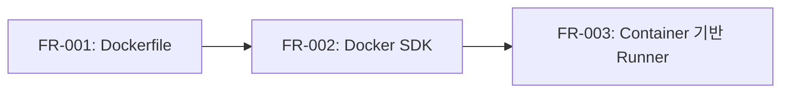

# Runner Docker 구현 명세서 - Phase 1: 기반 구축

본 문서는 Runner Docker 구현의 Phase 1 단계에 대한 세부 구현 명세서입니다.

---

## 목차

1. [개요](#1-개요)
2. [FR-001: Dockerfile 작성](#2-fr-001-dockerfile-작성)
3. [FR-002: Docker SDK 통합](#3-fr-002-docker-sdk-통합)
4. [FR-003: Container 기반 Runner](#4-fr-003-container-기반-runner)
5. [구현 체크리스트](#5-구현-체크리스트)

---

## 1. 개요

### 1.1 Phase 1 목표

Phase 1의 목표는 Docker Container 기반 Runner의 기반 인프라를 구축하는 것입니다:

- OpenCode Server를 실행하는 Docker 이미지 생성
- Docker SDK를 통한 Container 관리 기능 구현
- 기존 Runner 구조체를 Container 기반으로 변경

### 1.2 의존성 관계



### 1.3 예상 파일 변경

| 작업 유형 | 파일 경로                    | 설명                    |
| --------- | ---------------------------- | ----------------------- |
| 신규      | `docker/runner/Dockerfile`   | Runner Container 이미지 |
| 신규      | `internal/runner/docker.go`  | Docker 클라이언트 래퍼  |
| 수정      | `internal/runner/runner.go`  | Container 기반 Runner   |
| 수정      | `internal/runner/manager.go` | Docker SDK 통합         |
| 신규      | `internal/runner/config.go`  | Runner 설정 구조체      |
| 수정      | `go.mod`                     | Docker SDK 의존성 추가  |

---

## 2. FR-001: Dockerfile 작성

### 2.1 요구사항 요약

OpenCode 프로세스를 실행하는 Runner Dockerfile을 작성해야 합니다.

### 2.2 베이스 이미지 선택

**선택: `node:20-slim`**

선택 이유:

- OpenCode는 Node.js 기반 CLI 도구
- `slim` 이미지는 경량화되어 빠른 빌드/배포 가능
- Node.js 20 LTS 버전으로 안정성 확보

대안 검토:
| 이미지 | 크기 | 장점 | 단점 |
|--------|------|------|------|
| `node:20` | ~1GB | 모든 도구 포함 | 크기가 큼 |
| `node:20-slim` | ~200MB | 경량화, 필수 도구만 포함 | 일부 도구 없음 |
| `node:20-alpine` | ~150MB | 가장 경량 | musl libc 호환성 문제 가능 |

### 2.3 Dockerfile 구조

```dockerfile
# docker/runner/Dockerfile

# =============================================================================
# Stage 1: Builder - OpenCode 설치
# =============================================================================
FROM node:20-slim AS builder

# 빌드 의존성 설치
RUN apt-get update && apt-get install -y --no-install-recommends \
    git \
    && rm -rf /var/lib/apt/lists/*

# OpenCode CLI 전역 설치
RUN npm install -g @opencode/cli

# =============================================================================
# Stage 2: Runtime - 최종 이미지
# =============================================================================
FROM node:20-slim AS runtime

# 메타데이터
LABEL maintainer="cnap-team"
LABEL description="CNAP Runner Container with OpenCode Server"
LABEL version="1.0.0"

# 런타임 의존성 설치
RUN apt-get update && apt-get install -y --no-install-recommends \
    git \
    curl \
    ca-certificates \
    && rm -rf /var/lib/apt/lists/*

# 비루트 사용자 생성 (보안)
RUN groupadd --gid 1000 opencode \
    && useradd --uid 1000 --gid opencode --shell /bin/bash --create-home opencode

# OpenCode CLI 복사
COPY --from=builder /usr/local/lib/node_modules /usr/local/lib/node_modules
COPY --from=builder /usr/local/bin/opencode /usr/local/bin/opencode

# 작업 디렉토리 설정
WORKDIR /workspace

# 권한 설정
RUN chown -R opencode:opencode /workspace

# 비루트 사용자로 전환
USER opencode

# 환경 변수
ENV NODE_ENV=production
ENV OPENCODE_DATA_DIR=/workspace/.opencode

# Health check
HEALTHCHECK --interval=30s --timeout=10s --start-period=5s --retries=3 \
    CMD curl -f http://localhost:3000/health || exit 1

# OpenCode Server 포트
EXPOSE 3000

# 엔트리포인트
ENTRYPOINT ["opencode", "server"]
CMD ["--port", "3000", "--host", "0.0.0.0"]
```

### 2.4 이미지 빌드 및 테스트

#### 2.4.1 빌드 명령

```bash
# 이미지 빌드
docker build -t cnap-runner:latest -f docker/runner/Dockerfile .

# 태그 추가
docker tag cnap-runner:latest cnap-runner:v1.0.0
```

#### 2.4.2 로컬 테스트

```bash
# 컨테이너 실행 테스트
docker run -d \
    --name test-runner \
    -p 3000:3000 \
    -v $(pwd)/test-workspace:/workspace \
    -e OPENCODE_API_KEY=${OPENCODE_API_KEY} \
    cnap-runner:latest

# 헬스 체크
curl http://localhost:3000/health

# 로그 확인
docker logs test-runner

# 정리
docker stop test-runner && docker rm test-runner
```

### 2.5 Makefile 타겟 추가

```makefile
# Makefile에 추가

RUNNER_IMAGE_NAME ?= cnap-runner
RUNNER_IMAGE_TAG ?= latest

.PHONY: runner-build
runner-build: ## Build runner Docker image
	docker build -t $(RUNNER_IMAGE_NAME):$(RUNNER_IMAGE_TAG) -f docker/runner/Dockerfile .

.PHONY: runner-push
runner-push: ## Push runner Docker image
	docker push $(RUNNER_IMAGE_NAME):$(RUNNER_IMAGE_TAG)

.PHONY: runner-test
runner-test: runner-build ## Test runner Docker image
	docker run --rm $(RUNNER_IMAGE_NAME):$(RUNNER_IMAGE_TAG) --version
```

### 2.6 커밋 포인트

```
feat(runner): FR-001 OpenCode Runner Dockerfile 추가

- node:20-slim 기반 멀티스테이지 빌드
- 비루트 사용자(opencode)로 실행
- OpenCode Server 모드로 REST API 노출
- Health check 엔드포인트 설정

Refs: FR-001
```

---

## 3. FR-002: Docker SDK 통합

### 3.1 요구사항 요약

RunnerManager가 Docker SDK를 사용하여 Container 인스턴스를 관리합니다.

### 3.2 의존성 추가

```bash
go get github.com/docker/docker@v24.0.7
go get github.com/docker/go-connections@v0.4.0
```

`go.mod` 변경:

```go
require (
    // ... 기존 의존성
    github.com/docker/docker v24.0.7+incompatible
    github.com/docker/go-connections v0.4.0
)
```

### 3.3 Docker 클라이언트 인터페이스

#### 3.3.1 인터페이스 정의

```go
// internal/runner/docker.go

package taskrunner

import (
    "context"
    "io"

    "github.com/docker/docker/api/types"
    "github.com/docker/docker/api/types/container"
    "github.com/docker/docker/api/types/network"
    "github.com/docker/docker/client"
    ocispec "github.com/opencontainers/image-spec/specs-go/v1"
)

// DockerClient는 Docker 작업을 위한 인터페이스입니다.
// 테스트 시 mock 구현을 주입할 수 있습니다.
type DockerClient interface {
    // Container 관리
    ContainerCreate(ctx context.Context, config *container.Config, hostConfig *container.HostConfig, networkingConfig *network.NetworkingConfig, platform *ocispec.Platform, containerName string) (container.CreateResponse, error)
    ContainerStart(ctx context.Context, containerID string, options container.StartOptions) error
    ContainerStop(ctx context.Context, containerID string, options container.StopOptions) error
    ContainerRemove(ctx context.Context, containerID string, options container.RemoveOptions) error
    ContainerInspect(ctx context.Context, containerID string) (types.ContainerJSON, error)
    ContainerWait(ctx context.Context, containerID string, condition container.WaitCondition) (<-chan container.WaitResponse, <-chan error)
    ContainerLogs(ctx context.Context, containerID string, options container.LogsOptions) (io.ReadCloser, error)

    // 이미지 관리
    ImagePull(ctx context.Context, refStr string, options types.ImagePullOptions) (io.ReadCloser, error)

    // 연결 관리
    Ping(ctx context.Context) (types.Ping, error)
    Close() error
}

// dockerClientWrapper는 실제 Docker 클라이언트를 래핑합니다.
type dockerClientWrapper struct {
    client *client.Client
}

// NewDockerClient는 Docker 클라이언트를 생성합니다.
func NewDockerClient() (DockerClient, error) {
    cli, err := client.NewClientWithOpts(
        client.FromEnv,
        client.WithAPIVersionNegotiation(),
    )
    if err != nil {
        return nil, err
    }

    return &dockerClientWrapper{client: cli}, nil
}

// ContainerCreate implements DockerClient.
func (d *dockerClientWrapper) ContainerCreate(ctx context.Context, config *container.Config, hostConfig *container.HostConfig, networkingConfig *network.NetworkingConfig, platform *ocispec.Platform, containerName string) (container.CreateResponse, error) {
    return d.client.ContainerCreate(ctx, config, hostConfig, networkingConfig, platform, containerName)
}

// ContainerStart implements DockerClient.
func (d *dockerClientWrapper) ContainerStart(ctx context.Context, containerID string, options container.StartOptions) error {
    return d.client.ContainerStart(ctx, containerID, options)
}

// ContainerStop implements DockerClient.
func (d *dockerClientWrapper) ContainerStop(ctx context.Context, containerID string, options container.StopOptions) error {
    return d.client.ContainerStop(ctx, containerID, options)
}

// ContainerRemove implements DockerClient.
func (d *dockerClientWrapper) ContainerRemove(ctx context.Context, containerID string, options container.RemoveOptions) error {
    return d.client.ContainerRemove(ctx, containerID, options)
}

// ContainerInspect implements DockerClient.
func (d *dockerClientWrapper) ContainerInspect(ctx context.Context, containerID string) (types.ContainerJSON, error) {
    return d.client.ContainerInspect(ctx, containerID)
}

// ContainerWait implements DockerClient.
func (d *dockerClientWrapper) ContainerWait(ctx context.Context, containerID string, condition container.WaitCondition) (<-chan container.WaitResponse, <-chan error) {
    return d.client.ContainerWait(ctx, containerID, condition)
}

// ContainerLogs implements DockerClient.
func (d *dockerClientWrapper) ContainerLogs(ctx context.Context, containerID string, options container.LogsOptions) (io.ReadCloser, error) {
    return d.client.ContainerLogs(ctx, containerID, options)
}

// ImagePull implements DockerClient.
func (d *dockerClientWrapper) ImagePull(ctx context.Context, refStr string, options types.ImagePullOptions) (io.ReadCloser, error) {
    return d.client.ImagePull(ctx, refStr, options)
}

// Ping implements DockerClient.
func (d *dockerClientWrapper) Ping(ctx context.Context) (types.Ping, error) {
    return d.client.Ping(ctx)
}

// Close implements DockerClient.
func (d *dockerClientWrapper) Close() error {
    return d.client.Close()
}

// 인터페이스 구현 확인
var _ DockerClient = (*dockerClientWrapper)(nil)
```

### 3.4 Container 관리 헬퍼 함수

```go
// internal/runner/docker.go (계속)

import (
    "fmt"
    "time"

    "github.com/docker/go-connections/nat"
)

// ContainerConfig는 Container 생성 설정입니다.
type ContainerConfig struct {
    Name          string            // Container 이름
    Image         string            // Docker 이미지
    Env           []string          // 환경 변수
    Mounts        []MountConfig     // 볼륨 마운트
    Port          int               // 노출할 포트
    Labels        map[string]string // Container 라벨
    Resources     ResourceLimit     // 리소스 제한
}

// MountConfig는 볼륨 마운트 설정입니다.
type MountConfig struct {
    Source   string // 호스트 경로
    Target   string // Container 경로
    ReadOnly bool   // 읽기 전용 여부
}

// ResourceLimit는 Container 리소스 제한입니다.
type ResourceLimit struct {
    MemoryMB  int64   // 메모리 제한 (MB)
    CPUCores  float64 // CPU 코어 수
}

// CreateContainer는 새 Container를 생성합니다.
func CreateContainer(ctx context.Context, dockerClient DockerClient, cfg ContainerConfig) (string, error) {
    // Container 설정 구성
    containerConfig := &container.Config{
        Image:  cfg.Image,
        Env:    cfg.Env,
        Labels: cfg.Labels,
        ExposedPorts: nat.PortSet{
            nat.Port(fmt.Sprintf("%d/tcp", cfg.Port)): struct{}{},
        },
    }

    // 호스트 설정 구성
    hostConfig := &container.HostConfig{
        PortBindings: nat.PortMap{
            nat.Port(fmt.Sprintf("%d/tcp", cfg.Port)): []nat.PortBinding{
                {
                    HostIP:   "127.0.0.1",
                    HostPort: "0", // 동적 포트 할당
                },
            },
        },
        Resources: container.Resources{
            Memory:   cfg.Resources.MemoryMB * 1024 * 1024,
            NanoCPUs: int64(cfg.Resources.CPUCores * 1e9),
        },
        AutoRemove: false,
    }

    // 볼륨 마운트 설정
    if len(cfg.Mounts) > 0 {
        hostConfig.Binds = make([]string, 0, len(cfg.Mounts))
        for _, m := range cfg.Mounts {
            bind := fmt.Sprintf("%s:%s", m.Source, m.Target)
            if m.ReadOnly {
                bind += ":ro"
            }
            hostConfig.Binds = append(hostConfig.Binds, bind)
        }
    }

    // Container 생성
    resp, err := dockerClient.ContainerCreate(
        ctx,
        containerConfig,
        hostConfig,
        nil,  // networkingConfig
        nil,  // platform
        cfg.Name,
    )
    if err != nil {
        return "", fmt.Errorf("container 생성 실패: %w", err)
    }

    return resp.ID, nil
}

// StartContainer는 Container를 시작합니다.
func StartContainer(ctx context.Context, dockerClient DockerClient, containerID string) error {
    return dockerClient.ContainerStart(ctx, containerID, container.StartOptions{})
}

// StopContainer는 Container를 중지합니다.
func StopContainer(ctx context.Context, dockerClient DockerClient, containerID string, timeout time.Duration) error {
    timeoutSec := int(timeout.Seconds())
    return dockerClient.ContainerStop(ctx, containerID, container.StopOptions{
        Timeout: &timeoutSec,
    })
}

// RemoveContainer는 Container를 삭제합니다.
func RemoveContainer(ctx context.Context, dockerClient DockerClient, containerID string, force bool) error {
    return dockerClient.ContainerRemove(ctx, containerID, container.RemoveOptions{
        Force:         force,
        RemoveVolumes: false,
    })
}

// GetContainerPort는 Container의 매핑된 포트를 반환합니다.
func GetContainerPort(ctx context.Context, dockerClient DockerClient, containerID string, containerPort int) (int, error) {
    inspect, err := dockerClient.ContainerInspect(ctx, containerID)
    if err != nil {
        return 0, fmt.Errorf("container 조회 실패: %w", err)
    }

    portKey := nat.Port(fmt.Sprintf("%d/tcp", containerPort))
    bindings, ok := inspect.NetworkSettings.Ports[portKey]
    if !ok || len(bindings) == 0 {
        return 0, fmt.Errorf("포트 매핑을 찾을 수 없음: %d", containerPort)
    }

    var hostPort int
    _, err = fmt.Sscanf(bindings[0].HostPort, "%d", &hostPort)
    if err != nil {
        return 0, fmt.Errorf("포트 파싱 실패: %w", err)
    }

    return hostPort, nil
}

// GetContainerStatus는 Container의 상태를 반환합니다.
func GetContainerStatus(ctx context.Context, dockerClient DockerClient, containerID string) (string, error) {
    inspect, err := dockerClient.ContainerInspect(ctx, containerID)
    if err != nil {
        return "", fmt.Errorf("container 조회 실패: %w", err)
    }

    return inspect.State.Status, nil
}

// WaitForContainer는 Container가 특정 상태가 될 때까지 대기합니다.
func WaitForContainer(ctx context.Context, dockerClient DockerClient, containerID string, condition container.WaitCondition) error {
    statusCh, errCh := dockerClient.ContainerWait(ctx, containerID, condition)

    select {
    case err := <-errCh:
        return fmt.Errorf("container 대기 중 오류: %w", err)
    case status := <-statusCh:
        if status.StatusCode != 0 {
            return fmt.Errorf("container 종료 코드: %d", status.StatusCode)
        }
        return nil
    case <-ctx.Done():
        return ctx.Err()
    }
}
```

### 3.5 커밋 포인트

```
feat(runner): FR-002 Docker SDK 통합

- github.com/docker/docker 의존성 추가
- DockerClient 인터페이스 정의 (테스트 용이성)
- Container 생성/시작/중지/삭제 헬퍼 함수
- 포트 매핑 및 상태 조회 기능

Refs: FR-002
```

---

## 4. FR-003: Container 기반 Runner

### 4.1 요구사항 요약

기존 Runner 구조체를 Docker Container 기반으로 변경합니다. 구조체 이름은 유지하면서 내부 구현만 변경합니다.

### 4.2 Runner 설정 구조체

```go
// internal/runner/config.go

package taskrunner

import (
    "os"
    "strconv"
    "time"
)

// RunnerConfig는 RunnerManager 설정입니다.
type RunnerConfig struct {
    // Docker 설정
    ImageName    string // Docker 이미지 이름 (기본: cnap-runner:latest)
    NetworkName  string // Docker 네트워크 (기본: bridge)

    // 작업 공간 설정
    WorkspaceBaseDir string // 작업 공간 기본 경로 (기본: ./data/workspace)

    // 리소스 제한
    DefaultResources ResourceLimit

    // 타임아웃 설정
    ContainerStartTimeout time.Duration // Container 시작 타임아웃 (기본: 30초)
    ContainerStopTimeout  time.Duration // Container 중지 타임아웃 (기본: 10초)
    HealthCheckTimeout    time.Duration // Health check 타임아웃 (기본: 60초)

    // OpenCode Server 설정
    ContainerPort int // Container 내부 포트 (기본: 3000)
}

// DefaultRunnerConfig는 기본 설정을 반환합니다.
func DefaultRunnerConfig() RunnerConfig {
    return RunnerConfig{
        ImageName:            getEnvOrDefault("RUNNER_IMAGE", "cnap-runner:latest"),
        NetworkName:          getEnvOrDefault("RUNNER_NETWORK", "bridge"),
        WorkspaceBaseDir:     getEnvOrDefault("RUNNER_WORKSPACE_DIR", "./data/workspace"),
        DefaultResources: ResourceLimit{
            MemoryMB: getEnvOrDefaultInt64("RUNNER_MEMORY_MB", 512),
            CPUCores: getEnvOrDefaultFloat64("RUNNER_CPU_CORES", 0.5),
        },
        ContainerStartTimeout: getEnvOrDefaultDuration("RUNNER_START_TIMEOUT", 30*time.Second),
        ContainerStopTimeout:  getEnvOrDefaultDuration("RUNNER_STOP_TIMEOUT", 10*time.Second),
        HealthCheckTimeout:    getEnvOrDefaultDuration("RUNNER_HEALTH_TIMEOUT", 60*time.Second),
        ContainerPort:         getEnvOrDefaultInt("RUNNER_CONTAINER_PORT", 3000),
    }
}

func getEnvOrDefault(key, defaultValue string) string {
    if v := os.Getenv(key); v != "" {
        return v
    }
    return defaultValue
}

func getEnvOrDefaultInt(key string, defaultValue int) int {
    if v := os.Getenv(key); v != "" {
        if i, err := strconv.Atoi(v); err == nil {
            return i
        }
    }
    return defaultValue
}

func getEnvOrDefaultInt64(key string, defaultValue int64) int64 {
    if v := os.Getenv(key); v != "" {
        if i, err := strconv.ParseInt(v, 10, 64); err == nil {
            return i
        }
    }
    return defaultValue
}

func getEnvOrDefaultFloat64(key string, defaultValue float64) float64 {
    if v := os.Getenv(key); v != "" {
        if f, err := strconv.ParseFloat(v, 64); err == nil {
            return f
        }
    }
    return defaultValue
}

func getEnvOrDefaultDuration(key string, defaultValue time.Duration) time.Duration {
    if v := os.Getenv(key); v != "" {
        if d, err := time.ParseDuration(v); err == nil {
            return d
        }
    }
    return defaultValue
}
```

### 4.3 변경된 Runner 구조체

```go
// internal/runner/runner.go

package taskrunner

import (
    "bytes"
    "context"
    "encoding/json"
    "fmt"
    "io"
    "net/http"
    "os"
    "time"

    "go.uber.org/zap"
)

// Runner 상태 상수
const (
    RunnerStatusPending  = "pending"
    RunnerStatusStarting = "starting"
    RunnerStatusReady    = "ready"
    RunnerStatusRunning  = "running"
    RunnerStatusStopping = "stopping"
    RunnerStatusStopped  = "stopped"
    RunnerStatusFailed   = "failed"
)

// TaskRunner는 Task 실행을 위한 인터페이스입니다.
type TaskRunner interface {
    // Run은 주어진 메시지들로 AI API를 호출하고 결과를 반환합니다.
    Run(ctx context.Context, req *RunRequest) (*RunResult, error)
}

// Runner는 Docker Container 기반 TaskRunner 구현체입니다.
type Runner struct {
    // 식별 정보
    ID            string    // Task ID (Runner 식별자)
    ContainerID   string    // Docker Container ID
    ContainerName string    // Docker Container 이름

    // 상태 정보
    Status     string    // Runner 상태

    // Agent 정보
    AgentInfo  AgentInfo

    // 네트워크 정보
    HostPort      int       // 호스트에 매핑된 포트
    ContainerPort int       // Container 내부 포트
    BaseURL       string    // OpenCode Server URL (http://localhost:{HostPort})

    // 작업 공간
    WorkspacePath string    // 마운트된 작업 공간 경로

    // 내부 의존성
    dockerClient DockerClient
    httpClient   *http.Client
    logger       *zap.Logger

    // 설정
    config RunnerConfig
}

// AgentInfo는 에이전트 실행에 필요한 정보를 담는 구조체입니다.
type AgentInfo struct {
    AgentID       string
    Provider      string
    Model         string
    Prompt        string
    WorkspacePath string // 신규: Agent 작업 공간 경로
}

// RunnerOption은 Runner 초기화 옵션을 설정하기 위한 함수 타입입니다.
type RunnerOption func(*Runner)

// WithDockerClient는 Runner가 사용할 DockerClient를 주입합니다(테스트용).
func WithDockerClient(client DockerClient) RunnerOption {
    return func(r *Runner) {
        r.dockerClient = client
    }
}

// WithHTTPClient는 Runner가 사용할 http.Client를 주입합니다(테스트용).
func WithHTTPClient(client *http.Client) RunnerOption {
    return func(r *Runner) {
        r.httpClient = client
    }
}

// WithConfig는 Runner 설정을 주입합니다.
func WithConfig(config RunnerConfig) RunnerOption {
    return func(r *Runner) {
        r.config = config
    }
}

// NewRunner는 새로운 Container 기반 Runner를 생성합니다.
// 이 함수는 Container를 생성하지만 시작하지는 않습니다.
func NewRunner(taskID string, agentInfo AgentInfo, logger *zap.Logger, opts ...RunnerOption) (*Runner, error) {
    if logger == nil {
        logger = zap.NewNop()
    }

    r := &Runner{
        ID:            taskID,
        Status:        RunnerStatusPending,
        AgentInfo:     agentInfo,
        logger:        logger,
        config:        DefaultRunnerConfig(),
        httpClient:    &http.Client{Timeout: 120 * time.Second},
        ContainerPort: 3000,
    }

    for _, opt := range opts {
        opt(r)
    }

    // DockerClient가 주입되지 않았으면 새로 생성
    if r.dockerClient == nil {
        client, err := NewDockerClient()
        if err != nil {
            return nil, fmt.Errorf("docker client 생성 실패: %w", err)
        }
        r.dockerClient = client
    }

    // 작업 공간 경로 설정
    if agentInfo.WorkspacePath != "" {
        r.WorkspacePath = agentInfo.WorkspacePath
    } else {
        r.WorkspacePath = fmt.Sprintf("%s/%s", r.config.WorkspaceBaseDir, agentInfo.AgentID)
    }

    // Container 이름 설정
    r.ContainerName = fmt.Sprintf("cnap-runner-%s", taskID)

    return r, nil
}

// Start는 Runner Container를 시작합니다.
func (r *Runner) Start(ctx context.Context) error {
    r.logger.Info("Starting runner container",
        zap.String("runner_id", r.ID),
        zap.String("container_name", r.ContainerName),
    )

    r.Status = RunnerStatusStarting

    // 작업 공간 디렉토리 생성
    if err := os.MkdirAll(r.WorkspacePath, 0755); err != nil {
        r.Status = RunnerStatusFailed
        return fmt.Errorf("작업 공간 생성 실패: %w", err)
    }

    // 환경 변수 구성
    env := r.buildEnvironmentVariables()

    // Container 생성
    containerID, err := CreateContainer(ctx, r.dockerClient, ContainerConfig{
        Name:  r.ContainerName,
        Image: r.config.ImageName,
        Env:   env,
        Mounts: []MountConfig{
            {
                Source:   r.WorkspacePath,
                Target:   "/workspace",
                ReadOnly: false,
            },
        },
        Port: r.ContainerPort,
        Labels: map[string]string{
            "cnap.runner.id":       r.ID,
            "cnap.agent.id":        r.AgentInfo.AgentID,
            "cnap.runner.managed":  "true",
        },
        Resources: r.config.DefaultResources,
    })
    if err != nil {
        r.Status = RunnerStatusFailed
        return fmt.Errorf("container 생성 실패: %w", err)
    }
    r.ContainerID = containerID

    // Container 시작
    if err := StartContainer(ctx, r.dockerClient, r.ContainerID); err != nil {
        r.Status = RunnerStatusFailed
        // 생성된 Container 정리
        _ = RemoveContainer(ctx, r.dockerClient, r.ContainerID, true)
        return fmt.Errorf("container 시작 실패: %w", err)
    }

    // 매핑된 포트 조회
    hostPort, err := GetContainerPort(ctx, r.dockerClient, r.ContainerID, r.ContainerPort)
    if err != nil {
        r.Status = RunnerStatusFailed
        _ = r.Stop(ctx)
        return fmt.Errorf("포트 조회 실패: %w", err)
    }
    r.HostPort = hostPort
    r.BaseURL = fmt.Sprintf("http://localhost:%d", hostPort)

    // Health check 대기
    if err := r.waitForHealthy(ctx); err != nil {
        r.Status = RunnerStatusFailed
        _ = r.Stop(ctx)
        return fmt.Errorf("health check 실패: %w", err)
    }

    r.Status = RunnerStatusReady
    r.logger.Info("Runner container started successfully",
        zap.String("runner_id", r.ID),
        zap.String("container_id", r.ContainerID),
        zap.Int("host_port", r.HostPort),
    )

    return nil
}

// Stop은 Runner Container를 중지하고 제거합니다.
func (r *Runner) Stop(ctx context.Context) error {
    r.logger.Info("Stopping runner container",
        zap.String("runner_id", r.ID),
        zap.String("container_id", r.ContainerID),
    )

    r.Status = RunnerStatusStopping

    if r.ContainerID == "" {
        r.Status = RunnerStatusStopped
        return nil
    }

    // Container 중지
    if err := StopContainer(ctx, r.dockerClient, r.ContainerID, r.config.ContainerStopTimeout); err != nil {
        r.logger.Warn("Container 중지 중 오류",
            zap.String("container_id", r.ContainerID),
            zap.Error(err),
        )
    }

    // Container 삭제
    if err := RemoveContainer(ctx, r.dockerClient, r.ContainerID, true); err != nil {
        r.logger.Warn("Container 삭제 중 오류",
            zap.String("container_id", r.ContainerID),
            zap.Error(err),
        )
    }

    r.Status = RunnerStatusStopped
    r.ContainerID = ""

    return nil
}

// buildEnvironmentVariables는 Container에 전달할 환경 변수를 구성합니다.
func (r *Runner) buildEnvironmentVariables() []string {
    env := []string{
        fmt.Sprintf("OPENCODE_MODEL=%s", r.AgentInfo.Model),
    }

    // API 키 전달 (환경 변수에서 읽기)
    if apiKey := os.Getenv("OPENCODE_API_KEY"); apiKey != "" {
        env = append(env, fmt.Sprintf("OPENCODE_API_KEY=%s", apiKey))
    }
    if apiKey := os.Getenv("ANTHROPIC_API_KEY"); apiKey != "" {
        env = append(env, fmt.Sprintf("ANTHROPIC_API_KEY=%s", apiKey))
    }
    if apiKey := os.Getenv("OPENAI_API_KEY"); apiKey != "" {
        env = append(env, fmt.Sprintf("OPENAI_API_KEY=%s", apiKey))
    }

    return env
}

// waitForHealthy는 Container가 준비될 때까지 대기합니다.
func (r *Runner) waitForHealthy(ctx context.Context) error {
    healthURL := fmt.Sprintf("%s/health", r.BaseURL)
    deadline := time.Now().Add(r.config.HealthCheckTimeout)

    for time.Now().Before(deadline) {
        select {
        case <-ctx.Done():
            return ctx.Err()
        default:
        }

        resp, err := r.httpClient.Get(healthURL)
        if err == nil {
            resp.Body.Close()
            if resp.StatusCode == http.StatusOK {
                return nil
            }
        }

        time.Sleep(500 * time.Millisecond)
    }

    return fmt.Errorf("health check 타임아웃")
}

// ensure Runner implements TaskRunner interface
var _ TaskRunner = (*Runner)(nil)
```

### 4.4 Run 메서드 구현 (Phase 2에서 완성)

```go
// internal/runner/runner.go (계속)

// Run implements TaskRunner interface.
// Phase 2에서 OpenCode REST API 통신 구현 예정
func (r *Runner) Run(ctx context.Context, req *RunRequest) (*RunResult, error) {
    if r.Status != RunnerStatusReady {
        return nil, fmt.Errorf("runner가 준비되지 않음 (status: %s)", r.Status)
    }

    r.Status = RunnerStatusRunning
    defer func() {
        r.Status = RunnerStatusReady
    }()

    r.logger.Info("Runner executing task",
        zap.String("runner_id", r.ID),
        zap.String("task_id", req.TaskID),
        zap.Int("message_count", len(req.Messages)),
    )

    // TODO: Phase 2에서 OpenCode REST API 호출 구현
    // 현재는 placeholder 구현
    return nil, fmt.Errorf("not implemented: OpenCode REST API 통신은 Phase 2에서 구현 예정")
}

// RunRequest는 TaskRunner 실행 요청입니다.
type RunRequest struct {
    TaskID       string
    Model        string
    SystemPrompt string
    Messages     []ChatMessage
    Callback     StatusCallback
}

// ChatMessage는 대화 메시지입니다.
type ChatMessage struct {
    Role    string `json:"role"`
    Content string `json:"content"`
}

// RunResult는 에이전트 실행 결과를 나타냅니다.
type RunResult struct {
    Agent   string
    Name    string
    Success bool
    Output  string
    Error   error
}

// StatusCallback은 Task 실행 중 상태 변경을 Controller에 알리기 위한 콜백 인터페이스입니다.
type StatusCallback interface {
    OnStatusChange(taskID string, status string) error
    OnMessage(taskID string, message string) error
    OnComplete(taskID string, result *RunResult) error
    OnError(taskID string, err error) error
}
```

### 4.5 변경된 RunnerManager

```go
// internal/runner/manager.go

package taskrunner

import (
    "context"
    "fmt"
    "sync"

    "go.uber.org/zap"
)

// RunnerManager manages Runner instances.
type RunnerManager struct {
    runners      map[string]*Runner
    dockerClient DockerClient
    mu           sync.RWMutex
    config       RunnerConfig
    logger       *zap.Logger
}

// RunnerManagerOption은 RunnerManager 옵션입니다.
type RunnerManagerOption func(*RunnerManager)

// WithDockerClientOption은 DockerClient를 주입합니다.
func WithDockerClientOption(client DockerClient) RunnerManagerOption {
    return func(rm *RunnerManager) {
        rm.dockerClient = client
    }
}

// WithRunnerConfig는 RunnerConfig를 설정합니다.
func WithRunnerConfig(config RunnerConfig) RunnerManagerOption {
    return func(rm *RunnerManager) {
        rm.config = config
    }
}

// WithLogger는 logger를 설정합니다.
func WithLogger(logger *zap.Logger) RunnerManagerOption {
    return func(rm *RunnerManager) {
        rm.logger = logger
    }
}

var (
    instance *RunnerManager
    once     sync.Once
)

// GetRunnerManager returns the singleton instance of RunnerManager.
func GetRunnerManager(opts ...RunnerManagerOption) *RunnerManager {
    once.Do(func() {
        instance = &RunnerManager{
            runners: make(map[string]*Runner),
            config:  DefaultRunnerConfig(),
            logger:  zap.NewNop(),
        }

        for _, opt := range opts {
            opt(instance)
        }

        // DockerClient가 설정되지 않았으면 새로 생성
        if instance.dockerClient == nil {
            client, err := NewDockerClient()
            if err != nil {
                instance.logger.Fatal("Docker client 생성 실패", zap.Error(err))
            }
            instance.dockerClient = client
        }
    })
    return instance
}

// CreateRunner creates a new Runner and adds it to the manager.
// Container는 생성되지만 시작되지 않습니다. Start()를 별도로 호출해야 합니다.
func (rm *RunnerManager) CreateRunner(ctx context.Context, taskID string, agentInfo AgentInfo) (*Runner, error) {
    rm.mu.Lock()
    defer rm.mu.Unlock()

    // 이미 존재하는지 확인
    if existing, ok := rm.runners[taskID]; ok {
        return existing, nil
    }

    runner, err := NewRunner(
        taskID,
        agentInfo,
        rm.logger,
        WithDockerClient(rm.dockerClient),
        WithConfig(rm.config),
    )
    if err != nil {
        return nil, fmt.Errorf("runner 생성 실패: %w", err)
    }

    rm.runners[taskID] = runner
    return runner, nil
}

// StartRunner starts a Runner's container.
func (rm *RunnerManager) StartRunner(ctx context.Context, taskID string) error {
    rm.mu.RLock()
    runner, ok := rm.runners[taskID]
    rm.mu.RUnlock()

    if !ok {
        return fmt.Errorf("runner를 찾을 수 없음: %s", taskID)
    }

    return runner.Start(ctx)
}

// GetRunner returns a Runner by its ID.
func (rm *RunnerManager) GetRunner(taskID string) *Runner {
    rm.mu.RLock()
    defer rm.mu.RUnlock()

    return rm.runners[taskID]
}

// ListRunner returns a list of all Runners.
func (rm *RunnerManager) ListRunner() []*Runner {
    rm.mu.RLock()
    defer rm.mu.RUnlock()

    runnersList := make([]*Runner, 0, len(rm.runners))
    for _, runner := range rm.runners {
        if runner != nil {
            runnersList = append(runnersList, runner)
        }
    }
    return runnersList
}

// DeleteRunner removes a Runner by its ID and stops its container.
func (rm *RunnerManager) DeleteRunner(ctx context.Context, taskID string) error {
    rm.mu.Lock()
    defer rm.mu.Unlock()

    runner, exists := rm.runners[taskID]
    if !exists {
        return nil
    }

    // Container 중지
    if err := runner.Stop(ctx); err != nil {
        rm.logger.Warn("Runner 중지 중 오류",
            zap.String("task_id", taskID),
            zap.Error(err),
        )
    }

    delete(rm.runners, taskID)
    return nil
}

// Cleanup은 모든 Runner를 정리합니다. (종료 시 호출)
func (rm *RunnerManager) Cleanup(ctx context.Context) error {
    rm.mu.Lock()
    defer rm.mu.Unlock()

    var lastErr error
    for taskID, runner := range rm.runners {
        if err := runner.Stop(ctx); err != nil {
            rm.logger.Warn("Runner 정리 중 오류",
                zap.String("task_id", taskID),
                zap.Error(err),
            )
            lastErr = err
        }
        delete(rm.runners, taskID)
    }

    return lastErr
}

// GetRunnerCount는 현재 관리 중인 Runner 수를 반환합니다.
func (rm *RunnerManager) GetRunnerCount() int {
    rm.mu.RLock()
    defer rm.mu.RUnlock()
    return len(rm.runners)
}
```

### 4.6 커밋 포인트

```
feat(runner): FR-003 Container 기반 Runner 구현

- Runner 구조체를 Docker Container 기반으로 변경
- ContainerID, HostPort, WorkspacePath 필드 추가
- Start(), Stop() 메서드로 Container 수명 관리
- RunnerManager에 Docker SDK 통합
- 기존 TaskRunner 인터페이스 호환성 유지

Refs: FR-003
```

---

## 5. 구현 체크리스트

### 5.1 Phase 1 구현 순서

| 순서 | 작업               | 파일                         | 커밋 메시지                                            |
| ---- | ------------------ | ---------------------------- | ------------------------------------------------------ |
| 1    | Dockerfile 작성    | `docker/runner/Dockerfile`   | `feat(runner): FR-001 OpenCode Runner Dockerfile 추가` |
| 2    | Makefile 타겟 추가 | `Makefile`                   | `chore: Runner 이미지 빌드 타겟 추가`                  |
| 3    | Docker SDK 의존성  | `go.mod`, `go.sum`           | `feat(runner): Docker SDK 의존성 추가`                 |
| 4    | Docker 클라이언트  | `internal/runner/docker.go`  | `feat(runner): FR-002 Docker SDK 통합`                 |
| 5    | Runner 설정        | `internal/runner/config.go`  | `feat(runner): Runner 설정 구조체 추가`                |
| 6    | Runner 구조체 변경 | `internal/runner/runner.go`  | `feat(runner): FR-003 Container 기반 Runner 구현`      |
| 7    | RunnerManager 변경 | `internal/runner/manager.go` | `refactor(runner): RunnerManager Docker 통합`          |
| 8    | 단위 테스트        | `internal/runner/*_test.go`  | `test(runner): Phase 1 단위 테스트 추가`               |

### 5.2 테스트 전략

#### 5.2.1 Mock 기반 단위 테스트

```go
// internal/runner/docker_test.go

package taskrunner

import (
    "context"
    "testing"

    "github.com/docker/docker/api/types"
    "github.com/docker/docker/api/types/container"
    "github.com/stretchr/testify/assert"
    "github.com/stretchr/testify/mock"
)

// MockDockerClient는 테스트용 mock Docker 클라이언트입니다.
type MockDockerClient struct {
    mock.Mock
}

func (m *MockDockerClient) ContainerCreate(ctx context.Context, config *container.Config, hostConfig *container.HostConfig, networkingConfig *network.NetworkingConfig, platform *ocispec.Platform, containerName string) (container.CreateResponse, error) {
    args := m.Called(ctx, config, hostConfig, networkingConfig, platform, containerName)
    return args.Get(0).(container.CreateResponse), args.Error(1)
}

// ... 나머지 mock 메서드들

func TestCreateContainer(t *testing.T) {
    ctx := context.Background()
    mockClient := new(MockDockerClient)

    mockClient.On("ContainerCreate",
        ctx,
        mock.AnythingOfType("*container.Config"),
        mock.AnythingOfType("*container.HostConfig"),
        mock.Anything,
        mock.Anything,
        "test-container",
    ).Return(container.CreateResponse{ID: "container-123"}, nil)

    containerID, err := CreateContainer(ctx, mockClient, ContainerConfig{
        Name:  "test-container",
        Image: "test-image:latest",
        Port:  3000,
    })

    assert.NoError(t, err)
    assert.Equal(t, "container-123", containerID)
    mockClient.AssertExpectations(t)
}
```

#### 5.2.2 통합 테스트

```go
// internal/runner/runner_integration_test.go

//go:build integration
// +build integration

package taskrunner

import (
    "context"
    "testing"
    "time"

    "github.com/stretchr/testify/assert"
    "github.com/stretchr/testify/require"
    "go.uber.org/zap"
)

func TestRunner_Integration_StartStop(t *testing.T) {
    if testing.Short() {
        t.Skip("통합 테스트는 short 모드에서 스킵됩니다")
    }

    ctx, cancel := context.WithTimeout(context.Background(), 2*time.Minute)
    defer cancel()

    logger, _ := zap.NewDevelopment()

    runner, err := NewRunner("test-task-123", AgentInfo{
        AgentID: "test-agent",
        Model:   "gpt-4",
    }, logger)
    require.NoError(t, err)

    // Container 시작
    err = runner.Start(ctx)
    require.NoError(t, err)
    assert.Equal(t, RunnerStatusReady, runner.Status)
    assert.NotEmpty(t, runner.ContainerID)
    assert.Greater(t, runner.HostPort, 0)

    // Container 중지
    err = runner.Stop(ctx)
    require.NoError(t, err)
    assert.Equal(t, RunnerStatusStopped, runner.Status)
}
```

### 5.3 예상 파일 구조

```
internal/runner/
├── config.go          # 신규: Runner 설정
├── docker.go          # 신규: Docker 클라이언트 인터페이스
├── docker_test.go     # 신규: Docker 단위 테스트
├── manager.go         # 수정: RunnerManager Docker 통합
├── manager_test.go    # 수정: Manager 테스트 업데이트
├── runner.go          # 수정: Container 기반 Runner
├── runner_test.go     # 수정: Runner 테스트 업데이트
└── runner_integration_test.go  # 수정: 통합 테스트

docker/runner/
└── Dockerfile         # 신규: Runner Container 이미지
```

---

## 다음 단계

Phase 1 완료 후 [Phase 2: 통신 구현](./runner-docker-implementation-phase2.md)으로 진행합니다.

- FR-004: OpenCode REST API 프로토콜 구현
- FR-005: 인터페이스 호환성 유지
