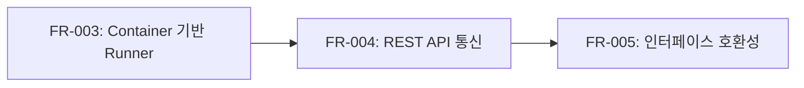

# Runner Docker 구현 명세서 - Phase 2: 통신 구현

본 문서는 Runner Docker 구현의 Phase 2 단계에 대한 세부 구현 명세서입니다.

---

## 목차

1. [개요](#1-개요)
2. [FR-004: OpenCode Server REST API 통신](#2-fr-004-opencode-server-rest-api-통신)
3. [FR-005: 기존 인터페이스 호환성 유지](#3-fr-005-기존-인터페이스-호환성-유지)
4. [구현 체크리스트](#4-구현-체크리스트)

---

## 1. 개요

### 1.1 Phase 2 목표

Phase 2의 목표는 Container 내 OpenCode Server와의 통신을 구현하는 것입니다:

- OpenCode Server REST API 프로토콜 구현
- HTTP 클라이언트를 통한 요청/응답 처리
- 기존 `TaskRunner` 인터페이스와의 호환성 유지

### 1.2 의존성 관계



### 1.3 예상 파일 변경

| 작업 유형 | 파일 경로                         | 설명                         |
| --------- | --------------------------------- | ---------------------------- |
| 신규      | `internal/runner/api.go`          | OpenCode REST API 클라이언트 |
| 신규      | `internal/runner/api_types.go`    | API 요청/응답 타입 정의      |
| 수정      | `internal/runner/runner.go`       | Run() 메서드 완성            |
| 수정      | `internal/controller/executor.go` | 새 Runner API 연동           |
| 신규      | `internal/runner/api_test.go`     | API 테스트                   |

---

## 2. FR-004: OpenCode Server REST API 통신

### 2.1 요구사항 요약

OpenCode Server의 REST API를 사용하여 Container와 통신합니다.

### 2.2 OpenCode Server REST API 분석

OpenCode Server는 다음과 같은 REST API 엔드포인트를 제공합니다:

| 엔드포인트           | 메서드 | 설명                     |
| -------------------- | ------ | ------------------------ |
| `/health`            | GET    | 서버 상태 확인           |
| `/api/sessions`      | POST   | 새 세션 생성             |
| `/api/sessions/{id}` | GET    | 세션 조회                |
| `/api/sessions/{id}` | DELETE | 세션 종료                |
| `/api/chat`          | POST   | 메시지 전송 및 응답 수신 |
| `/api/chat/stream`   | POST   | 스트리밍 응답 (SSE)      |

### 2.3 API 타입 정의

```go
// internal/runner/api_types.go

package taskrunner

import "time"

// ======================================
// Health Check
// ======================================

// HealthResponse는 /health 응답입니다.
type HealthResponse struct {
    Status  string `json:"status"`  // "ok" 또는 "error"
    Version string `json:"version"` // OpenCode 버전
}

// ======================================
// Session Management
// ======================================

// CreateSessionRequest는 /api/sessions POST 요청입니다.
type CreateSessionRequest struct {
    Model        string `json:"model,omitempty"`         // AI 모델 (선택)
    SystemPrompt string `json:"system_prompt,omitempty"` // 시스템 프롬프트 (선택)
}

// Session은 OpenCode 세션 정보입니다.
type Session struct {
    ID        string    `json:"id"`
    Model     string    `json:"model"`
    CreatedAt time.Time `json:"created_at"`
    Status    string    `json:"status"` // "active", "idle", "closed"
}

// CreateSessionResponse는 /api/sessions POST 응답입니다.
type CreateSessionResponse struct {
    Session Session `json:"session"`
}

// ======================================
// Chat API
// ======================================

// ChatRequest는 /api/chat POST 요청입니다.
type ChatRequest struct {
    SessionID string        `json:"session_id,omitempty"` // 세션 ID (선택, 없으면 임시 세션)
    Model     string        `json:"model,omitempty"`      // AI 모델 (선택)
    Messages  []ChatMessage `json:"messages"`             // 대화 메시지
    Stream    bool          `json:"stream,omitempty"`     // 스트리밍 여부
}

// ChatResponse는 /api/chat POST 응답입니다.
type ChatResponse struct {
    ID       string `json:"id"`       // 응답 ID
    Model    string `json:"model"`    // 사용된 모델
    Response struct {
        Role    string `json:"role"`    // "assistant"
        Content string `json:"content"` // 응답 내용
    } `json:"response"`
    Usage struct {
        PromptTokens     int `json:"prompt_tokens"`
        CompletionTokens int `json:"completion_tokens"`
        TotalTokens      int `json:"total_tokens"`
    } `json:"usage"`
    FinishReason string `json:"finish_reason"` // "stop", "length", "tool_use"
}

// ChatStreamEvent는 스트리밍 응답의 개별 이벤트입니다.
type ChatStreamEvent struct {
    Event string `json:"event"` // "message", "done", "error"
    Data  struct {
        Content      string `json:"content,omitempty"`       // 부분 응답
        FinishReason string `json:"finish_reason,omitempty"` // 완료 시
        Error        string `json:"error,omitempty"`         // 에러 시
    } `json:"data"`
}

// ======================================
// Error Response
// ======================================

// APIError는 API 에러 응답입니다.
type APIError struct {
    Error struct {
        Type    string `json:"type"`    // 에러 타입
        Message string `json:"message"` // 에러 메시지
        Code    string `json:"code"`    // 에러 코드
    } `json:"error"`
}

func (e *APIError) String() string {
    return e.Error.Type + ": " + e.Error.Message
}
```

### 2.4 OpenCode API 클라이언트 구현

```go
// internal/runner/api.go

package taskrunner

import (
    "bufio"
    "bytes"
    "context"
    "encoding/json"
    "fmt"
    "io"
    "net/http"
    "strings"
    "time"

    "go.uber.org/zap"
)

// OpenCodeClient는 OpenCode Server REST API 클라이언트입니다.
type OpenCodeClient struct {
    baseURL    string
    httpClient *http.Client
    logger     *zap.Logger
}

// OpenCodeClientOption은 OpenCodeClient 옵션입니다.
type OpenCodeClientOption func(*OpenCodeClient)

// WithOpenCodeHTTPClient는 HTTP 클라이언트를 설정합니다.
func WithOpenCodeHTTPClient(client *http.Client) OpenCodeClientOption {
    return func(c *OpenCodeClient) {
        c.httpClient = client
    }
}

// WithOpenCodeLogger는 로거를 설정합니다.
func WithOpenCodeLogger(logger *zap.Logger) OpenCodeClientOption {
    return func(c *OpenCodeClient) {
        c.logger = logger
    }
}

// NewOpenCodeClient는 새 OpenCode API 클라이언트를 생성합니다.
func NewOpenCodeClient(baseURL string, opts ...OpenCodeClientOption) *OpenCodeClient {
    c := &OpenCodeClient{
        baseURL: strings.TrimSuffix(baseURL, "/"),
        httpClient: &http.Client{
            Timeout: 120 * time.Second,
        },
        logger: zap.NewNop(),
    }

    for _, opt := range opts {
        opt(c)
    }

    return c
}

// ======================================
// Health Check
// ======================================

// Health는 서버 상태를 확인합니다.
func (c *OpenCodeClient) Health(ctx context.Context) (*HealthResponse, error) {
    resp, err := c.doRequest(ctx, http.MethodGet, "/health", nil)
    if err != nil {
        return nil, err
    }
    defer resp.Body.Close()

    var result HealthResponse
    if err := json.NewDecoder(resp.Body).Decode(&result); err != nil {
        return nil, fmt.Errorf("응답 파싱 실패: %w", err)
    }

    return &result, nil
}

// ======================================
// Session Management
// ======================================

// CreateSession은 새 세션을 생성합니다.
func (c *OpenCodeClient) CreateSession(ctx context.Context, req *CreateSessionRequest) (*Session, error) {
    resp, err := c.doRequest(ctx, http.MethodPost, "/api/sessions", req)
    if err != nil {
        return nil, err
    }
    defer resp.Body.Close()

    var result CreateSessionResponse
    if err := json.NewDecoder(resp.Body).Decode(&result); err != nil {
        return nil, fmt.Errorf("응답 파싱 실패: %w", err)
    }

    return &result.Session, nil
}

// GetSession은 세션 정보를 조회합니다.
func (c *OpenCodeClient) GetSession(ctx context.Context, sessionID string) (*Session, error) {
    resp, err := c.doRequest(ctx, http.MethodGet, "/api/sessions/"+sessionID, nil)
    if err != nil {
        return nil, err
    }
    defer resp.Body.Close()

    var result Session
    if err := json.NewDecoder(resp.Body).Decode(&result); err != nil {
        return nil, fmt.Errorf("응답 파싱 실패: %w", err)
    }

    return &result, nil
}

// DeleteSession은 세션을 종료합니다.
func (c *OpenCodeClient) DeleteSession(ctx context.Context, sessionID string) error {
    resp, err := c.doRequest(ctx, http.MethodDelete, "/api/sessions/"+sessionID, nil)
    if err != nil {
        return err
    }
    defer resp.Body.Close()

    return nil
}

// ======================================
// Chat API
// ======================================

// Chat은 메시지를 전송하고 응답을 수신합니다.
func (c *OpenCodeClient) Chat(ctx context.Context, req *ChatRequest) (*ChatResponse, error) {
    req.Stream = false // 스트리밍 비활성화

    resp, err := c.doRequest(ctx, http.MethodPost, "/api/chat", req)
    if err != nil {
        return nil, err
    }
    defer resp.Body.Close()

    var result ChatResponse
    if err := json.NewDecoder(resp.Body).Decode(&result); err != nil {
        return nil, fmt.Errorf("응답 파싱 실패: %w", err)
    }

    return &result, nil
}

// ChatStreamHandler는 스트리밍 이벤트 핸들러입니다.
type ChatStreamHandler func(event *ChatStreamEvent) error

// ChatStream은 스트리밍 모드로 메시지를 전송합니다.
func (c *OpenCodeClient) ChatStream(ctx context.Context, req *ChatRequest, handler ChatStreamHandler) error {
    req.Stream = true

    httpReq, err := c.buildRequest(ctx, http.MethodPost, "/api/chat/stream", req)
    if err != nil {
        return err
    }
    httpReq.Header.Set("Accept", "text/event-stream")

    resp, err := c.httpClient.Do(httpReq)
    if err != nil {
        return fmt.Errorf("요청 실패: %w", err)
    }
    defer resp.Body.Close()

    if resp.StatusCode != http.StatusOK {
        return c.handleErrorResponse(resp)
    }

    // SSE 파싱
    reader := bufio.NewReader(resp.Body)
    for {
        select {
        case <-ctx.Done():
            return ctx.Err()
        default:
        }

        line, err := reader.ReadString('\n')
        if err != nil {
            if err == io.EOF {
                return nil
            }
            return fmt.Errorf("스트림 읽기 실패: %w", err)
        }

        line = strings.TrimSpace(line)
        if line == "" || strings.HasPrefix(line, ":") {
            continue // 빈 줄 또는 주석
        }

        if strings.HasPrefix(line, "data: ") {
            data := strings.TrimPrefix(line, "data: ")
            if data == "[DONE]" {
                return nil
            }

            var event ChatStreamEvent
            if err := json.Unmarshal([]byte(data), &event); err != nil {
                c.logger.Warn("스트림 이벤트 파싱 실패",
                    zap.String("data", data),
                    zap.Error(err),
                )
                continue
            }

            if err := handler(&event); err != nil {
                return err
            }

            if event.Event == "done" || event.Event == "error" {
                return nil
            }
        }
    }
}

// ======================================
// Internal Methods
// ======================================

// doRequest는 HTTP 요청을 수행합니다.
func (c *OpenCodeClient) doRequest(ctx context.Context, method, path string, body interface{}) (*http.Response, error) {
    req, err := c.buildRequest(ctx, method, path, body)
    if err != nil {
        return nil, err
    }

    resp, err := c.httpClient.Do(req)
    if err != nil {
        return nil, fmt.Errorf("요청 실패: %w", err)
    }

    if resp.StatusCode >= 400 {
        defer resp.Body.Close()
        return nil, c.handleErrorResponse(resp)
    }

    return resp, nil
}

// buildRequest는 HTTP 요청을 구성합니다.
func (c *OpenCodeClient) buildRequest(ctx context.Context, method, path string, body interface{}) (*http.Request, error) {
    url := c.baseURL + path

    var bodyReader io.Reader
    if body != nil {
        bodyBytes, err := json.Marshal(body)
        if err != nil {
            return nil, fmt.Errorf("요청 바디 직렬화 실패: %w", err)
        }
        bodyReader = bytes.NewReader(bodyBytes)
    }

    req, err := http.NewRequestWithContext(ctx, method, url, bodyReader)
    if err != nil {
        return nil, fmt.Errorf("요청 생성 실패: %w", err)
    }

    req.Header.Set("Content-Type", "application/json")

    return req, nil
}

// handleErrorResponse는 에러 응답을 처리합니다.
func (c *OpenCodeClient) handleErrorResponse(resp *http.Response) error {
    body, _ := io.ReadAll(resp.Body)

    var apiErr APIError
    if err := json.Unmarshal(body, &apiErr); err == nil && apiErr.Error.Message != "" {
        return fmt.Errorf("API 에러 [%d]: %s", resp.StatusCode, apiErr.String())
    }

    return fmt.Errorf("HTTP 에러 [%d]: %s", resp.StatusCode, string(body))
}
```

### 2.5 Runner Run 메서드 완성

```go
// internal/runner/runner.go (Run 메서드 업데이트)

// Run implements TaskRunner interface.
func (r *Runner) Run(ctx context.Context, req *RunRequest) (*RunResult, error) {
    if r.Status != RunnerStatusReady {
        return nil, fmt.Errorf("runner가 준비되지 않음 (status: %s)", r.Status)
    }

    r.Status = RunnerStatusRunning
    defer func() {
        r.Status = RunnerStatusReady
    }()

    r.logger.Info("Runner executing task",
        zap.String("runner_id", r.ID),
        zap.String("task_id", req.TaskID),
        zap.Int("message_count", len(req.Messages)),
    )

    // OpenCode API 클라이언트 생성
    apiClient := NewOpenCodeClient(
        r.BaseURL,
        WithOpenCodeHTTPClient(r.httpClient),
        WithOpenCodeLogger(r.logger),
    )

    // 시스템 프롬프트와 메시지 결합
    messages := r.buildMessages(req)

    // 콜백이 있으면 스트리밍 모드 사용
    if req.Callback != nil {
        return r.runWithStreaming(ctx, apiClient, req, messages)
    }

    // 일반 모드
    return r.runSync(ctx, apiClient, req, messages)
}

// buildMessages는 요청 메시지를 구성합니다.
func (r *Runner) buildMessages(req *RunRequest) []ChatMessage {
    messages := make([]ChatMessage, 0, len(req.Messages)+1)

    // 시스템 프롬프트 추가
    if req.SystemPrompt != "" {
        messages = append(messages, ChatMessage{
            Role:    "system",
            Content: req.SystemPrompt,
        })
    }

    // 기존 메시지 추가
    messages = append(messages, req.Messages...)

    return messages
}

// runSync는 동기 모드로 실행합니다.
func (r *Runner) runSync(ctx context.Context, client *OpenCodeClient, req *RunRequest, messages []ChatMessage) (*RunResult, error) {
    chatReq := &ChatRequest{
        Model:    req.Model,
        Messages: messages,
        Stream:   false,
    }

    resp, err := client.Chat(ctx, chatReq)
    if err != nil {
        return nil, fmt.Errorf("chat API 호출 실패: %w", err)
    }

    return &RunResult{
        Agent:   resp.Model,
        Name:    req.TaskID,
        Success: true,
        Output:  resp.Response.Content,
        Error:   nil,
    }, nil
}

// runWithStreaming는 스트리밍 모드로 실행합니다.
func (r *Runner) runWithStreaming(ctx context.Context, client *OpenCodeClient, req *RunRequest, messages []ChatMessage) (*RunResult, error) {
    chatReq := &ChatRequest{
        Model:    req.Model,
        Messages: messages,
        Stream:   true,
    }

    var fullContent strings.Builder
    var lastModel string

    handler := func(event *ChatStreamEvent) error {
        switch event.Event {
        case "message":
            // 부분 응답 처리
            if event.Data.Content != "" {
                fullContent.WriteString(event.Data.Content)

                // 콜백으로 중간 응답 전달
                if err := req.Callback.OnMessage(req.TaskID, event.Data.Content); err != nil {
                    r.logger.Warn("콜백 전달 실패",
                        zap.String("task_id", req.TaskID),
                        zap.Error(err),
                    )
                }
            }
        case "done":
            // 완료 처리
            r.logger.Debug("스트리밍 완료",
                zap.String("task_id", req.TaskID),
                zap.String("finish_reason", event.Data.FinishReason),
            )
        case "error":
            return fmt.Errorf("스트리밍 에러: %s", event.Data.Error)
        }
        return nil
    }

    err := client.ChatStream(ctx, chatReq, handler)
    if err != nil {
        // 에러 콜백
        if req.Callback != nil {
            _ = req.Callback.OnError(req.TaskID, err)
        }
        return nil, fmt.Errorf("chat stream 실패: %w", err)
    }

    result := &RunResult{
        Agent:   lastModel,
        Name:    req.TaskID,
        Success: true,
        Output:  fullContent.String(),
        Error:   nil,
    }

    // 완료 콜백
    if req.Callback != nil {
        if err := req.Callback.OnComplete(req.TaskID, result); err != nil {
            r.logger.Warn("완료 콜백 실패",
                zap.String("task_id", req.TaskID),
                zap.Error(err),
            )
        }
    }

    return result, nil
}
```

### 2.6 커밋 포인트

```
feat(runner): FR-004 OpenCode Server REST API 통신 구현

- OpenCodeClient 구현 (Health, Session, Chat API)
- ChatStream SSE 스트리밍 지원
- Runner.Run() 메서드 완성
- 동기/스트리밍 모드 지원

Refs: FR-004
```

---

## 3. FR-005: 기존 인터페이스 호환성 유지

### 3.1 요구사항 요약

기존 `TaskRunner` 인터페이스와 `StatusCallback` 인터페이스를 유지하여 Controller 코드 변경을 최소화합니다.

### 3.2 인터페이스 매핑

#### 3.2.1 TaskRunner 인터페이스 (변경 없음)

```go
// 기존 인터페이스 유지
type TaskRunner interface {
    Run(ctx context.Context, req *RunRequest) (*RunResult, error)
}

// Runner가 TaskRunner 구현
var _ TaskRunner = (*Runner)(nil)
```

#### 3.2.2 StatusCallback 인터페이스 (변경 없음)

```go
// 기존 인터페이스 유지
type StatusCallback interface {
    OnStatusChange(taskID string, status string) error
    OnMessage(taskID string, message string) error
    OnComplete(taskID string, result *RunResult) error
    OnError(taskID string, err error) error
}
```

### 3.3 Controller executor.go 수정

```go
// internal/controller/executor.go

// 변경 전
func (c *Controller) executeTask(ctx context.Context, taskID string, task *storage.Task) {
    // ...
    runner := c.runnerManager.GetRunner(taskID)
    if runner == nil {
        // Runner가 없으면 자동으로 재생성
        agentInfo := taskrunner.AgentInfo{
            AgentID:  agent.AgentID,
            Provider: agent.Provider,
            Model:    agent.Model,
            Prompt:   agent.Prompt,
        }
        runner = c.runnerManager.CreateRunner(taskID, agentInfo, c.logger)
    }
    // ...
}

// 변경 후
func (c *Controller) executeTask(ctx context.Context, taskID string, task *storage.Task) {
    // ...
    runner := c.runnerManager.GetRunner(taskID)
    if runner == nil {
        // Runner가 없으면 자동으로 재생성
        agentInfo := taskrunner.AgentInfo{
            AgentID:       agent.AgentID,
            Provider:      agent.Provider,
            Model:         agent.Model,
            Prompt:        agent.Prompt,
            WorkspacePath: fmt.Sprintf("./data/workspace/%s", agent.AgentID),
        }

        var err error
        runner, err = c.runnerManager.CreateRunner(ctx, taskID, agentInfo)
        if err != nil {
            c.logger.Error("Runner 생성 실패", zap.Error(err))
            _ = c.repo.UpsertTaskStatus(ctx, taskID, task.AgentID, storage.TaskStatusFailed)
            return
        }

        // Container 시작
        if err := c.runnerManager.StartRunner(ctx, taskID); err != nil {
            c.logger.Error("Runner 시작 실패", zap.Error(err))
            _ = c.repo.UpsertTaskStatus(ctx, taskID, task.AgentID, storage.TaskStatusFailed)
            return
        }
    }
    // ...

    // 기존 Run() 호출은 동일하게 유지
    result, err := runner.Run(ctx, req)
    // ...
}
```

### 3.4 RunnerManager API 변경 (호환성 레이어)

```go
// internal/runner/manager.go

// 호환성을 위한 레거시 메서드 (deprecated)
// Deprecated: CreateRunnerLegacy는 이전 버전과의 호환성을 위해 유지됩니다.
// 새 코드에서는 CreateRunner(ctx, taskID, agentInfo)를 사용하세요.
func (rm *RunnerManager) CreateRunnerLegacy(taskID string, agentInfo AgentInfo, logger *zap.Logger, opts ...RunnerOption) *Runner {
    ctx := context.Background()

    runner, err := rm.CreateRunner(ctx, taskID, agentInfo)
    if err != nil {
        rm.logger.Error("Runner 생성 실패", zap.Error(err))
        return nil
    }

    if err := runner.Start(ctx); err != nil {
        rm.logger.Error("Runner 시작 실패", zap.Error(err))
        return nil
    }

    return runner
}

// DeleteRunner 호환성 래퍼
// 기존: DeleteRunner(taskID string) *Runner
// 신규: DeleteRunner(ctx context.Context, taskID string) error
func (rm *RunnerManager) DeleteRunnerSync(taskID string) *Runner {
    ctx := context.Background()
    runner := rm.GetRunner(taskID)

    if err := rm.DeleteRunner(ctx, taskID); err != nil {
        rm.logger.Warn("Runner 삭제 중 오류", zap.Error(err))
    }

    return runner
}
```

### 3.5 마이그레이션 가이드

#### 3.5.1 Controller 코드 변경 최소화

기존 executor.go의 호출 패턴을 최대한 유지하면서 필요한 변경만 수행합니다:

```go
// 변경 전 (기존 패턴)
runner := c.runnerManager.GetRunner(taskID)
if runner == nil {
    runner = c.runnerManager.CreateRunner(taskID, agentInfo, c.logger)
}
result, err := runner.Run(ctx, req)

// 변경 후 (새 패턴 - 최소 변경)
runner := c.runnerManager.GetRunner(taskID)
if runner == nil {
    runner, err = c.runnerManager.CreateRunner(ctx, taskID, agentInfo)
    if err != nil {
        // 에러 처리
        return
    }
    if err := c.runnerManager.StartRunner(ctx, taskID); err != nil {
        // 에러 처리
        return
    }
}
result, err := runner.Run(ctx, req) // 이 부분은 동일
```

#### 3.5.2 신규 API 사용 권장

| 기존 API                                  | 신규 API                               | 비고           |
| ----------------------------------------- | -------------------------------------- | -------------- |
| `CreateRunner(taskID, agentInfo, logger)` | `CreateRunner(ctx, taskID, agentInfo)` | Context 추가   |
| `DeleteRunner(taskID) *Runner`            | `DeleteRunner(ctx, taskID) error`      | 반환 타입 변경 |
| -                                         | `StartRunner(ctx, taskID)`             | 신규 메서드    |

### 3.6 커밋 포인트

```
feat(runner): FR-005 기존 인터페이스 호환성 유지

- TaskRunner, StatusCallback 인터페이스 유지
- RunnerManager 호환성 래퍼 메서드 추가
- executor.go 최소 변경으로 새 Runner 연동
- 마이그레이션 가이드 문서화

Refs: FR-005
```

---

## 4. 구현 체크리스트

### 4.1 Phase 2 구현 순서

| 순서 | 작업                | 파일                              | 커밋 메시지                                         |
| ---- | ------------------- | --------------------------------- | --------------------------------------------------- |
| 1    | API 타입 정의       | `internal/runner/api_types.go`    | `feat(runner): OpenCode API 타입 정의`              |
| 2    | API 클라이언트 구현 | `internal/runner/api.go`          | `feat(runner): FR-004 OpenCode REST API 클라이언트` |
| 3    | Runner Run 메서드   | `internal/runner/runner.go`       | `feat(runner): Run() 메서드 완성`                   |
| 4    | 호환성 래퍼         | `internal/runner/manager.go`      | `feat(runner): FR-005 호환성 레이어 추가`           |
| 5    | Controller 연동     | `internal/controller/executor.go` | `refactor(controller): 새 Runner API 연동`          |
| 6    | API 테스트          | `internal/runner/api_test.go`     | `test(runner): OpenCode API 테스트`                 |

### 4.2 테스트 전략

#### 4.2.1 API 클라이언트 단위 테스트

```go
// internal/runner/api_test.go

package taskrunner

import (
    "context"
    "encoding/json"
    "net/http"
    "net/http/httptest"
    "testing"

    "github.com/stretchr/testify/assert"
    "github.com/stretchr/testify/require"
)

func TestOpenCodeClient_Health(t *testing.T) {
    server := httptest.NewServer(http.HandlerFunc(func(w http.ResponseWriter, r *http.Request) {
        assert.Equal(t, "/health", r.URL.Path)
        assert.Equal(t, http.MethodGet, r.Method)

        resp := HealthResponse{
            Status:  "ok",
            Version: "1.0.0",
        }
        json.NewEncoder(w).Encode(resp)
    }))
    defer server.Close()

    client := NewOpenCodeClient(server.URL)
    resp, err := client.Health(context.Background())

    require.NoError(t, err)
    assert.Equal(t, "ok", resp.Status)
    assert.Equal(t, "1.0.0", resp.Version)
}

func TestOpenCodeClient_Chat(t *testing.T) {
    server := httptest.NewServer(http.HandlerFunc(func(w http.ResponseWriter, r *http.Request) {
        assert.Equal(t, "/api/chat", r.URL.Path)
        assert.Equal(t, http.MethodPost, r.Method)

        var req ChatRequest
        err := json.NewDecoder(r.Body).Decode(&req)
        require.NoError(t, err)
        assert.Equal(t, "gpt-4", req.Model)
        assert.Len(t, req.Messages, 1)

        resp := ChatResponse{
            ID:    "resp-123",
            Model: "gpt-4",
        }
        resp.Response.Role = "assistant"
        resp.Response.Content = "Hello! How can I help you?"
        json.NewEncoder(w).Encode(resp)
    }))
    defer server.Close()

    client := NewOpenCodeClient(server.URL)
    resp, err := client.Chat(context.Background(), &ChatRequest{
        Model: "gpt-4",
        Messages: []ChatMessage{
            {Role: "user", Content: "Hello"},
        },
    })

    require.NoError(t, err)
    assert.Equal(t, "Hello! How can I help you?", resp.Response.Content)
}

func TestOpenCodeClient_ChatStream(t *testing.T) {
    server := httptest.NewServer(http.HandlerFunc(func(w http.ResponseWriter, r *http.Request) {
        assert.Equal(t, "/api/chat/stream", r.URL.Path)

        w.Header().Set("Content-Type", "text/event-stream")
        w.WriteHeader(http.StatusOK)

        events := []string{
            `data: {"event":"message","data":{"content":"Hello"}}`,
            `data: {"event":"message","data":{"content":" World"}}`,
            `data: {"event":"done","data":{"finish_reason":"stop"}}`,
        }

        for _, event := range events {
            w.Write([]byte(event + "\n\n"))
            w.(http.Flusher).Flush()
        }
    }))
    defer server.Close()

    client := NewOpenCodeClient(server.URL)
    var collected []string

    err := client.ChatStream(context.Background(), &ChatRequest{
        Model:    "gpt-4",
        Messages: []ChatMessage{{Role: "user", Content: "Hello"}},
    }, func(event *ChatStreamEvent) error {
        if event.Event == "message" {
            collected = append(collected, event.Data.Content)
        }
        return nil
    })

    require.NoError(t, err)
    assert.Equal(t, []string{"Hello", " World"}, collected)
}

func TestOpenCodeClient_ErrorHandling(t *testing.T) {
    server := httptest.NewServer(http.HandlerFunc(func(w http.ResponseWriter, r *http.Request) {
        w.WriteHeader(http.StatusBadRequest)
        json.NewEncoder(w).Encode(APIError{
            Error: struct {
                Type    string `json:"type"`
                Message string `json:"message"`
                Code    string `json:"code"`
            }{
                Type:    "invalid_request",
                Message: "Model not found",
                Code:    "model_not_found",
            },
        })
    }))
    defer server.Close()

    client := NewOpenCodeClient(server.URL)
    _, err := client.Chat(context.Background(), &ChatRequest{
        Model:    "invalid-model",
        Messages: []ChatMessage{{Role: "user", Content: "Hello"}},
    })

    require.Error(t, err)
    assert.Contains(t, err.Error(), "Model not found")
}
```

#### 4.2.2 Runner Run 메서드 테스트

```go
// internal/runner/runner_test.go (추가)

func TestRunner_Run_Sync(t *testing.T) {
    // Mock HTTP 서버 설정
    server := httptest.NewServer(http.HandlerFunc(func(w http.ResponseWriter, r *http.Request) {
        if r.URL.Path == "/health" {
            json.NewEncoder(w).Encode(HealthResponse{Status: "ok"})
            return
        }
        if r.URL.Path == "/api/chat" {
            resp := ChatResponse{}
            resp.Response.Content = "Test response"
            json.NewEncoder(w).Encode(resp)
            return
        }
    }))
    defer server.Close()

    // Mock Docker 클라이언트
    mockDocker := &MockDockerClient{}
    // ... mock 설정

    runner := &Runner{
        ID:            "test-task",
        Status:        RunnerStatusReady,
        BaseURL:       server.URL,
        httpClient:    &http.Client{Timeout: 10 * time.Second},
        logger:        zap.NewNop(),
    }

    result, err := runner.Run(context.Background(), &RunRequest{
        TaskID:   "test-task",
        Model:    "gpt-4",
        Messages: []ChatMessage{{Role: "user", Content: "Hello"}},
    })

    require.NoError(t, err)
    assert.True(t, result.Success)
    assert.Equal(t, "Test response", result.Output)
}
```

### 4.3 예상 파일 구조

```
internal/runner/
├── api.go             # 신규: OpenCode REST API 클라이언트
├── api_types.go       # 신규: API 요청/응답 타입
├── api_test.go        # 신규: API 테스트
├── config.go          # Phase 1: Runner 설정
├── docker.go          # Phase 1: Docker 클라이언트 인터페이스
├── docker_test.go     # Phase 1: Docker 단위 테스트
├── manager.go         # 수정: 호환성 레이어 추가
├── manager_test.go    # 수정: Manager 테스트 업데이트
├── runner.go          # 수정: Run() 메서드 완성
├── runner_test.go     # 수정: Runner 테스트 업데이트
└── runner_integration_test.go

internal/controller/
└── executor.go        # 수정: 새 Runner API 연동
```

---

## 다음 단계

Phase 2 완료 후 [Phase 3: 작업 공간 및 설정 관리](./runner-docker-implementation-phase3.md)로 진행합니다.

- FR-006: Workspace 관리
- FR-007: Container 설정 주입
