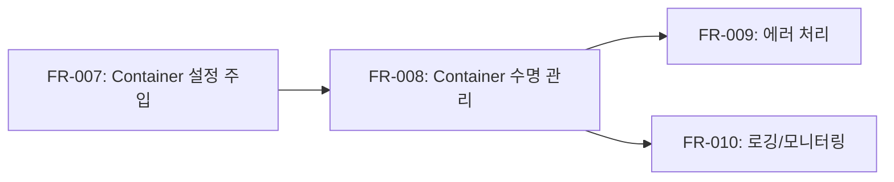

# Runner Docker 구현 명세서 - Phase 4a: Container 수명 관리

본 문서는 Runner Docker 구현의 Phase 4 단계 중 FR-008 Container 수명 관리에 대한 세부 구현 명세서입니다.

---

## 목차

1. [개요](#1-개요)
2. [FR-008: Container 수명 관리](#2-fr-008-container-수명-관리)
3. [구현 체크리스트](#3-구현-체크리스트)

---

## 1. 개요

### 1.1 Phase 4a 목표

Phase 4a의 목표는 Container의 수명을 Task 수명과 연결하여 관리하는 것입니다:

- Task 생성/완료 시 Container 생성/종료
- Container 타임아웃 처리
- 유휴 Container 정리

### 1.2 의존성 관계



### 1.3 예상 파일 변경

| 작업 유형 | 파일 경로                           | 설명                  |
| --------- | ----------------------------------- | --------------------- |
| 신규      | `internal/runner/lifecycle.go`      | Container 수명 관리자 |
| 수정      | `internal/runner/manager.go`        | 수명 관리 통합        |
| 수정      | `internal/runner/runner.go`         | 수명 상태 추적        |
| 신규      | `internal/runner/lifecycle_test.go` | 수명 관리 테스트      |

---

## 2. FR-008: Container 수명 관리

### 2.1 요구사항 요약

Container의 수명을 Task 수명과 연결하여 관리합니다.

### 2.2 Container 상태 매핑

| Task 상태 | Container 상태 | Container 동작       |
| --------- | -------------- | -------------------- |
| pending   | 생성 대기      | 생성하지 않음        |
| running   | running        | 생성 및 실행         |
| waiting   | running (유휴) | 유지 (타임아웃 적용) |
| completed | 종료됨         | 중지 및 삭제         |
| failed    | 종료됨/에러    | 중지 및 삭제         |
| canceled  | 종료됨         | 강제 중지 및 삭제    |

### 2.3 수명 관리자 인터페이스

```go
// internal/runner/lifecycle.go

package taskrunner

import (
    "context"
    "sync"
    "time"

    "go.uber.org/zap"
)

// LifecycleManager는 Container 수명을 관리합니다.
type LifecycleManager interface {
    // Start는 수명 관리자를 시작합니다.
    Start(ctx context.Context) error

    // Stop은 수명 관리자를 중지합니다.
    Stop(ctx context.Context) error

    // RegisterRunner는 Runner를 수명 관리 대상으로 등록합니다.
    RegisterRunner(runner *Runner) error

    // UnregisterRunner는 Runner를 수명 관리 대상에서 제거합니다.
    UnregisterRunner(runnerID string) error

    // NotifyActivity는 Runner의 활동을 알립니다.
    NotifyActivity(runnerID string)

    // GetRunnerStats는 Runner 상태 통계를 반환합니다.
    GetRunnerStats() *LifecycleStats
}

// LifecycleConfig는 수명 관리 설정입니다.
type LifecycleConfig struct {
    // 유휴 타임아웃: 이 시간 동안 활동이 없으면 Container 종료
    IdleTimeout time.Duration

    // 최대 실행 시간: Container 최대 실행 시간
    MaxRuntime time.Duration

    // 정리 주기: 유휴 Container 검사 주기
    CleanupInterval time.Duration

    // 최대 동시 Container 수
    MaxConcurrentContainers int

    // Graceful shutdown 타임아웃
    ShutdownTimeout time.Duration
}

// DefaultLifecycleConfig는 기본 수명 관리 설정을 반환합니다.
func DefaultLifecycleConfig() LifecycleConfig {
    return LifecycleConfig{
        IdleTimeout:             getEnvOrDefaultDuration("RUNNER_IDLE_TIMEOUT", 5*time.Minute),
        MaxRuntime:              getEnvOrDefaultDuration("RUNNER_MAX_RUNTIME", 30*time.Minute),
        CleanupInterval:         getEnvOrDefaultDuration("RUNNER_CLEANUP_INTERVAL", 1*time.Minute),
        MaxConcurrentContainers: getEnvOrDefaultInt("RUNNER_MAX_CONTAINERS", 10),
        ShutdownTimeout:         getEnvOrDefaultDuration("RUNNER_SHUTDOWN_TIMEOUT", 30*time.Second),
    }
}

// LifecycleStats는 수명 관리 통계입니다.
type LifecycleStats struct {
    TotalRunners     int
    ActiveRunners    int
    IdleRunners      int
    StoppedRunners   int
    TerminatedByIdle int64
    TerminatedByMax  int64
}

// runnerState는 Runner의 수명 상태를 추적합니다.
type runnerState struct {
    Runner        *Runner
    StartTime     time.Time
    LastActivity  time.Time
    IsIdle        bool
}

// lifecycleManager는 LifecycleManager 구현체입니다.
type lifecycleManager struct {
    config   LifecycleConfig
    runners  map[string]*runnerState
    mu       sync.RWMutex
    logger   *zap.Logger

    // 통계
    terminatedByIdle int64
    terminatedByMax  int64

    // 정리 루프 제어
    stopChan chan struct{}
    wg       sync.WaitGroup
}

// NewLifecycleManager는 새 LifecycleManager를 생성합니다.
func NewLifecycleManager(logger *zap.Logger, config ...LifecycleConfig) LifecycleManager {
    cfg := DefaultLifecycleConfig()
    if len(config) > 0 {
        cfg = config[0]
    }

    if logger == nil {
        logger = zap.NewNop()
    }

    return &lifecycleManager{
        config:   cfg,
        runners:  make(map[string]*runnerState),
        logger:   logger,
        stopChan: make(chan struct{}),
    }
}
```

### 2.4 수명 관리자 구현

```go
// internal/runner/lifecycle.go (계속)

// Start implements LifecycleManager.
func (lm *lifecycleManager) Start(ctx context.Context) error {
    lm.logger.Info("수명 관리자 시작",
        zap.Duration("idle_timeout", lm.config.IdleTimeout),
        zap.Duration("max_runtime", lm.config.MaxRuntime),
        zap.Duration("cleanup_interval", lm.config.CleanupInterval),
    )

    // 정리 루프 시작
    lm.wg.Add(1)
    go lm.cleanupLoop(ctx)

    return nil
}

// Stop implements LifecycleManager.
func (lm *lifecycleManager) Stop(ctx context.Context) error {
    lm.logger.Info("수명 관리자 중지 시작")

    // 정리 루프 중지
    close(lm.stopChan)

    // 대기 (타임아웃 적용)
    done := make(chan struct{})
    go func() {
        lm.wg.Wait()
        close(done)
    }()

    select {
    case <-done:
        lm.logger.Info("수명 관리자 정상 중지됨")
    case <-time.After(lm.config.ShutdownTimeout):
        lm.logger.Warn("수명 관리자 중지 타임아웃")
    case <-ctx.Done():
        lm.logger.Warn("수명 관리자 중지 컨텍스트 취소됨")
    }

    // 모든 Runner 정리
    return lm.cleanupAllRunners(ctx)
}

// RegisterRunner implements LifecycleManager.
func (lm *lifecycleManager) RegisterRunner(runner *Runner) error {
    lm.mu.Lock()
    defer lm.mu.Unlock()

    // 최대 Container 수 확인
    activeCount := lm.countActiveRunnersLocked()
    if activeCount >= lm.config.MaxConcurrentContainers {
        return fmt.Errorf("최대 동시 Container 수 초과 (%d/%d)",
            activeCount, lm.config.MaxConcurrentContainers)
    }

    now := time.Now()
    lm.runners[runner.ID] = &runnerState{
        Runner:       runner,
        StartTime:    now,
        LastActivity: now,
        IsIdle:       false,
    }

    lm.logger.Info("Runner 등록됨",
        zap.String("runner_id", runner.ID),
        zap.Int("total_runners", len(lm.runners)),
    )

    return nil
}

// UnregisterRunner implements LifecycleManager.
func (lm *lifecycleManager) UnregisterRunner(runnerID string) error {
    lm.mu.Lock()
    defer lm.mu.Unlock()

    if _, exists := lm.runners[runnerID]; !exists {
        return fmt.Errorf("runner를 찾을 수 없음: %s", runnerID)
    }

    delete(lm.runners, runnerID)

    lm.logger.Info("Runner 등록 해제됨",
        zap.String("runner_id", runnerID),
        zap.Int("remaining_runners", len(lm.runners)),
    )

    return nil
}

// NotifyActivity implements LifecycleManager.
func (lm *lifecycleManager) NotifyActivity(runnerID string) {
    lm.mu.Lock()
    defer lm.mu.Unlock()

    if state, exists := lm.runners[runnerID]; exists {
        state.LastActivity = time.Now()
        state.IsIdle = false
    }
}

// GetRunnerStats implements LifecycleManager.
func (lm *lifecycleManager) GetRunnerStats() *LifecycleStats {
    lm.mu.RLock()
    defer lm.mu.RUnlock()

    stats := &LifecycleStats{
        TotalRunners:     len(lm.runners),
        TerminatedByIdle: lm.terminatedByIdle,
        TerminatedByMax:  lm.terminatedByMax,
    }

    for _, state := range lm.runners {
        switch state.Runner.Status {
        case RunnerStatusReady, RunnerStatusRunning:
            if state.IsIdle {
                stats.IdleRunners++
            } else {
                stats.ActiveRunners++
            }
        case RunnerStatusStopped, RunnerStatusFailed:
            stats.StoppedRunners++
        }
    }

    return stats
}

// cleanupLoop는 주기적으로 유휴 Container를 정리합니다.
func (lm *lifecycleManager) cleanupLoop(ctx context.Context) {
    defer lm.wg.Done()

    ticker := time.NewTicker(lm.config.CleanupInterval)
    defer ticker.Stop()

    for {
        select {
        case <-ticker.C:
            lm.performCleanup(ctx)
        case <-lm.stopChan:
            return
        case <-ctx.Done():
            return
        }
    }
}

// performCleanup은 유휴 및 만료된 Container를 정리합니다.
func (lm *lifecycleManager) performCleanup(ctx context.Context) {
    lm.mu.Lock()
    now := time.Now()
    runnersToCleanup := make([]*Runner, 0)

    for id, state := range lm.runners {
        // 유휴 타임아웃 확인
        idleDuration := now.Sub(state.LastActivity)
        if idleDuration > lm.config.IdleTimeout {
            state.IsIdle = true

            // Ready 상태인 유휴 Runner만 정리
            if state.Runner.Status == RunnerStatusReady {
                lm.logger.Info("유휴 Runner 정리 예정",
                    zap.String("runner_id", id),
                    zap.Duration("idle_duration", idleDuration),
                )
                runnersToCleanup = append(runnersToCleanup, state.Runner)
                lm.terminatedByIdle++
            }
        }

        // 최대 실행 시간 확인
        runtime := now.Sub(state.StartTime)
        if runtime > lm.config.MaxRuntime {
            lm.logger.Warn("최대 실행 시간 초과 Runner 정리 예정",
                zap.String("runner_id", id),
                zap.Duration("runtime", runtime),
            )
            runnersToCleanup = append(runnersToCleanup, state.Runner)
            lm.terminatedByMax++
        }
    }
    lm.mu.Unlock()

    // Container 정리 (락 해제 후)
    for _, runner := range runnersToCleanup {
        if err := runner.Stop(ctx); err != nil {
            lm.logger.Warn("Runner 정리 중 오류",
                zap.String("runner_id", runner.ID),
                zap.Error(err),
            )
        }
        lm.UnregisterRunner(runner.ID)
    }
}

// cleanupAllRunners는 모든 Runner를 정리합니다.
func (lm *lifecycleManager) cleanupAllRunners(ctx context.Context) error {
    lm.mu.Lock()
    runners := make([]*Runner, 0, len(lm.runners))
    for _, state := range lm.runners {
        runners = append(runners, state.Runner)
    }
    lm.mu.Unlock()

    var lastErr error
    for _, runner := range runners {
        if err := runner.Stop(ctx); err != nil {
            lm.logger.Warn("Runner 정리 중 오류",
                zap.String("runner_id", runner.ID),
                zap.Error(err),
            )
            lastErr = err
        }
    }

    return lastErr
}

// countActiveRunnersLocked는 활성 Runner 수를 반환합니다. (락 보유 상태에서 호출)
func (lm *lifecycleManager) countActiveRunnersLocked() int {
    count := 0
    for _, state := range lm.runners {
        if state.Runner.Status == RunnerStatusReady ||
           state.Runner.Status == RunnerStatusRunning ||
           state.Runner.Status == RunnerStatusStarting {
            count++
        }
    }
    return count
}

// 인터페이스 구현 확인
var _ LifecycleManager = (*lifecycleManager)(nil)
```

### 2.5 RunnerManager와 통합

```go
// internal/runner/manager.go (수정)

// RunnerManager에 LifecycleManager 추가
type RunnerManager struct {
    runners          map[string]*Runner
    dockerClient     DockerClient
    workspaceManager WorkspaceManager
    settingsManager  SettingsManager
    lifecycleManager LifecycleManager  // 신규
    mu               sync.RWMutex
    config           RunnerConfig
    logger           *zap.Logger
}

// Start는 RunnerManager를 시작합니다.
func (rm *RunnerManager) Start(ctx context.Context) error {
    // 수명 관리자 시작
    if rm.lifecycleManager != nil {
        if err := rm.lifecycleManager.Start(ctx); err != nil {
            return fmt.Errorf("수명 관리자 시작 실패: %w", err)
        }
    }
    return nil
}

// Stop은 RunnerManager를 중지합니다.
func (rm *RunnerManager) Stop(ctx context.Context) error {
    // 수명 관리자 중지
    if rm.lifecycleManager != nil {
        if err := rm.lifecycleManager.Stop(ctx); err != nil {
            rm.logger.Warn("수명 관리자 중지 중 오류", zap.Error(err))
        }
    }

    // 모든 Runner 정리
    return rm.Cleanup(ctx)
}

// CreateRunner (수정)
func (rm *RunnerManager) CreateRunner(ctx context.Context, taskID string, agentInfo AgentInfo) (*Runner, error) {
    rm.mu.Lock()
    defer rm.mu.Unlock()

    // 기존 코드...

    runner, err := NewRunner(/* ... */)
    if err != nil {
        return nil, err
    }

    rm.runners[taskID] = runner

    // 수명 관리자에 등록
    if rm.lifecycleManager != nil {
        if err := rm.lifecycleManager.RegisterRunner(runner); err != nil {
            delete(rm.runners, taskID)
            return nil, fmt.Errorf("수명 관리자 등록 실패: %w", err)
        }
    }

    return runner, nil
}

// DeleteRunner (수정)
func (rm *RunnerManager) DeleteRunner(ctx context.Context, taskID string) error {
    rm.mu.Lock()
    defer rm.mu.Unlock()

    runner, exists := rm.runners[taskID]
    if !exists {
        return nil
    }

    // 수명 관리자에서 제거
    if rm.lifecycleManager != nil {
        _ = rm.lifecycleManager.UnregisterRunner(taskID)
    }

    if err := runner.Stop(ctx); err != nil {
        rm.logger.Warn("Runner 중지 중 오류", zap.Error(err))
    }

    delete(rm.runners, taskID)
    return nil
}

// NotifyRunnerActivity는 Runner 활동을 알립니다.
func (rm *RunnerManager) NotifyRunnerActivity(taskID string) {
    if rm.lifecycleManager != nil {
        rm.lifecycleManager.NotifyActivity(taskID)
    }
}

// GetStats는 Runner 통계를 반환합니다.
func (rm *RunnerManager) GetStats() *LifecycleStats {
    if rm.lifecycleManager != nil {
        return rm.lifecycleManager.GetRunnerStats()
    }
    return &LifecycleStats{
        TotalRunners: len(rm.runners),
    }
}
```

### 2.6 커밋 포인트

```
feat(runner): FR-008 Container 수명 관리 구현

- LifecycleManager 인터페이스 정의
- 유휴 타임아웃 및 최대 실행 시간 처리
- 주기적 정리 루프
- 최대 동시 Container 수 제한
- RunnerManager와 통합

Refs: FR-008
```

---

## 3. 구현 체크리스트

### 3.1 Phase 4a 구현 순서

| 순서 | 작업                  | 파일                                | 커밋 메시지                                  |
| ---- | --------------------- | ----------------------------------- | -------------------------------------------- |
| 1    | LifecycleManager 구현 | `internal/runner/lifecycle.go`      | `feat(runner): FR-008 LifecycleManager 구현` |
| 2    | RunnerManager 통합    | `internal/runner/manager.go`        | `refactor(runner): LifecycleManager 통합`    |
| 3    | Config 업데이트       | `internal/runner/config.go`         | `feat(runner): 수명 관리 설정 추가`          |
| 4    | Lifecycle 테스트      | `internal/runner/lifecycle_test.go` | `test(runner): 수명 관리 테스트`             |

### 3.2 테스트 전략

```go
// internal/runner/lifecycle_test.go

package taskrunner

import (
    "context"
    "testing"
    "time"

    "github.com/stretchr/testify/assert"
    "github.com/stretchr/testify/require"
    "go.uber.org/zap"
)

func TestLifecycleManager_RegisterUnregister(t *testing.T) {
    lm := NewLifecycleManager(zap.NewNop(), LifecycleConfig{
        MaxConcurrentContainers: 10,
    })

    runner := &Runner{ID: "test-runner", Status: RunnerStatusReady}

    err := lm.RegisterRunner(runner)
    require.NoError(t, err)

    stats := lm.GetRunnerStats()
    assert.Equal(t, 1, stats.TotalRunners)

    err = lm.UnregisterRunner("test-runner")
    require.NoError(t, err)

    stats = lm.GetRunnerStats()
    assert.Equal(t, 0, stats.TotalRunners)
}

func TestLifecycleManager_MaxContainers(t *testing.T) {
    lm := NewLifecycleManager(zap.NewNop(), LifecycleConfig{
        MaxConcurrentContainers: 2,
    })

    // 2개까지 등록 가능
    for i := 0; i < 2; i++ {
        runner := &Runner{ID: fmt.Sprintf("runner-%d", i), Status: RunnerStatusReady}
        err := lm.RegisterRunner(runner)
        require.NoError(t, err)
    }

    // 3번째는 실패
    runner := &Runner{ID: "runner-overflow", Status: RunnerStatusReady}
    err := lm.RegisterRunner(runner)
    require.Error(t, err)
    assert.Contains(t, err.Error(), "최대 동시 Container 수 초과")
}

func TestLifecycleManager_NotifyActivity(t *testing.T) {
    lm := NewLifecycleManager(zap.NewNop())

    runner := &Runner{ID: "test-runner", Status: RunnerStatusReady}
    lm.RegisterRunner(runner)

    // 활동 알림
    lm.NotifyActivity("test-runner")

    // 존재하지 않는 Runner에 대한 알림 (패닉 없이 무시)
    lm.NotifyActivity("nonexistent")
}
```

---

## 다음 단계

Phase 4a 완료 후 [Phase 4b: 에러 처리 및 모니터링](./runner-docker-implementation-phase4b.md)으로 진행합니다.

- FR-009: 에러 처리 및 복구
- FR-010: 로깅 및 모니터링
