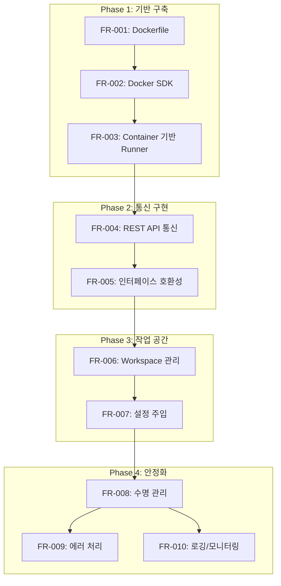

# Runner Docker 구현 명세서

본 문서는 Runner Docker 구현의 전체 구조를 설명하는 인덱스 문서입니다.

---

## 1. 개요

### 1.1 목적

CNAP Runner를 OpenCode Docker Container 기반으로 변경하여 독립적인 에이전트 실행 환경을 제공합니다.

### 1.2 주요 변경 사항

| 항목        | 현재 (AS-IS)       | 목표 (TO-BE)                 |
| ----------- | ------------------ | ---------------------------- |
| Runner 실체 | HTTP 클라이언트    | Docker Container             |
| 상태 관리   | Stateless          | Container 내 OpenCode가 관리 |
| 통신 방식   | 외부 API 직접 호출 | Container 내 REST API        |
| 리소스      | 최소               | Container 리소스 할당        |

### 1.3 관련 문서

- [요구사항 명세서](./runner-docker-requirements.md) - FR-001 ~ FR-010

---

## 2. 구현 Phase 개요



---

## 3. Phase별 상세 문서

### Phase 1: 기반 구축

**문서:** [runner-docker-implementation-phase1.md](./runner-docker-implementation-phase1.md)

| 요구사항 | 설명                  | 주요 파일                   |
| -------- | --------------------- | --------------------------- |
| FR-001   | Dockerfile 작성       | `docker/runner/Dockerfile`  |
| FR-002   | Docker SDK 통합       | `internal/runner/docker.go` |
| FR-003   | Container 기반 Runner | `internal/runner/runner.go` |

### Phase 2: 통신 구현

**문서:** [runner-docker-implementation-phase2.md](./runner-docker-implementation-phase2.md)

| 요구사항 | 설명                   | 주요 파일                   |
| -------- | ---------------------- | --------------------------- |
| FR-004   | OpenCode REST API 통신 | `internal/runner/api.go`    |
| FR-005   | 인터페이스 호환성      | `internal/runner/runner.go` |

### Phase 3: 작업 공간 및 설정

**문서:** [runner-docker-implementation-phase3.md](./runner-docker-implementation-phase3.md)

| 요구사항 | 설명                | 주요 파일                      |
| -------- | ------------------- | ------------------------------ |
| FR-006   | Workspace 관리      | `internal/runner/workspace.go` |
| FR-007   | Container 설정 주입 | `internal/runner/settings.go`  |

### Phase 4: 안정화 및 운영

**문서:**

- [runner-docker-implementation-phase4a.md](./runner-docker-implementation-phase4a.md) (수명 관리)
- [runner-docker-implementation-phase4b.md](./runner-docker-implementation-phase4b.md) (에러/로깅)

| 요구사항 | 설명                | 주요 파일                                  |
| -------- | ------------------- | ------------------------------------------ |
| FR-008   | Container 수명 관리 | `internal/runner/lifecycle.go`             |
| FR-009   | 에러 처리 및 복구   | `internal/runner/errors.go`, `recovery.go` |
| FR-010   | 로깅 및 모니터링    | `internal/runner/metrics.go`, `logs.go`    |

---

## 4. 파일 구조 개요

### 4.1 신규 파일

```
internal/runner/
├── api.go              # OpenCode REST API 클라이언트
├── api_types.go        # API 요청/응답 타입
├── config.go           # Runner 설정
├── docker.go           # Docker 클라이언트 인터페이스
├── errors.go           # 에러 타입 정의
├── lifecycle.go        # Container 수명 관리
├── logs.go             # Container 로그 수집
├── metrics.go          # 메트릭 수집
├── recovery.go         # 복구 메커니즘
├── settings.go         # Container 설정 관리
└── workspace.go        # 작업 공간 관리

docker/runner/
└── Dockerfile          # Runner Container 이미지

data/
├── workspace/          # Agent별 작업 공간 (런타임)
└── configs/
    └── opencode/       # OpenCode 기본 설정 템플릿
```

### 4.2 수정 파일

```
internal/runner/
├── manager.go          # Docker SDK, 수명관리 통합
└── runner.go           # Container 기반으로 변경

internal/controller/
└── executor.go         # 새 Runner API 연동
```

---

## 5. 전체 구현 체크리스트

### Phase 1 체크리스트

- [ ] `docker/runner/Dockerfile` 작성
- [ ] `Makefile`에 runner-build 타겟 추가
- [ ] `go.mod`에 Docker SDK 의존성 추가
- [ ] `internal/runner/docker.go` 구현
- [ ] `internal/runner/config.go` 구현
- [ ] `internal/runner/runner.go` Container 기반으로 변경
- [ ] `internal/runner/manager.go` Docker SDK 통합
- [ ] Phase 1 단위 테스트

### Phase 2 체크리스트

- [ ] `internal/runner/api_types.go` 구현
- [ ] `internal/runner/api.go` 구현
- [ ] `internal/runner/runner.go` Run() 메서드 완성
- [ ] `internal/runner/manager.go` 호환성 래퍼 추가
- [ ] `internal/controller/executor.go` 연동 수정
- [ ] Phase 2 단위 테스트

### Phase 3 체크리스트

- [ ] `data/configs/opencode/` 기본 설정 파일 생성
- [ ] `internal/runner/workspace.go` 구현
- [ ] `internal/runner/settings.go` 구현
- [ ] Runner와 Workspace/Settings 연동
- [ ] Phase 3 단위 테스트

### Phase 4 체크리스트

- [ ] `internal/runner/lifecycle.go` 구현
- [ ] `internal/runner/errors.go` 구현
- [ ] `internal/runner/recovery.go` 구현
- [ ] `internal/runner/metrics.go` 구현
- [ ] `internal/runner/logs.go` 구현
- [ ] RunnerManager에 수명관리 통합
- [ ] Phase 4 단위 테스트

### 통합 테스트 체크리스트

- [ ] Container 생성/시작/중지 통합 테스트
- [ ] OpenCode API 통신 통합 테스트
- [ ] 에러 복구 시나리오 테스트
- [ ] 수명 관리 (유휴 타임아웃) 테스트

---

## 6. 커밋 컨벤션

각 구현 단계는 다음 형식의 커밋 메시지를 사용합니다:

```
feat(runner): <요약>

<상세 설명>

Refs: FR-XXX
```

예시:

```
feat(runner): FR-001 OpenCode Runner Dockerfile 추가

- node:20-slim 기반 멀티스테이지 빌드
- 비루트 사용자(opencode)로 실행
- OpenCode Server 모드로 REST API 노출

Refs: FR-001
```

---

## 7. 참고 자료

- [OpenCode Server 문서](https://opencode.ai/docs/server/)
- [Docker SDK for Go](https://pkg.go.dev/github.com/docker/docker/client)
- [현재 Runner 구현](../internal/runner/runner.go)
- [Architecture Overview](./architecture-overview.md)
- [Task Lifecycle 문서](./task-lifecycle-refactoring.md)
