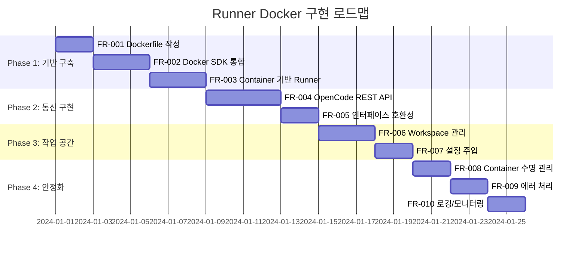

# Runner Docker 구현 변경 요구사항 명세서

본 문서는 현재 단순 API 호출 방식의 Runner 구현을 OpenCode Docker Container 기반으로 변경하기 위한 기능 요구사항을 정의합니다.

---

## 1. 개요

### 1.1 현재 구현 (AS-IS)

현재 Runner 구현은 OpenCode Zen API를 HTTP로 직접 호출하는 방식입니다.

**주요 특징:**

- [`runner.go`](../internal/runner/runner.go)에서 `https://opencode.ai/zen/v1/chat/completions` 엔드포인트 직접 호출
- OpenAI 호환 포맷 (Chat Completions API)
- 매 요청마다 전체 대화 히스토리 전송 (Stateless)
- 환경 변수 `OPEN_CODE_API_KEY`로 인증
- `http.Client`를 통한 단일 HTTP 요청/응답

**현재 흐름:**

```
Controller → Runner.Run → HTTP POST → OpenCode API → Response → Controller
```

### 1.2 목표 구현 (TO-BE)

OpenCode Server를 Docker Container로 실행하여 프로세스 기반의 에이전트 실행을 구현합니다.

**주요 변경:**

- 각 Runner가 독립적인 Docker Container로 실행
- OpenCode Server REST API (https://opencode.ai/docs/server/) 사용
- Container 내부에서 OpenCode가 상태 관리
- 작업 공간(Workspace)을 Container와 마운트
- MCP 도구 및 설정 주입 지원

**목표 흐름:**

```
Controller → RunnerManager → Docker SDK → Container with OpenCode Server → REST API → Controller
```

---

## 2. 현재 구현 분석

### 2.1 Runner 구조체

**파일:** [`internal/runner/runner.go`](../internal/runner/runner.go)

```go
type Runner struct {
    ID         string
    Status     string
    agentInfo  AgentInfo
    logger     *zap.Logger
    apiKey     string
    baseURL    string
    httpClient *http.Client
}
```

**현재 역할:**

- HTTP 클라이언트 래퍼
- API 키 관리
- 요청/응답 직렬화

### 2.2 RunnerManager 구조체

**파일:** [`internal/runner/manager.go`](../internal/runner/manager.go)

```go
type RunnerManager struct {
    runners map[string]*Runner
    mu      sync.RWMutex
}
```

**현재 역할:**

- Runner 인스턴스 생성/조회/삭제
- Task ID 기반 Runner 매핑
- 싱글톤 패턴 사용

### 2.3 TaskRunner 인터페이스

**파일:** [`internal/runner/runner.go:17-21`](../internal/runner/runner.go)

```go
type TaskRunner interface {
    Run(ctx context.Context, req *RunRequest) (*RunResult, error)
}
```

### 2.4 StatusCallback 인터페이스

**파일:** [`internal/runner/runner.go:40-54`](../internal/runner/runner.go)

```go
type StatusCallback interface {
    OnStatusChange(taskID string, status string) error
    OnMessage(taskID string, message string) error
    OnComplete(taskID string, result *RunResult) error
    OnError(taskID string, err error) error
}
```

### 2.5 Controller 연동 부분

**파일:** [`internal/controller/executor.go`](../internal/controller/executor.go)

- `executeTask()`: Runner를 통해 Task 실행
- RunnerManager에서 Runner 조회/생성
- MessageIndex에서 대화 히스토리 로드
- StatusCallback으로 결과 전달

---

## 3. 기능 요구사항

요구사항은 구현 순서에 따라 정렬되어 있습니다.

### Phase 1: 기반 구축

---

### FR-001: Runner Dockerfile 작성

**우선순위:** 높음 | **Phase:** 1

**설명:**
OpenCode 프로세스를 실행하는 Runner Dockerfile을 작성해야 합니다. 이것이 가장 먼저 필요한 이유는 Docker 이미지가 있어야 Container를 실행할 수 있기 때문입니다.

**수용 기준:**

- [ ] OpenCode CLI 설치
- [ ] OpenCode Server 모드 실행 가능
- [ ] 필요한 런타임 의존성 포함
- [ ] 보안 설정 (비루트 사용자)
- [ ] 경량화된 이미지

**예상 Dockerfile 구조:**

```dockerfile
FROM node:20-slim

# OpenCode 설치
RUN npm install -g opencode-cli

# 비루트 사용자 설정
RUN useradd -m opencode
USER opencode

WORKDIR /workspace

# OpenCode Server 모드로 실행 (REST API 노출)
EXPOSE 3000
ENTRYPOINT ["opencode", "server", "--port", "3000"]
```

---

### FR-002: Docker SDK 통합

**우선순위:** 높음 | **Phase:** 1

**설명:**
RunnerManager가 Docker SDK를 사용하여 Container 인스턴스를 관리합니다. Dockerfile이 준비되면 이를 실행할 수 있는 Docker 클라이언트가 필요합니다.

**수용 기준:**

- [ ] Docker SDK (`github.com/docker/docker/client`) 의존성 추가
- [ ] Docker 클라이언트 초기화 및 연결 확인
- [ ] Container 생성 (이미지, 환경 변수, 볼륨 마운트, 포트 매핑)
- [ ] Container 시작/중지/삭제
- [ ] Container 상태 조회
- [ ] Container 로그 스트리밍

**인터페이스 변경:**

```go
// 현재 RunnerManager
type RunnerManager struct {
    runners map[string]*Runner
    mu      sync.RWMutex
}

// 변경된 RunnerManager
type RunnerManager struct {
    runners      map[string]*Runner
    dockerClient *client.Client
    mu           sync.RWMutex
    config       RunnerConfig
}

type RunnerConfig struct {
    ImageName        string        // Docker 이미지 이름
    WorkspaceBaseDir string        // 작업 공간 기본 경로
    NetworkName      string        // Docker 네트워크
    ResourceLimits   ResourceLimit // 리소스 제한
}
```

---

### FR-003: Docker Container 기반 Runner

**우선순위:** 높음 | **Phase:** 1

**설명:**
Runner가 하나의 Docker Container 인스턴스가 되어야 합니다. 각 Container는 OpenCode Server 프로세스를 실행합니다. 기존 `Runner` 구조체 이름을 유지하면서 내부 구현을 변경합니다.

**수용 기준:**

- [ ] Runner 생성 시 Docker Container가 시작됨
- [ ] Runner 삭제 시 Docker Container가 종료됨
- [ ] Container 상태가 Runner 상태와 동기화됨
- [ ] Container 비정상 종료 시 Runner 상태가 failed로 변경됨
- [ ] Container 내 OpenCode Server의 REST API 엔드포인트 접근 가능

**현재 구현과 차이점:**

| 항목        | 현재                          | 목표                         |
| ----------- | ----------------------------- | ---------------------------- |
| Runner 실체 | 메모리 내 HTTP 클라이언트     | Docker Container             |
| 상태 관리   | Stateless - 매 요청 새로 시작 | Container 내 OpenCode가 관리 |
| 프로세스    | 없음                          | OpenCode Server 프로세스     |
| 리소스      | 최소                          | Container 리소스 할당 필요   |
| 통신 방식   | 외부 API 직접 호출            | Container 내 REST API 호출   |

**변경된 Runner 구조체:**

```go
// Runner - Container 기반 Runner (기존 이름 유지)
type Runner struct {
    ID            string
    ContainerID   string          // 신규: Docker Container ID
    ContainerPort int             // 신규: Container 내 OpenCode Server 포트
    Status        string
    AgentInfo     AgentInfo
    WorkspacePath string          // 신규: 마운트된 작업 공간 경로
    logger        *zap.Logger
    dockerClient  *client.Client  // 변경: Docker 클라이언트
    httpClient    *http.Client    // 유지: Container 내 REST API 호출용
    baseURL       string          // 변경: Container 내 OpenCode Server URL
}
```

---

### Phase 2: 통신 구현

---

### FR-004: OpenCode Server REST API 통신

**우선순위:** 높음 | **Phase:** 2

**설명:**
OpenCode Server (https://opencode.ai/docs/server/)의 REST API를 사용하여 Container와 통신합니다. Container가 실행되면 REST API를 통해 메시지를 주고받습니다.

**수용 기준:**

- [ ] OpenCode Server REST API 엔드포인트 확인 및 문서화
- [ ] HTTP 클라이언트를 통한 Container 내 REST API 호출
- [ ] JSON 기반 요청/응답 직렬화/역직렬화
- [ ] REST API 응답 스트리밍 지원 (SSE 등)
- [ ] 에러 응답 처리

**통신 방식:**

```
CNAP Controller
     │
     ▼
Runner.Run()
     │
     ▼ HTTP POST
Container (localhost:{mapped_port})
     │
     ▼
OpenCode Server REST API (/api/chat, /api/status 등)
     │
     ▼
AI Provider (OpenAI, Anthropic 등)
```

**인터페이스 변경:**

```go
// 현재: 외부 OpenCode Zen API 직접 호출
func (r *Runner) Run(ctx context.Context, req *RunRequest) (*RunResult, error)

// 변경: Container 내 OpenCode Server REST API 호출
func (r *Runner) Run(ctx context.Context, req *RunRequest) (*RunResult, error)
func (r *Runner) sendRequest(ctx context.Context, endpoint string, payload interface{}) (*http.Response, error)
func (r *Runner) waitForContainer(ctx context.Context) error
```

---

### FR-005: 기존 인터페이스 호환성 유지

**우선순위:** 높음 | **Phase:** 2

**설명:**
기존 `TaskRunner` 인터페이스와 `StatusCallback` 인터페이스를 유지하여 Controller 코드 변경을 최소화합니다.

**수용 기준:**

- [ ] `TaskRunner` 인터페이스 유지
- [ ] `StatusCallback` 인터페이스 유지
- [ ] `RunRequest`, `RunResult` 구조체 유지
- [ ] Controller의 executor.go 변경 최소화

**인터페이스 유지:**

```go
// 유지되는 인터페이스
type TaskRunner interface {
    Run(ctx context.Context, req *RunRequest) (*RunResult, error)
}

// Runner가 TaskRunner 구현 (기존과 동일)
var _ TaskRunner = (*Runner)(nil)
```

---

### Phase 3: 작업 공간 및 설정 관리

---

### FR-006: 작업 공간 (Workspace) 관리

**우선순위:** 높음 | **Phase:** 3

**설명:**
각 Agent는 러너 컨테이너에 할당할 작업 공간을 가집니다. 작업 공간은 `./data/workspace` 아래에 생성됩니다.

**수용 기준:**

- [ ] Agent 생성 시 작업 공간 디렉토리 생성 (`./data/workspace/{agent_id}/`)
- [ ] Runner Container 시작 시 작업 공간을 마운트
- [ ] Container 내 OpenCode 프로세스의 작업 디렉토리가 마운트된 경로
- [ ] 작업 공간 정리 정책 (Agent 삭제 시 처리 방식)

**디렉토리 구조:**

```
./data/
├── workspace/
│   ├── {agent_id_1}/
│   │   ├── .opencode/          # OpenCode 설정
│   │   ├── project_files/      # 실제 작업 파일
│   │   └── ...
│   └── {agent_id_2}/
│       └── ...
└── messages/                   # 기존 메시지 저장 경로
```

---

### FR-007: Container 설정 주입

**우선순위:** 중간 | **Phase:** 3

**설명:**
컨테이너에 설정을 주입하여 MCP 등 다양한 도구 설정이 가능해야 합니다.

**수용 기준:**

- [ ] OpenCode 설정 파일 마운트 지원
- [ ] MCP 서버 설정 주입 지원
- [ ] 환경 변수를 통한 설정 전달
- [ ] Agent별 커스텀 설정 지원

**설정 항목:**

- OpenCode 설정 (`opencode.json` 또는 환경 변수)
- MCP 서버 연결 정보
- AI 모델 및 프롬프트 설정
- 타임아웃 및 리소스 제한

---

### Phase 4: 안정화 및 운영

---

### FR-008: Container 수명 관리

**우선순위:** 중간 | **Phase:** 4

**설명:**
Container의 수명을 Task 수명과 연결하여 관리합니다.

**수용 기준:**

- [ ] Task 생성 시 Container 생성
- [ ] Task 완료 시 Container 종료
- [ ] Container 타임아웃 처리
- [ ] 유휴 Container 정리

**Container 상태 매핑:**

| Task 상태 | Container 상태 |
| --------- | -------------- |
| pending   | 생성 대기      |
| running   | running        |
| waiting   | running (유휴) |
| completed | 종료됨         |
| failed    | 종료됨/에러    |
| canceled  | 종료됨         |

---

### FR-009: 에러 처리 및 복구

**우선순위:** 중간 | **Phase:** 4

**설명:**
Container 관련 에러 상황에 대한 처리 및 복구 메커니즘을 구현합니다.

**수용 기준:**

- [ ] Container 시작 실패 시 에러 반환
- [ ] Container 비정상 종료 감지
- [ ] 네트워크 오류 처리
- [ ] 타임아웃 처리
- [ ] 리소스 부족 상황 처리

---

### FR-010: 로깅 및 모니터링

**우선순위:** 낮음 | **Phase:** 4

**설명:**
Container 실행 상태를 로깅하고 모니터링할 수 있어야 합니다.

**수용 기준:**

- [ ] Container 생성/시작/종료 로그
- [ ] OpenCode Server 프로세스 로그 수집
- [ ] 메트릭 수집 (실행 시간, 리소스 사용량)
- [ ] 디버깅을 위한 Container 로그 접근

---

## 4. 비기능 요구사항

### NFR-001: 성능

- Container 시작 시간: 5초 이내
- 메시지 응답 지연: 기존 API 호출 대비 10% 이내 증가 허용
- 동시 Container 수: 최소 10개 지원

### NFR-002: 리소스 관리

- Container 메모리 제한: 기본 512MB, 최대 2GB
- Container CPU 제한: 기본 0.5 코어, 최대 2 코어
- 디스크 사용량 제한: 작업 공간 당 1GB

### NFR-003: 보안

- Container 격리 (네트워크, 파일시스템)
- 비루트 사용자로 실행
- 호스트 시스템 접근 제한
- API 키 안전한 전달 (환경 변수 또는 시크릿)

---

## 5. 인터페이스 변경 요약

### 5.1 유지되는 인터페이스

| 인터페이스       | 파일      | 변경 |
| ---------------- | --------- | ---- |
| `TaskRunner`     | runner.go | 유지 |
| `StatusCallback` | runner.go | 유지 |
| `RunRequest`     | runner.go | 유지 |
| `RunResult`      | runner.go | 유지 |

### 5.2 변경되는 구조체

| 구조체          | 현재                 | 변경 후                          |
| --------------- | -------------------- | -------------------------------- |
| `Runner`        | HTTP 클라이언트 기반 | Docker Container + REST API 기반 |
| `RunnerManager` | 메모리 맵 관리       | Docker SDK 클라이언트 추가       |
| `AgentInfo`     | API 관련 정보        | Workspace 경로 추가              |

### 5.3 신규 타입

```go
// RunnerConfig - RunnerManager 설정
type RunnerConfig struct {
    ImageName        string
    WorkspaceBaseDir string
    NetworkName      string
    ResourceLimits   ResourceLimit
}

// ResourceLimit - Container 리소스 제한
type ResourceLimit struct {
    MemoryMB int64
    CPUCores float64
}
```

---

## 6. 데이터 모델 변경

### 6.1 Agent 테이블 확장 (선택사항)

작업 공간 경로를 Agent 테이블에 저장할 수 있습니다:

```go
type Agent struct {
    // ... 기존 필드 ...
    WorkspacePath string `gorm:"column:workspace_path;type:text"` // 신규
}
```

또는 컨벤션으로 `./data/workspace/{agent_id}/` 경로를 사용합니다.

---

## 7. 구현 로드맵



### 구현 순서 요약

| Phase | 요구사항 ID | 요구사항 명            | 의존성 |
| ----- | ----------- | ---------------------- | ------ |
| 1     | FR-001      | Dockerfile 작성        | 없음   |
| 1     | FR-002      | Docker SDK 통합        | FR-001 |
| 1     | FR-003      | Container 기반 Runner  | FR-002 |
| 2     | FR-004      | OpenCode REST API 통신 | FR-003 |
| 2     | FR-005      | 인터페이스 호환성 유지 | FR-004 |
| 3     | FR-006      | Workspace 관리         | FR-005 |
| 3     | FR-007      | Container 설정 주입    | FR-006 |
| 4     | FR-008      | Container 수명 관리    | FR-007 |
| 4     | FR-009      | 에러 처리 및 복구      | FR-008 |
| 4     | FR-010      | 로깅 및 모니터링       | FR-008 |

---

## 8. 참고 자료

- [OpenCode Server 문서](https://opencode.ai/docs/server/)
- [Docker SDK for Go](https://pkg.go.dev/github.com/docker/docker/client)
- [현재 Runner 구현](../internal/runner/runner.go)
- [현재 RunnerManager 구현](../internal/runner/manager.go)
- [Task Lifecycle 문서](./task-lifecycle-refactoring.md)
- [Architecture Overview](./architecture-overview.md)
