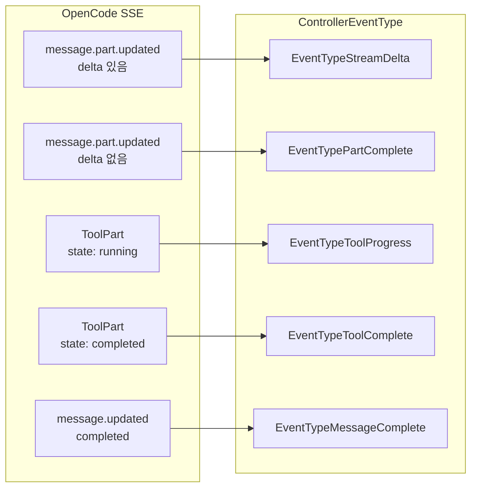

# 스트림 메시지 처리 아키텍처 제안서

## 1. 현재 문제점

### 1.1 문제 상황

현재 [`OnMessage`](internal/controller/runner_callback.go:26) 콜백에서 스트림 메시지를 그대로 [`ControllerEvent`](internal/controller/types.go)로 발행하고 있습니다:

```go
// 현재 구현 (runner_callback.go)
func (c *Controller) OnMessage(taskID string, msg *taskrunner.RunnerMessage) error {
    if msg.Type == taskrunner.MessageTypeText && msg.Content != "" {
        c.controllerEventChan <- ControllerEvent{
            TaskID:  taskID,
            Status:  "message",
            Content: msg.Content,  // 부분 메시지인지 전체 메시지인지 구별 불가
        }
    }
    return c.UpdateTaskStatus(context.Background(), taskID, storage.TaskStatusWaiting)
}
```

### 1.2 주요 문제점

1. **부분 메시지 업데이트와 새로운 메시지 구별 불가**

   - 스트리밍 중 delta로 추가된 텍스트인지, 새로운 메시지인지 알 수 없음
   - `Content` 필드가 전체 내용인지 추가된 부분인지 명확하지 않음

2. **Connector에서 항상 새 메시지로 처리**

   - 모든 이벤트가 동일한 `Status: "message"`로 전달
   - Connector는 매번 새 Discord 메시지를 생성
   - Discord 채널이 메시지로 넘침

3. **메시지/Part ID 누락**
   - OpenCode의 `MessageID`, `PartID`가 전달되지 않음
   - 동일 메시지의 부분 업데이트를 추적할 수 없음

## 2. OpenCode 이벤트 모델 분석

### 2.1 OpenCode SSE 이벤트 구조

OpenCode API는 [`Event`](internal/runner/api_types.go:486) 구조체로 SSE 이벤트를 전송합니다:

```go
type Event struct {
    Type       string                 `json:"type"`       // 이벤트 타입
    Properties map[string]interface{} `json:"properties"` // 이벤트 속성
}
```

### 2.2 주요 이벤트 타입

| 이벤트 타입            | 설명                 | 주요 속성       |
| ---------------------- | -------------------- | --------------- |
| `message.part.updated` | Part 내용 업데이트   | `part`, `delta` |
| `message.updated`      | 메시지 상태 업데이트 | `message`       |
| `session.updated`      | 세션 상태 업데이트   | `session`       |

### 2.3 Delta 필드 의미

`message.part.updated` 이벤트에서:

- **`delta` 필드가 있음**: 부분 업데이트 (기존 내용에 추가)
- **`delta` 필드가 없음**: 전체 교체 (Part 완료 또는 상태 변경)

```json
// 스트리밍 중 부분 업데이트
{
  "type": "message.part.updated",
  "properties": {
    "part": { "id": "prt_xxx", "text": "Hello, how can I" },
    "delta": " help"  // 이번에 추가된 텍스트만
  }
}

// Part 완료 (delta 없음)
{
  "type": "message.part.updated",
  "properties": {
    "part": { "id": "prt_xxx", "text": "Hello, how can I help you today?", "time": { "end": 1234567890 } }
  }
}
```

### 2.4 Part 구조

[`Part`](internal/runner/api_types.go:413) 구조체는 다양한 타입을 지원합니다:

| Part Type   | 설명        |
| ----------- | ----------- |
| `text`      | 일반 텍스트 |
| `reasoning` | 추론 과정   |
| `tool`      | 도구 호출   |
| `file`      | 파일 첨부   |
| `step`      | 실행 단계   |

## 3. 제안하는 새로운 구조

### 3.1 RunnerMessage 확장

[`RunnerMessage`](internal/runner/api_types.go:56)에 delta 관련 필드를 추가합니다:

```go
type RunnerMessage struct {
    // 기존 필드
    Type       RunnerMessageType `json:"type"`
    SessionID  string            `json:"session_id,omitempty"`
    MessageID  string            `json:"message_id,omitempty"`
    PartID     string            `json:"part_id,omitempty"`
    Timestamp  time.Time         `json:"timestamp"`
    Content    string            `json:"content,omitempty"`
    ToolCall   *ToolCallInfo     `json:"tool_call,omitempty"`
    ToolResult *ToolResultInfo   `json:"tool_result,omitempty"`
    Status     string            `json:"status,omitempty"`
    Progress   float64           `json:"progress,omitempty"`
    Error      *MessageErrorInfo `json:"error,omitempty"`
    Metadata   map[string]any    `json:"metadata,omitempty"`
    RawEvent   *Event            `json:"raw_event,omitempty"`

    // 새로 추가할 필드
    Delta     string `json:"delta,omitempty"`   // 부분 업데이트 텍스트 (새로 추가된 부분만)
    IsPartial bool   `json:"is_partial"`        // true면 delta만 추가, false면 Content가 전체 내용
    PartType  string `json:"part_type,omitempty"` // text, tool, reasoning 등
}
```

### 3.2 ControllerEvent 확장

[`ControllerEvent`](internal/controller/types.go)를 확장하여 세분화된 이벤트 정보를 전달합니다:

```go
type ControllerEvent struct {
    // 기존 필드
    TaskID  string `json:"task_id"`
    Status  string `json:"status"`   // running, waiting, completed, failed, canceled
    Content string `json:"content"`
    Error   error  `json:"error,omitempty"`

    // 새로 추가할 필드
    EventType ControllerEventType `json:"event_type"` // 세분화된 이벤트 타입
    MessageID string              `json:"message_id,omitempty"` // OpenCode 메시지 ID
    PartID    string              `json:"part_id,omitempty"`    // OpenCode Part ID
    PartType  PartType            `json:"part_type,omitempty"`  // text, tool, reasoning 등
    Delta     string              `json:"delta,omitempty"`      // 부분 업데이트 텍스트
    ToolInfo  *ToolEventInfo      `json:"tool_info,omitempty"`  // 도구 관련 정보
}

type ToolEventInfo struct {
    ToolID    string         `json:"tool_id"`
    ToolName  string         `json:"tool_name"`
    State     string         `json:"state"`     // pending, running, completed, error
    Arguments map[string]any `json:"arguments,omitempty"`
    Result    string         `json:"result,omitempty"`
    IsError   bool           `json:"is_error,omitempty"`
}
```

### 3.3 ControllerEventType 정의

```go
type ControllerEventType string

const (
    // 스트리밍 관련
    EventTypeStreamDelta     ControllerEventType = "stream_delta"      // 스트리밍 중 부분 텍스트
    EventTypePartComplete    ControllerEventType = "part_complete"     // Part 완료

    // 도구 관련
    EventTypeToolStart       ControllerEventType = "tool_start"        // 도구 호출 시작
    EventTypeToolProgress    ControllerEventType = "tool_progress"     // 도구 실행 중
    EventTypeToolComplete    ControllerEventType = "tool_complete"     // 도구 완료

    // 메시지/Task 관련
    EventTypeMessageComplete ControllerEventType = "message_complete"  // 메시지 완료
    EventTypeTaskComplete    ControllerEventType = "task_complete"     // Task 완료
    EventTypeError           ControllerEventType = "error"             // 에러
)
```

### 3.4 PartType 정의

```go
type PartType string

const (
    PartTypeText      PartType = "text"
    PartTypeReasoning PartType = "reasoning"
    PartTypeTool      PartType = "tool"
    PartTypeFile      PartType = "file"
    PartTypeStep      PartType = "step"
)
```

## 4. 이벤트 흐름도

### 4.1 전체 흐름

```
OpenCode SSE → Runner → Controller → Connector → Discord

┌─────────────────┐    ┌─────────────────┐    ┌─────────────────┐    ┌─────────────────┐
│   OpenCode API  │───>│     Runner      │───>│   Controller    │───>│   Connector     │
│                 │    │                 │    │                 │    │                 │
│ SSE Events      │    │ RunnerMessage   │    │ ControllerEvent │    │ Discord Message │
└─────────────────┘    └─────────────────┘    └─────────────────┘    └─────────────────┘
```

### 4.2 이벤트 변환 맵핑



### 4.3 상세 변환 로직

```go
func convertEventToControllerEvent(taskID string, msg *RunnerMessage) ControllerEvent {
    event := ControllerEvent{
        TaskID:    taskID,
        MessageID: msg.MessageID,
        PartID:    msg.PartID,
        PartType:  PartType(msg.PartType),
    }

    switch {
    case msg.IsPartial && msg.Delta != "":
        // 스트리밍 중 부분 업데이트
        event.EventType = EventTypeStreamDelta
        event.Delta = msg.Delta
        event.Content = msg.Content  // 누적된 전체 내용
        event.Status = "running"

    case msg.Type == MessageTypeText && !msg.IsPartial:
        // Part 완료
        event.EventType = EventTypePartComplete
        event.Content = msg.Content
        event.Status = "running"

    case msg.Type == MessageTypeToolCall:
        // 도구 호출 시작
        event.EventType = EventTypeToolStart
        event.Status = "running"
        event.ToolInfo = &ToolEventInfo{
            ToolID:    msg.ToolCall.ToolID,
            ToolName:  msg.ToolCall.ToolName,
            State:     "pending",
            Arguments: msg.ToolCall.Arguments,
        }

    case msg.Type == MessageTypeToolResult:
        // 도구 완료
        event.EventType = EventTypeToolComplete
        event.Status = "running"
        event.ToolInfo = &ToolEventInfo{
            ToolID:   msg.ToolResult.ToolID,
            ToolName: msg.ToolResult.ToolName,
            State:    "completed",
            Result:   msg.ToolResult.Result,
            IsError:  msg.ToolResult.IsError,
        }

    case msg.Type == MessageTypeComplete:
        // 메시지 완료
        event.EventType = EventTypeMessageComplete
        event.Content = msg.Content
        event.Status = "waiting"

    case msg.Type == MessageTypeError:
        // 에러
        event.EventType = EventTypeError
        event.Status = "failed"
        if msg.Error != nil {
            event.Error = fmt.Errorf("%s: %s", msg.Error.Code, msg.Error.Message)
        }
    }

    return event
}
```

## 5. Connector 처리 로직

### 5.1 이벤트 타입별 처리

```go
func (c *Connector) handleControllerEvent(event ControllerEvent) {
    switch event.EventType {
    case EventTypeStreamDelta:
        // 기존 Discord 메시지 편집 (delta만 추가)
        c.updateStreamingMessage(event.TaskID, event.PartID, event.Delta, event.Content)

    case EventTypePartComplete:
        // Part 완료, 다음 Part 대기
        c.finalizePartMessage(event.TaskID, event.PartID, event.Content)

    case EventTypeToolStart:
        // 도구 실행 UI 표시
        c.showToolStatus(event.TaskID, event.ToolInfo, "🔧 Running...")

    case EventTypeToolProgress:
        // 도구 진행 상태 업데이트
        c.updateToolProgress(event.TaskID, event.ToolInfo)

    case EventTypeToolComplete:
        // 도구 완료 UI 업데이트
        if event.ToolInfo.IsError {
            c.showToolStatus(event.TaskID, event.ToolInfo, "❌ Error")
        } else {
            c.showToolStatus(event.TaskID, event.ToolInfo, "✅ Complete")
        }

    case EventTypeMessageComplete:
        // 최종 메시지 정리
        c.finalizeMessage(event.TaskID, event.Content)

    case EventTypeError:
        // 에러 표시
        c.showError(event.TaskID, event.Error)
    }
}
```

### 5.2 스트리밍 메시지 관리

```go
type StreamingMessageState struct {
    discordMessageID string            // Discord 메시지 ID
    partBuffers      map[string]string // PartID → 누적된 내용
    lastUpdateTime   time.Time
    mu               sync.Mutex
}

func (c *Connector) updateStreamingMessage(taskID, partID, delta, fullContent string) {
    state := c.getOrCreateStreamState(taskID)
    state.mu.Lock()
    defer state.mu.Unlock()

    // Part 버퍼 업데이트
    state.partBuffers[partID] = fullContent

    // Debounce 처리 (다음 문서에서 상세 설명)
    c.debouncer.Update(taskID, c.formatMessage(state))
}
```

## 6. 구현 단계

### Phase 1: RunnerMessage 확장

- [ ] `Delta`, `IsPartial`, `PartType` 필드 추가
- [ ] SSE 이벤트 파싱 로직 수정하여 delta 추출

### Phase 2: ControllerEvent 확장

- [ ] `ControllerEventType` 정의
- [ ] 새로운 필드들 추가
- [ ] 이벤트 변환 로직 구현

### Phase 3: Connector 업데이트

- [ ] 이벤트 타입별 핸들러 구현
- [ ] 스트리밍 메시지 상태 관리 구현
- [ ] Debounce 메커니즘 통합 (별도 문서 참조)

### Phase 4: 테스트 및 검증

- [ ] 단위 테스트 작성
- [ ] 통합 테스트 작성
- [ ] 실제 Discord 환경에서 검증

## 7. 예상 효과

| 항목               | 현재       | 개선 후                   |
| ------------------ | ---------- | ------------------------- |
| Discord 메시지 수  | 토큰당 1개 | Part당 1개 (편집)         |
| 부분 업데이트 지원 | ❌         | ✅                        |
| 도구 상태 표시     | 없음       | 실시간 표시               |
| Rate Limit 위험    | 높음       | 낮음 (Debounce 적용 시)   |
| 코드 가독성        | 낮음       | 높음 (명확한 이벤트 타입) |
