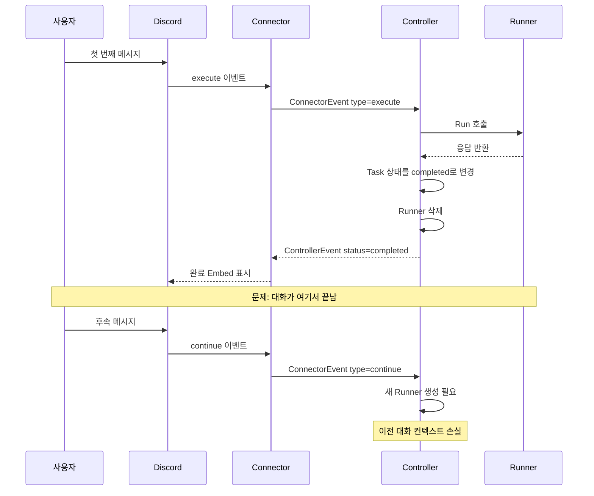
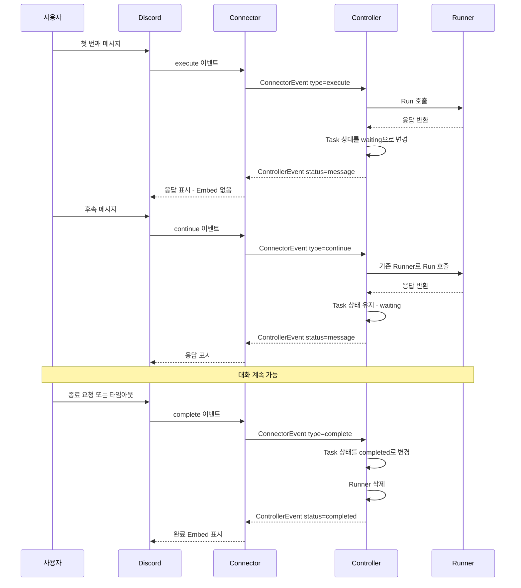
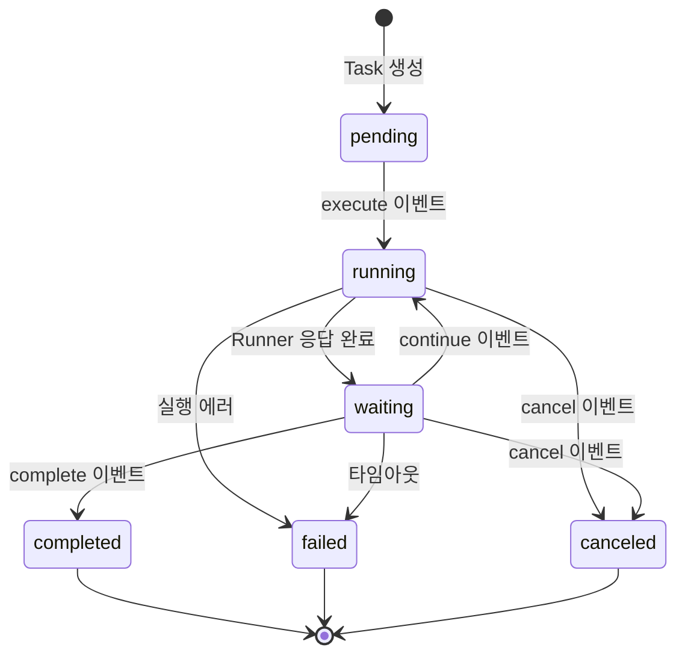

# Task Lifecycle Refactoring

Task 완료 처리 방식을 변경하여 멀티턴 대화를 지원하기 위한 구현 계획 문서입니다.

## 1. 현재 문제점 (AS-IS)

### 1.1 Executor 함수 구조

현재 두 가지 실행 함수가 존재합니다:

| 함수                                                           | 용도             | 결과 전달                             | 콜백                             |
| -------------------------------------------------------------- | ---------------- | ------------------------------------- | -------------------------------- |
| [`executeTask`](internal/controller/executor.go:103)           | CLI 단일 실행    | 로그만 출력                           | 없음                             |
| [`executeTaskWithResult`](internal/controller/executor.go:237) | Discord Bot 연동 | `controllerEventChan`으로 이벤트 전송 | Controller가 StatusCallback 구현 |

**문제점:**

- `executeTaskWithResult` 함수명이 역할을 명확히 표현하지 못함
- "Result"가 아닌 "이벤트 전송"이 핵심 기능임

### 1.2 자동 완료 처리 문제

현재 구현에서는 Runner가 응답할 때마다 Task가 자동으로 완료 처리됩니다:

- [`executor.go:415`](internal/controller/executor.go:415): `runner.Run()` 반환 후 즉시 `completed` 상태로 변경
- [`executor.go:426`](internal/controller/executor.go:426): 매 실행 후 Runner가 삭제됨

```go
// executor.go:415-426 현재 구현
_ = c.repo.UpsertTaskStatus(context.Background(), taskID, task.AgentID, storage.TaskStatusCompleted)

c.controllerEventChan <- ControllerEvent{
    TaskID:   taskID,
    ThreadID: threadID,
    Status:   "completed",
    Content:  result.Output,
}

// Runner 정리
c.runnerManager.DeleteRunner(taskID)
```

### 1.2 HTTP API 직접 호출 방식

- 현재는 HTTP API를 직접 호출하는 방식 (프로세스 관리 없음)
- 에이전트 프롬프트는 매 요청마다 `SystemPrompt`로 전달

### 1.3 문제 시나리오



## 2. 변경 목표 (TO-BE)

### 2.1 핵심 목표

- Runner 응답 후에도 Task가 완료되지 않도록 변경
- Task 완료는 명시적 완료 이벤트로만 처리
- 멀티턴 대화 지원

### 2.2 목표 시나리오



## 3. 구현 계획

### Phase 1: Task 상태 관리 변경

#### 1.1 새로운 Task 상태 추가

[`internal/storage/constants.go`](internal/storage/constants.go)에 `waiting` 상태 추가:

```go
const (
    TaskStatusPending   = "pending"
    TaskStatusRunning   = "running"
    TaskStatusWaiting   = "waiting"   // 신규: Runner 응답 후 사용자 입력 대기
    TaskStatusCompleted = "completed"
    TaskStatusFailed    = "failed"
    TaskStatusCanceled  = "canceled"
    TaskStatusDeleted   = "deleted"
)
```

#### 1.2 자동 완료 로직 제거

[`internal/controller/executor.go`](internal/controller/executor.go)의 [`executeTaskWithResult`](internal/controller/executor.go:236) 함수 변경:

**Before:**

```go
_ = c.repo.UpsertTaskStatus(context.Background(), taskID, task.AgentID, storage.TaskStatusCompleted)

c.controllerEventChan <- ControllerEvent{
    TaskID:   taskID,
    ThreadID: threadID,
    Status:   "completed",
    Content:  result.Output,
}

c.runnerManager.DeleteRunner(taskID)
```

**After:**

```go
_ = c.repo.UpsertTaskStatus(context.Background(), taskID, task.AgentID, storage.TaskStatusWaiting)

c.controllerEventChan <- ControllerEvent{
    TaskID:   taskID,
    ThreadID: threadID,
    Status:   "message",  // completed -> message
    Content:  result.Output,
}

// Runner 삭제 제거 - Task가 완료될 때까지 유지
```

### Phase 2: Runner 수명 관리 변경

#### 2.1 Runner 삭제 조건 변경

Runner는 다음 조건에서만 삭제:

- Task가 명시적으로 완료될 때 (`complete` 이벤트)
- Task가 취소될 때 (`cancel` 이벤트)
- Task가 실패할 때
- 타임아웃 발생 시

#### 2.2 Runner 컨텍스트 유지

Runner가 Task의 대화 컨텍스트를 유지하도록 개선:

- MessageIndex에서 이전 대화 히스토리 로드
- 후속 메시지 추가 후 Runner 재실행

### Phase 3: ConnectorEvent 상태 정리

#### 3.1 새로운 이벤트 타입 추가

[`internal/controller/types.go`](internal/controller/types.go)의 [`ConnectorEvent`](internal/controller/types.go:14) 수정:

```go
// ConnectorEvent는 Connector에서 Controller로 전송되는 이벤트를 나타냅니다.
type ConnectorEvent struct {
    // Type은 이벤트 유형을 나타냅니다.
    // 지원 타입:
    //   - "execute": Task 실행 시작 (새 Task 또는 처음 실행)
    //   - "continue": 기존 Task에 메시지 추가 후 실행 계속 (멀티턴 대화)
    //   - "cancel": Task 취소
    //   - "complete": Task 명시적 완료 (신규)
    Type     string
    TaskID   string
    ThreadID string
    Prompt   string
}
```

#### 3.2 complete 이벤트 핸들러 추가

[`internal/controller/event.go`](internal/controller/event.go)에 `handleCompleteEvent` 추가:

```go
func (c *Controller) handleCompleteEvent(ctx context.Context, event ConnectorEvent) {
    c.logger.Info("Completing task",
        zap.String("task_id", event.TaskID),
    )

    // Task 상태를 completed로 변경
    task, err := c.repo.GetTask(ctx, event.TaskID)
    if err != nil {
        c.logger.Error("Failed to get task", zap.Error(err))
        return
    }

    _ = c.repo.UpsertTaskStatus(ctx, event.TaskID, task.AgentID, storage.TaskStatusCompleted)

    // Runner 삭제
    c.runnerManager.DeleteRunner(event.TaskID)

    c.controllerEventChan <- ControllerEvent{
        TaskID:   event.TaskID,
        ThreadID: event.ThreadID,
        Status:   "completed",
        Content:  "Task completed by user request",
    }
}
```

#### 3.3 Connector 처리 로직 수정

[`internal/connector/task_result.go`](internal/connector/task_result.go)의 [`sendResultToDiscord`](internal/connector/task_result.go:34) 수정:

- `message` 상태: 일반 메시지로 전송 (Embed 없음) - 현재 구현 유지
- `completed` 상태: 완료 Embed 표시 - Task가 최종 완료될 때만

### Phase 4: 함수 이름 리팩토링

#### 4.1 executeTaskWithResult → executeTaskWithEventEmit

함수명을 역할에 맞게 변경하여 "이벤트 전송" 기능을 명확히 표현:

**Before:**

```go
func (c *Controller) executeTaskWithResult(ctx context.Context, taskID, threadID string, task *storage.Task)
```

**After:**

```go
func (c *Controller) executeTaskWithEventEmit(ctx context.Context, taskID, threadID string, task *storage.Task)
```

#### 4.2 호출부 변경

[`internal/controller/event.go`](internal/controller/event.go)에서 호출부 변경:

```go
// handleExecuteEvent (line 86)
c.executeTaskWithEventEmit(ctx, event.TaskID, event.ThreadID, task)

// handleContinueEvent (line 147)
c.executeTaskWithEventEmit(ctx, taskID, threadID, task)
```

### Phase 5: 인터페이스 문서화

## 4. 퍼블릭 인터페이스 정의

### 4.1 ConnectorEvent (Connector → Controller)

| Type       | 설명                            | 필수 필드                |
| ---------- | ------------------------------- | ------------------------ |
| `execute`  | 새 Task 실행 시작               | TaskID, ThreadID, Prompt |
| `continue` | 기존 Task에 메시지 추가 후 실행 | TaskID, ThreadID, Prompt |
| `cancel`   | Task 취소                       | TaskID, ThreadID         |
| `complete` | Task 명시적 완료 (신규)         | TaskID, ThreadID         |

### 4.2 ControllerEvent (Controller → Connector)

| Status      | 설명                         | Task 상태 변화      |
| ----------- | ---------------------------- | ------------------- |
| `message`   | Runner 중간 응답 (Task 계속) | running → waiting   |
| `completed` | Task 최종 완료               | waiting → completed |
| `failed`    | Task 실패                    | \* → failed         |
| `canceled`  | Task 취소됨                  | \* → canceled       |

### 4.3 StatusCallback (Runner → Controller)

[`internal/runner/runner.go`](internal/runner/runner.go)의 [`StatusCallback`](internal/runner/runner.go:25) 인터페이스:

| 메서드           | 설명           | 호출 시점          |
| ---------------- | -------------- | ------------------ |
| `OnStatusChange` | 상태 변경 알림 | Task 상태 변경 시  |
| `OnMessage`      | 중간 응답 전달 | AI 응답 수신 시    |
| `OnComplete`     | 실행 완료 알림 | Runner.Run 완료 시 |
| `OnError`        | 에러 발생 알림 | 에러 발생 시       |

## 5. 변경 파일 목록

| 파일                                                                     | 변경 내용                                                                                                      |
| ------------------------------------------------------------------------ | -------------------------------------------------------------------------------------------------------------- |
| [`internal/controller/executor.go`](internal/controller/executor.go)     | 자동 완료 로직 제거, Runner 삭제 조건 변경, 함수명 변경 (`executeTaskWithResult` → `executeTaskWithEventEmit`) |
| [`internal/controller/types.go`](internal/controller/types.go)           | `complete` 이벤트 타입 문서 추가                                                                               |
| [`internal/controller/event.go`](internal/controller/event.go)           | `handleCompleteEvent` 핸들러 추가, 함수 호출부 변경                                                            |
| [`internal/storage/constants.go`](internal/storage/constants.go)         | `TaskStatusWaiting` 상태 추가                                                                                  |
| [`internal/connector/task_result.go`](internal/connector/task_result.go) | 상태별 처리 로직 확인 (변경 필요 시)                                                                           |

## 6. Task 상태 다이어그램



## 7. 예상 변경 흐름 (상세 시퀀스)

```
1. 사용자 첫 메시지
   → execute 이벤트
   → Task 생성 (status: pending)
   → Task 상태 변경 (pending → running)
   → Runner 생성 및 실행
   → Runner 응답
   → OnMessage 콜백
   → message 이벤트 전송
   → Discord에 응답 표시 (Embed 없음)
   → Task 상태 변경 (running → waiting)
   → Runner 유지

2. 사용자 후속 메시지
   → continue 이벤트
   → 새 메시지 저장 (MessageIndex)
   → Task 상태 변경 (waiting → running)
   → 기존 Runner로 실행 (대화 히스토리 포함)
   → Runner 응답
   → OnMessage 콜백
   → message 이벤트 전송
   → Discord에 응답 표시
   → Task 상태 변경 (running → waiting)
   → (반복 가능)

3. 대화 종료
   → complete 이벤트 (사용자 요청 또는 타임아웃)
   → Task 상태 변경 (waiting → completed)
   → Runner 삭제
   → completed 이벤트 전송
   → Discord에 완료 Embed 표시
```

## 8. 고려사항

### 8.1 타임아웃 처리

- `waiting` 상태에서 일정 시간(예: 30분) 후 러너 프로세스 삭제 처리(완료하지 않음)
- 백그라운드 작업으로 타임아웃 모니터링 필요

### 8.2 Runner 메모리 관음

- `waiting` 상태의 Runner가 메모리에 계속 유지됨
- Runner 최대 개수 제한 또는 LRU 캐시 적용 고려

### 8.3 에러 복구

- Runner 실행 중 에러 발생 시 Task 상태를 `failed`로 변경
- 재시도 로직 추가 고려

### 8.4 동시성 제어

- 동일 Task에 대한 동시 `continue` 이벤트 방지
- `running` 상태에서 `continue` 이벤트 수신 시 에러 반환 (현재 구현 유지)
