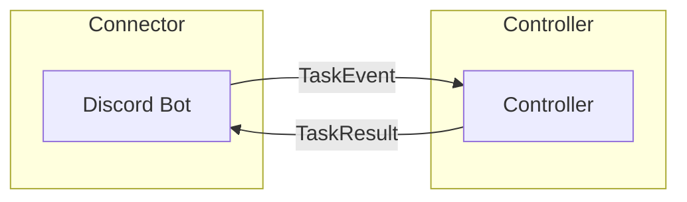
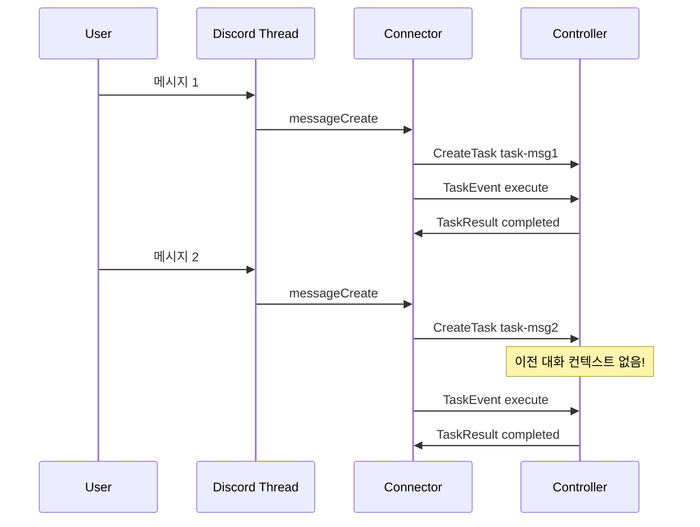
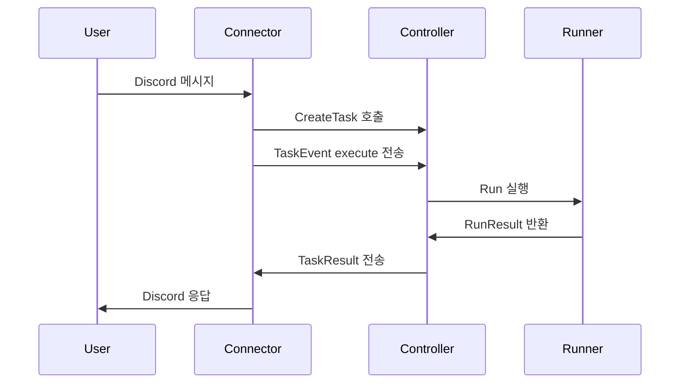
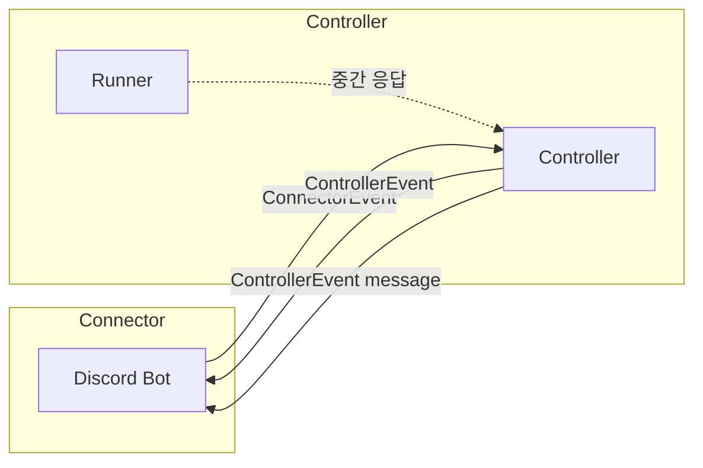
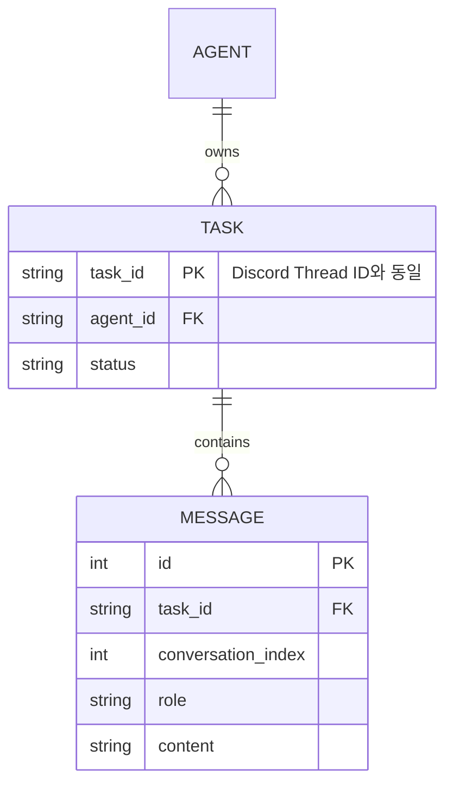
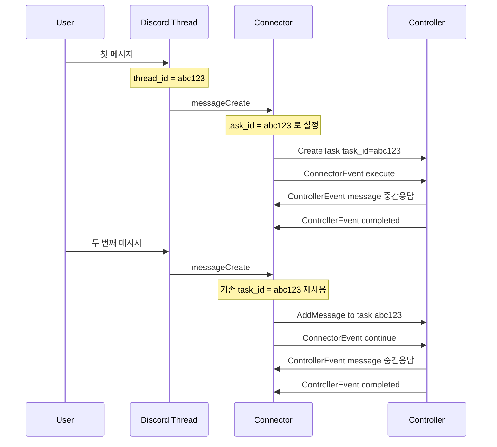
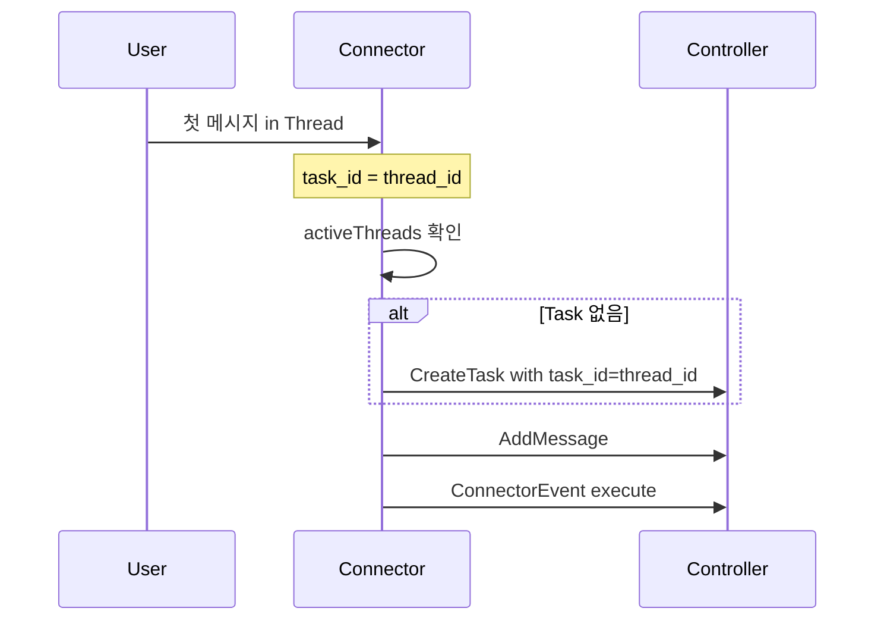
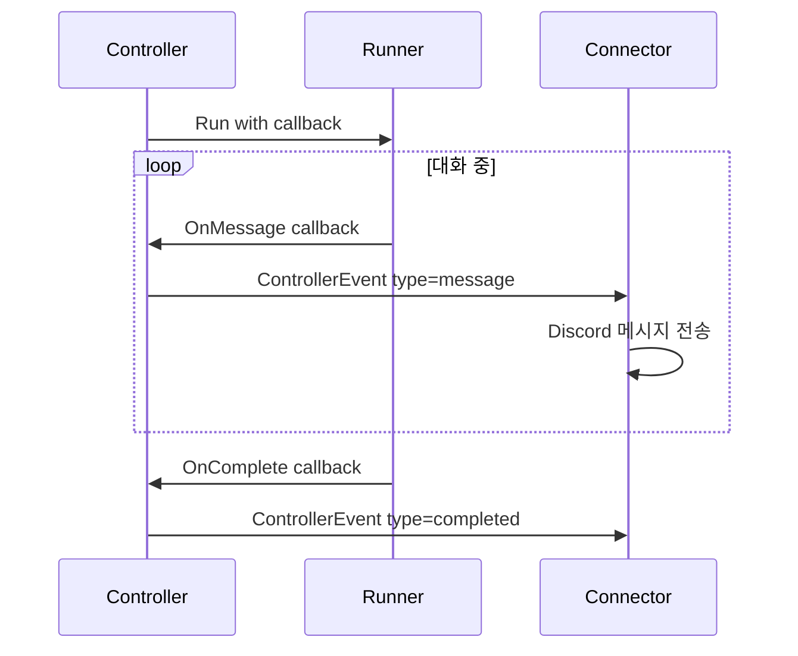

# Thread-Task 리팩토링 계획

## 개요

이 문서는 CNAP 시스템에서 Discord Thread와 Task 간의 관계를 개선하기 위한 리팩토링 계획을 정의합니다. 현재 각 메시지가 독립적인 Task로 생성되는 구조에서, 하나의 Thread가 하나의 Task에 매핑되어 지속적인 대화가 가능한 구조로 변경합니다.

---

## 1. AS-IS 현황

### 1.1 통신 구조

현재 시스템은 **채널 기반 비동기 통신**을 사용합니다:



**채널 정의** ([`internal/controller/controller.go:49-50`](internal/controller/controller.go:49)):

```go
type Controller struct {
    // ...
    taskEventChan  chan TaskEvent   // Connector → Controller
    taskResultChan chan TaskResult  // Controller → Connector
}
```

**TaskEvent 구조체** ([`internal/controller/controller.go:26-31`](internal/controller/controller.go:26)):

```go
// Connector → Controller 방향 이벤트
type TaskEvent struct {
    Type     string // "execute", "cancel" 만 존재
    TaskID   string
    ThreadID string // Discord thread ID
    Prompt   string // 사용자 메시지
}
```

**TaskResult 구조체** ([`internal/controller/controller.go:34-40`](internal/controller/controller.go:34)):

```go
// Controller → Connector 방향 결과
type TaskResult struct {
    TaskID   string
    ThreadID string
    Status   string // "completed", "failed", "canceled" 만 존재
    Content  string
    Error    error
}
```

### 1.2 Task-Thread 관계

**현재 문제점: 각 메시지가 독립적인 Task로 생성됨**



**Task ID 생성 방식** ([`internal/connector/thread.go:77`](internal/connector/thread.go:77)):

```go
// 각 메시지마다 새로운 Task ID 생성 (Discord message ID 기반)
taskID := fmt.Sprintf("task-%s", m.ID)
```

**activeThreads 맵** ([`internal/connector/server.go:21`](internal/connector/server.go:21)):

```go
type Server struct {
    // ...
    activeThreads  map[string]string  // Thread ID → Agent Name 매핑만 관리
}
```

### 1.3 Event Loop

**현재 Event Loop 구조** ([`internal/controller/controller.go:736-751`](internal/controller/controller.go:736)):

```go
func (c *Controller) eventLoop(ctx context.Context) {
    for {
        select {
        case event := <-c.taskEventChan:
            go c.handleTaskEvent(ctx, event)  // execute, cancel만 처리
        case <-ctx.Done():
            return
        }
    }
}
```

**지원되는 이벤트 타입** ([`internal/controller/controller.go:761-771`](internal/controller/controller.go:761)):

```go
func (c *Controller) handleTaskEvent(ctx context.Context, event TaskEvent) {
    switch event.Type {
    case "execute":
        c.handleExecuteEvent(ctx, event)
    case "cancel":
        c.handleCancelEvent(ctx, event)
    default:
        // Unknown event type
    }
}
```

**StatusCallback 인터페이스** ([`internal/runner/runner.go:26-35`](internal/runner/runner.go:26)):

```go
type StatusCallback interface {
    OnStatusChange(taskID string, status string) error
    OnComplete(taskID string, result *RunResult) error
    OnError(taskID string, err error) error
}
```

> ⚠️ `StatusCallback`이 정의되어 있고 Controller가 구현하고 있지만, Runner에서 실제로 호출하지 않음

### 1.4 메시지 흐름

**현재 메시지 처리 흐름** ([`internal/connector/thread.go:73-117`](internal/connector/thread.go:73)):



**SendMessage 함수** ([`internal/controller/controller.go:577-646`](internal/controller/controller.go:577)):

- 정의되어 있으나 현재 Connector에서 사용하지 않음
- Task 생성 후 실행을 트리거하는 용도로 설계됨

**AddMessage 함수** ([`internal/controller/controller.go:538-575`](internal/controller/controller.go:538)):

- 기존 Task에 메시지를 추가하는 기능
- 현재 사용되지 않음

---

## 2. TO-BE 설계

### 2.1 통신 구조 변경

**구조체 이름 변경으로 방향성 명확화**:

```go
// ConnectorEvent: Connector → Controller 방향 이벤트
type ConnectorEvent struct {
    Type     string // "execute", "continue", "cancel"
    TaskID   string
    Prompt   string
}

// ControllerEvent: Controller → Connector 방향 이벤트
type ControllerEvent struct {
    TaskID   string
    Type     string // "message", "completed", "failed", "canceled"
    Content  string
    Error    error
}
```



### 2.2 Task ID = Thread ID 매핑

**핵심 변경**: Task ID를 Discord Thread ID와 동일하게 사용

> Thread는 Discord Connector만의 개념이므로, Task 모델에 thread_id를 추가하지 않고,
> Connector에서 Thread ID를 Task ID로 사용합니다.



**새로운 메시지 흐름**:



### 2.3 Event Loop 확장

**확장된 ConnectorEvent 타입**:

```go
// ConnectorEvent: Connector → Controller 방향 이벤트
type ConnectorEvent struct {
    Type   string // "execute", "continue", "cancel"
    TaskID string // Discord의 경우 Thread ID와 동일
    Prompt string
}
```

**확장된 ControllerEvent 타입**:

```go
// ControllerEvent: Controller → Connector 방향 이벤트
type ControllerEvent struct {
    TaskID  string
    Type    string // "message", "completed", "failed", "canceled"
    Content string
    Error   error
}
```

### 2.4 메시지 흐름 변경

**Thread 시작 시 (첫 메시지)**:



**Runner 중간 응답 전달**:



---

## 3. 변경 항목 상세

### 3.1 Controller 변경

**파일: [`internal/controller/controller.go`](internal/controller/controller.go)**

**구조체 이름 변경**:

```go
// 기존: TaskEvent → ConnectorEvent
// Connector → Controller 방향 이벤트
type ConnectorEvent struct {
    Type   string // "execute", "continue", "cancel"
    TaskID string
    Prompt string
}

// 기존: TaskResult → ControllerEvent
// Controller → Connector 방향 이벤트
type ControllerEvent struct {
    TaskID  string
    Type    string // "message", "completed", "failed", "canceled"
    Content string
    Error   error
}
```

**Controller 구조체 채널 이름 변경**:

```go
type Controller struct {
    logger              *zap.Logger
    repo                *storage.Repository
    runnerManager       *taskrunner.RunnerManager
    taskContexts        map[string]*TaskContext
    mu                  sync.RWMutex
    connectorEventChan  chan ConnectorEvent  // Connector → Controller
    controllerEventChan chan ControllerEvent // Controller → Connector
}
```

**Event Loop 확장**:

```go
func (c *Controller) handleConnectorEvent(ctx context.Context, event ConnectorEvent) {
    switch event.Type {
    case "execute":
        c.handleExecuteEvent(ctx, event)
    case "continue":  // 새로 추가
        c.handleContinueEvent(ctx, event)
    case "cancel":
        c.handleCancelEvent(ctx, event)
    }
}
```

**새로운 handleContinueEvent 메서드**:

```go
// handleContinueEvent는 기존 Task에 메시지를 추가하고 실행을 계속합니다.
func (c *Controller) handleContinueEvent(ctx context.Context, event ConnectorEvent) {
    // 1. Task 조회
    task, err := c.repo.GetTask(ctx, event.TaskID)
    if err != nil {
        c.controllerEventChan <- ControllerEvent{
            TaskID: event.TaskID,
            Type:   "failed",
            Error:  fmt.Errorf("task not found: %w", err),
        }
        return
    }

    // 2. 메시지 추가
    if event.Prompt != "" {
        filePath, err := c.saveMessageToFile(ctx, event.TaskID, "user", event.Prompt)
        if err == nil {
            c.repo.AppendMessageIndex(ctx, event.TaskID, "user", filePath)
        }
    }

    // 3. Task 실행
    c.executeTaskWithResult(ctx, event.TaskID, task)
}
```

**Runner 콜백 연동**:

```go
// OnMessage는 Runner가 중간 응답을 생성할 때 호출됨
func (c *Controller) OnMessage(taskID, content string) {
    c.controllerEventChan <- ControllerEvent{
        TaskID:  taskID,
        Type:    "message",
        Content: content,
    }
}
```

### 3.2 Connector 변경

**파일: [`internal/connector/server.go`](internal/connector/server.go)**

**Server 구조체 변경**:

```go
type Server struct {
    logger              *zap.Logger
    session             *discordgo.Session
    controller          *controller.Controller
    threadsMutex        sync.RWMutex
    activeThreads       map[string]string // Thread ID → Agent Name (변경 없음)
    connectorEventChan  chan controller.ConnectorEvent  // Connector → Controller
    controllerEventChan <-chan controller.ControllerEvent // Controller → Connector
}
```

**파일: [`internal/connector/thread.go`](internal/connector/thread.go)**

**callAgentInThread 함수 변경**:

```go
func (s *Server) callAgentInThread(m *discordgo.Message, agent *controller.AgentInfo) {
    ctx := context.Background()

    // Thread ID를 Task ID로 사용
    taskID := m.ChannelID  // Discord Thread ID = Task ID

    // Task 존재 여부 확인
    task, err := s.controller.GetTask(ctx, taskID)

    if err != nil {
        // Task가 없으면 새로 생성
        s.logger.Info("Creating new task for thread",
            zap.String("task_id", taskID),
            zap.String("agent", agent.Name),
        )

        if err := s.controller.CreateTask(ctx, agent.Name, taskID, ""); err != nil {
            s.logger.Error("Failed to create task", zap.Error(err))
            _, _ = s.session.ChannelMessageSend(m.ChannelID, fmt.Sprintf("❌ Task 생성 실패: %v", err))
            return
        }

        // 첫 메시지 추가 및 execute 이벤트 전송
        if err := s.controller.AddMessage(ctx, taskID, "user", m.Content); err != nil {
            s.logger.Error("Failed to add message", zap.Error(err))
        }

        s.connectorEventChan <- controller.ConnectorEvent{
            Type:   "execute",
            TaskID: taskID,
            Prompt: m.Content,
        }
    } else {
        // Task가 있으면 메시지 추가 후 continue 이벤트 전송
        s.logger.Info("Continuing existing task",
            zap.String("task_id", taskID),
            zap.String("status", task.Status),
        )

        s.connectorEventChan <- controller.ConnectorEvent{
            Type:   "continue",
            TaskID: taskID,
            Prompt: m.Content,
        }
    }

    // "처리 중" 메시지 전송
    embed := &discordgo.MessageEmbed{
        Author:      &discordgo.MessageEmbedAuthor{Name: m.Author.Username, IconURL: m.Author.AvatarURL("")},
        Description: m.Content,
        Color:       0x0099ff,
        Footer:      &discordgo.MessageEmbedFooter{Text: fmt.Sprintf("'%s'가 처리 중입니다...", agent.Name)},
    }
    if _, err := s.session.ChannelMessageSendEmbed(m.ChannelID, embed); err != nil {
        s.logger.Error("Failed to send processing message", zap.Error(err))
    }
}
```

**파일: [`internal/connector/task_result.go`](internal/connector/task_result.go)**

**결과 핸들러 확장**:

```go
func (s *Server) resultHandler(ctx context.Context) {
    s.logger.Info("Result handler started")
    defer s.logger.Info("Result handler stopped")

    for {
        select {
        case event := <-s.controllerEventChan:
            s.logger.Info("Received controller event",
                zap.String("task_id", event.TaskID),
                zap.String("type", event.Type),
            )
            s.handleControllerEvent(event)

        case <-ctx.Done():
            s.logger.Info("Result handler shutting down")
            return
        }
    }
}

func (s *Server) handleControllerEvent(event controller.ControllerEvent) {
    // Task ID = Thread ID 이므로 바로 사용
    threadID := event.TaskID

    if threadID == "" {
        s.logger.Warn("Task ID is empty, cannot send result")
        return
    }

    switch event.Type {
    case "message":
        // 중간 응답 메시지 전송 (embed 없이 일반 메시지)
        s.sendMessageToThread(threadID, event.Content)

    case "completed":
        s.sendCompletedEmbed(threadID, event)

    case "failed":
        s.sendFailedEmbed(threadID, event)

    case "canceled":
        s.sendCanceledEmbed(threadID, event)
    }
}

func (s *Server) sendMessageToThread(threadID, content string) {
    // 너무 긴 메시지는 잘라내기
    if len(content) > 2000 {
        content = content[:1997] + "..."
    }

    _, err := s.session.ChannelMessageSend(threadID, content)
    if err != nil {
        s.logger.Error("Failed to send message to thread",
            zap.String("thread_id", threadID),
            zap.Error(err),
        )
    }
}
```

### 3.3 Runner 변경

**파일: [`internal/runner/runner.go`](internal/runner/runner.go)**

**StatusCallback 인터페이스 확장**:

```go
type StatusCallback interface {
    OnStatusChange(taskID string, status string) error
    OnMessage(taskID, content string) error  // 새로 추가
    OnComplete(taskID string, result *RunResult) error
    OnError(taskID string, err error) error
}
```

**파일: [`internal/runner/task_runner.go`](internal/runner/task_runner.go)**

**RunRequest 확장**:

```go
type RunRequest struct {
    TaskID       string
    Model        string
    SystemPrompt string
    Messages     []ChatMessage
    Callback     StatusCallback  // 새로 추가
}
```

**Run 메서드 수정**:

```go
func (r *Runner) Run(ctx context.Context, req *RunRequest) (*RunResult, error) {
    // ... 기존 로직 ...

    // 스트리밍 응답 처리 시 콜백 호출 (향후 스트리밍 지원 시)
    if req.Callback != nil {
        req.Callback.OnMessage(req.TaskID, partialContent)
    }

    // ... 나머지 로직 ...
}
```

---

## 4. 구현 단계

### 4.1 Phase 1: Controller 구조체 이름 변경

**목표**: TaskEvent → ConnectorEvent, TaskResult → ControllerEvent 이름 변경

**작업 항목**:

1. `controller/controller.go`: 구조체 이름 변경
2. `connector/server.go`: 채널 타입 및 이름 변경
3. `connector/thread.go`: ConnectorEvent 사용으로 변경
4. `connector/task_result.go`: ControllerEvent 사용으로 변경
5. 단위 테스트 수정

**예상 변경 파일**:

- `internal/controller/controller.go`
- `internal/connector/server.go`
- `internal/connector/thread.go`
- `internal/connector/task_result.go`

### 4.2 Phase 2: Task ID = Thread ID 매핑

**목표**: Thread ID를 Task ID로 사용하도록 Connector 변경

**작업 항목**:

1. `connector/thread.go`: Task ID 생성 로직 변경
   - 기존: `task-{messageID}` → 변경: `{threadID}`
2. Task 존재 여부 확인 로직 추가
3. 첫 메시지 vs 후속 메시지 분기 처리
4. 단위 테스트 작성

**예상 변경 파일**:

- `internal/connector/thread.go`

### 4.3 Phase 3: Event Loop 확장

**목표**: `continue` 이벤트 추가 및 처리

**작업 항목**:

1. `ConnectorEvent.Type`에 `"continue"` 추가
2. `handleContinueEvent` 핸들러 구현
3. 기존 Task에 메시지 추가 후 실행 계속 로직
4. 단위 테스트 작성

**예상 변경 파일**:

- `internal/controller/controller.go`
- `internal/controller/controller_test.go`

### 4.4 Phase 4: 중간 응답 지원

**목표**: Runner 중간 응답을 Connector로 전달

**작업 항목**:

1. `ControllerEvent.Type`에 `"message"` 추가
2. `StatusCallback.OnMessage` 메서드 추가
3. Controller의 `OnMessage` 구현
4. Connector의 `handleControllerEvent` 확장
5. Runner에서 콜백 호출 (스트리밍 지원 시)

**예상 변경 파일**:

- `internal/controller/controller.go`
- `internal/connector/task_result.go`
- `internal/runner/runner.go`
- `internal/runner/task_runner.go`

### 4.5 Phase 5: 통합 테스트

**목표**: 전체 흐름 E2E 테스트

**작업 항목**:

1. Thread 생성 → 첫 메시지 → Task 생성 테스트
2. 기존 Thread에 메시지 추가 → Task 재사용 테스트
3. 중간 응답 전달 테스트
4. Thread 종료/Task 완료 테스트
5. 에러 케이스 테스트

**예상 변경 파일**:

- `tests/integration/integration_test.go`

---

## 5. 마이그레이션 고려사항

### 5.1 하위 호환성

**기존 API 유지**:

- `CreateTask(agentID, taskID, prompt)` 시그니처 유지
- Connector에서 Task ID 생성 방식만 변경

**이벤트 타입 하위 호환**:

- 기존 `execute`, `cancel` 이벤트 동작 유지
- 새로운 `continue` 이벤트 추가

**기존 데이터 처리**:

- 기존 `task-{messageID}` 형식의 Task ID는 그대로 유지
- 새로운 Task만 Thread ID 형식의 Task ID 사용

### 5.2 롤백 계획

**Phase별 롤백 가능**:

1. Phase 1: 구조체 이름 revert
2. Phase 2: Task ID 생성 로직 revert
3. Phase 3-4: 코드 revert
4. 기존 기능에 영향 없이 점진적 적용 가능

### 5.3 모니터링

**추가 로깅**:

- Task 생성/재사용 로그
- `continue` 이벤트 처리 로그
- 중간 응답 전송 로그

**메트릭 추가 고려**:

- Thread당 메시지 수
- Task 재사용률
- 중간 응답 전송 횟수

---

## 부록: 용어 정의

| 용어            | 설명                                                                        |
| --------------- | --------------------------------------------------------------------------- |
| Thread          | Discord의 대화 스레드. 사용자와 에이전트 간 대화 공간                       |
| Task            | CNAP에서 관리하는 작업 단위. Discord에서는 Thread ID = Task ID              |
| Message         | Task 내의 개별 대화 메시지 (user/assistant role)                            |
| Runner          | AI API를 호출하여 실제 작업을 수행하는 컴포넌트                             |
| Connector       | Discord와 통신하는 컴포넌트                                                 |
| Controller      | Task 생명주기를 관리하는 중앙 컴포넌트                                      |
| ConnectorEvent  | Connector → Controller 방향의 이벤트 (execute, continue, cancel)            |
| ControllerEvent | Controller → Connector 방향의 이벤트 (message, completed, failed, canceled) |
